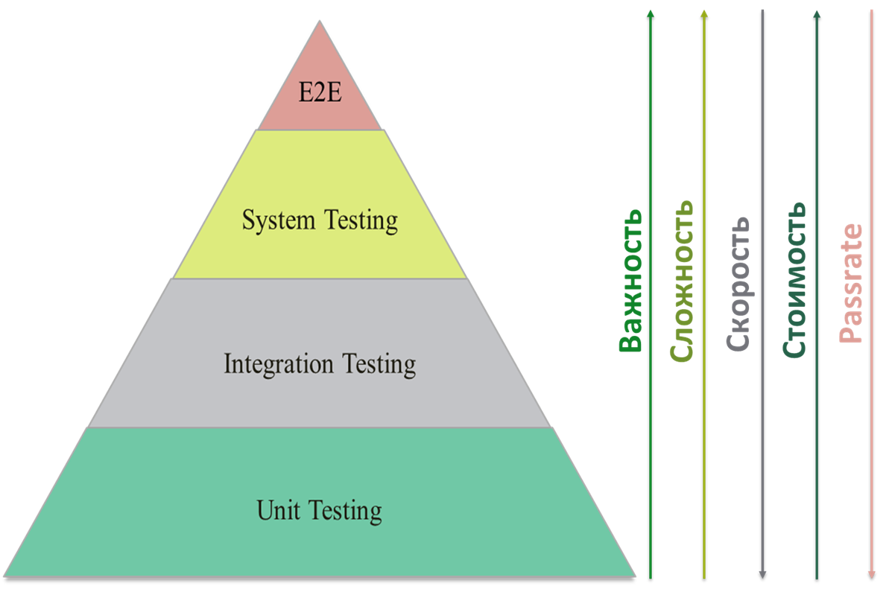
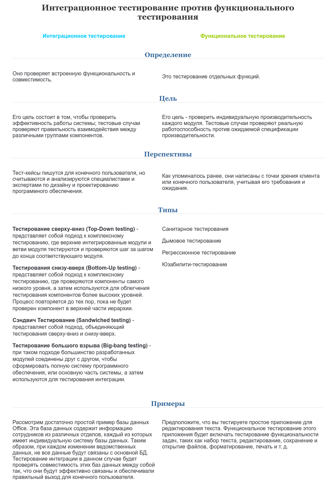

# Python

## Послідовності

### Що таке послідовність

Послідовністю в Python називається ітерований об'єкт, який підтримує ефективний доступ до елементів з використанням цілих індексів через спеціальний метод `__getitem__()` і підтримує метод `__len__()`, який повертає довжину послідовності.
До основних вбудованих типів послідовностей відносяться list, tuple, range, str та bytes.

Послідовності також опціонально можуть реалізовувати методи `count()`, `index()`, `__contains__()` та `__reversed__()` та інші.

### Які операції підтримують більшість послідовностей

- `x in s`, `x not in s` – чи знаходиться елемент `x` у послідовності `s` (для рядків та послідовностей байтів – чи є `x` підрядком `s`)
- `s + t` – конкатенація послідовностей
- `s * n, n * s` - конкатенація `n` нерекурсивних копій послідовності `s`
- `s[i]` - `i`-й елемент послідовності `s`
- `s[i:j]` – зріз послідовності `s` від `i` до `j`
- `s[i:j:k]` – зріз послідовності `s` від `i` до `j` з кроком `k`
- `len(s)` – довжина послідовності
- `min(s)` – мінімальний елемент послідовності
- `max(s)` – максимальний елемент послідовності
- `s.index(x[, i[, j]])` – індекс першого входження `x` (опціонально – починаючи з позиції `i` до позиції `j`)
- `s.count(x)` – загальна кількість входжень `x` у `s`
- `sum(s)` – сума елементів послідовності

Незмінні послідовності зазвичай реалізують операцію hash(s) - хеш-значення об'єкта.

Більшість змінних послідовностей підтримують такі операції:

- `s[i] = x` – елемент з індексом `i` замінюється на `x`
- `s[i:j] = t`, `s[i:j:k] = t` – елементи з індексами від `i` до `j` (з кроком `k`) замінюються вмістом ітерабельного об'єкта `t`
- `del s[i:j]`, `del s[i:j:k]` – видалення відповідних елементів із послідовності
- `s.append(x)` – додавання `x` до кінця послідовності
- `s.clear()` – видалення всіх елементів послідовності
- `s.copy()` – нерекурсивна копія послідовності
- `s.extend(t)` – додавання всіх елементів ітерабельного об'єкта до кінця послідовності
- `s.insert(i, x)` – вставка елемента `x` за індексом `i`
- `s.pop()`, `s.pop(i)` – повернення значення за індексом `i` (за замовчуванням – останній елемент) та видалення його з послідовності
- `s.remove(x)` – видалення першого входження `x`
- `s.reverse()` – розворот послідовності у зворотному порядку

### Які види рядків бувають у пайтоні

У третьому пайтоні є один вид рядків str, який є Юнікодом. Однобайтних рядків немає, замість них є тип bytes, тобто ланцюжок байт.

### Чи можна змінити окремий символ усередині рядка

Ні, рядки незмінні. Операції заміни, форматування та конкатенації повертають новий рядок.

### Як з'єднати список рядків в один. Як розбити рядок на список рядків

Щоб з'єднати, потрібний метод рядка `.join()`. Щоб розбити - метод `.split()`.

### Як кодувати та декодувати рядки

Кодувати – перевести Юнікод у байтовий рядок. Викликати метод `.encode()` рядка.

Декодувати – відновити рядок із ланцюжка байт. Викликати метод `.decode()` у об'єкту `bytes`.

В обох випадках явно передавати кодування, інакше буде використано те, що визначено в системі за замовчуванням. Бути готовим зловити винятки `UnicodeEncodeError`, `UnicodeDecodeError`.

### Чим список відрізняється від кортежу

Списки – це послідовності, що змінюються. Представлені класом List.

Кортежі – це незмінні послідовності. Представлені класом tuple.

На рівні мови відрізняються тим, що до кортежу не можна додати або прибрати елемент. На рівні інтерпретатора реалізовані схожим чином. Обидві колекції представлені масивом вказівників на структуру PyObject.

Для списку визначені функції, які додають до такого масиву новий елемент, видаляють наявний, з'єднують два масиви в один. Вони викликаються методами списку `.append()`, `.pop()`, `.sort()` і т.д.

### Що таке діапазон

Діапазони – незмінні послідовності чисел, які задаються початком, кінцем та кроком. Представлені класом range.
Параметри конструктора повинні бути цілими числами (або екземпляри класу int або будь-який об'єкт з методом `__index__`).
Підтримує всі загальні для послідовностей операції, крім конкатенації та повторення, а також у версіях Python до 3.2 зрізів та негативних індексів.

### Як зробити список унікальним (без елементів, що повторюються)

Варіант із множиною. Не гарантує порядок елементів.

```pycon
list(set([1, 2, 2, 2, 3, 3, 1]))
[1, 2, 3]
````

Варіант з OrderedDict (починаючи з версії 3.7 працюватиме і для звичайного словника). Гарантує порядок елементів. 

```pycon
from collections import OrderedDict
list(OrderedDict.fromkeys([1, 2, 2, 2, 3, 3, 1]))
[1, 2, 3]
````

Варіант із циклом. Повільно, але гарантує порядок. Підходить, якщо елементи не можна поміщати всередину множини (наприклад, словники).

```pycon
res = []
for x in [1, 2, 2, 2, 3, 3, 1]:
    if x not in res:
        res.append(x)
[1, 2, 3]
````

### Є кортеж із трьох елементів. Призначити змінним a, b, c його значення

`a, b, c = (1, 2, 3)`

### Як порівнюються послідовності

Дві послідовності рівні, якщо вони мають однаковий тип, рівну довжину та відповідні елементи обох послідовностей рівні.

Послідовності однакових типів можна порівнювати. Порівняння відбуваються в лексикографічному порядку: послідовність меншої довжини менша ніж послідовність більшої довжини, якщо їх довжини рівні, то результат порівняння дорівнює результату порівняння починаючи з перших елементів і до кінця.

## Множини та відображення (mappings)

### Як зрозуміти чи об'єкт хешується?

Об'єкт називається хешованим, якщо він має хеш-значення (ціле число), яке ніколи не змінюється протягом його життєвого циклу і повертається методом `__hash__()`, і може порівнюватись з іншими об'єктами (реалізує метод `__eq__()`). Рівні об'єкти, що хешуються, повинні мати рівні хеш-значення.
Всі стандартні незмінні об'єкти хешуються. Всі стандартні об'єкти, що змінюються, не хешуються.

### Що таке множина

Множина – це невпорядкована колекція об'єктів, що хешуються, які не повторюються.
У багатьох немає поняття позиції елемента. Відповідно, вони не підтримують індексацію та зрізи.
Вбудовані класи множин: set (змінювана множина), frozenset (незмінна множина).

### Для чого застосовуються множини

Зазвичай використовуються для перевірки елемента на входження в множину та видалення повторень елементів та виконання таких операцій, як об'єднання, перетин, різниця та симетрична різниця.

### Які операції можна робити над множиною

- `set([iterable])`, `frozenset([iterable])` – створення множини (порожнього або з елементів ітерабельного об'єкта)
- `len(s)` – кількість елементів множини
- `x in s`, `x not in s` – перевірка знаходження елемента у множині
- `s.isdisjoint(t)` – перевірка того, що дана множина не має спільних елементів із заданим
- `s.issubset(t)`, `s <= t` – перевірка того, що всі елементи множини s є елементами множини t
- `s < t` - перевірка того, що s <= t і s! = t
- `s.isuperset(t)`, `s >= t` – перевірка того, що всі елементи множини t є елементами множини s
- `s > t` - перевірка того, що `s >= t` і `s != t`
- `s.union(t, ...)`, `s | t | ...` – створення нової множини, яка є об'єднанням даних множин
- `s.intersection(t, ...)`, `s & t & ...` – створення нової множини, яка є перетином даних множин
- `s.difference(t, ...)`, `s - t - ...` – створення нової множини, яка є різницею даних множин
- `s.symmetric_difference(t)`, `s ^ t` – створення нової множини, яка є симетричною різницею даних множин (тобто, різниця об'єднання та перетину множин, іншими словами, всі елементи двох множин, які не є спільними)
- `s.copy()` – неповна копія множини s

Операції над множинами, які є методами, приймають як аргументи будь-які ітерабельні об'єкти. Операції над множинами, записані у вигляді бінарних операцій, вимагають, щоб другий операнд операції теж був множиною, і повертають множину того типу, яким була перша множина.

Операції над змінними множинами:

- `s.update(t, ...)`, `s |= t | ...` – додати до цієї множини елементи з інших множин
- `s.intersection_update(t, ...)`, `s &= t & ...` – залишити в даній множині тільки ті елементи, які є і в інших множинах
- `s.difference_update(t, ...)`, `s -= t | ...` – видалити з цієї множини ті елементи, які є в інших множинах
- `s.symmetric_difference_update(t)`, `s^=t` – залишити або додати до s елементи, які є або в s, або в t, але не в обох множинах
- `s.add(element)` – додати новий елемент до множини
- `s.remove(element)` – видалити елемент із множини; якщо такого елемента немає, виникає виключення KeyError
- `s.discard(element)` – видалити елемент із множини, якщо він у ньому знаходиться
- `s.pop()` – видалити з множини й повернути довільний елемент; якщо множина порожня, виникає виключення KeyError
- `s.clear()` – видалити всі елементи множини.

### Як відбувається перевірка множин на рівність

Перевірка множин на рівність відбувається поелементно, незалежно від типів множин.

### Що таке відображення

Відображення (mapping) – це об'єкт-контейнер, який підтримує довільний доступ до елементів за ключами та описує всі методи, описані в абстрактному базовому класі `collections.Mapping` (`get()`, `items()`, `keys() `, `values()`) або `collections.MutableMapping` (`clear()`, `get()`, `items()`, `keys()`, `pop()`, `popitem()` , `setdefault()`, `update()`, `values()`).
До відображень відносяться класи `dict`, `collections.defaultdict`, `collections.OrderedDict` та `collections.Counter`.

### Які нюанси є у використанні чисел як ключів

Числові ключі у словниках підпорядковуються правилам порівняння чисел. Таким чином, `int(1)` та `float(1.0)` вважаються однаковим ключем. Однак через те, що значення типу float зберігаються приблизно, не рекомендується використовувати їх як ключі.

```pycon
>>> {True: 'yes', 1: 'no', 1.0: 'maybe'}
{True: 'maybe'}
````

### Які операції можна проводити над відображеннями

- `len(d)` – кількість елементів.
- `d[key]` – отримання значення із ключем key. Якщо такий ключ немає і відображення реалізує спеціальний метод `__missing__(self, key)`, він викликається. Якщо ключ не існує і метод `__missing__` не визначений, викидається виключення KeyError.
- `d[key] = value` – змінити значення або створити нову пару ключ-значення, якщо ключ не існує.
- `key in d`, `key not in d` – перевірка наявності ключа у відображенні.
- `iter(d)` – те саме, що iter(d.keys()).
- `clear()` – видалити усі елементи словника.
- `copy()` – створити неповну копію словника.
- `(метод класу) dict.fromkeys(sequence[, value])` – створює новий словник з ключами із послідовності sequence та заданим значенням (за замовчуванням – None).
- `d.get(key[, default])` – безпечне набуття значення по ключу (ніколи не викидає KeyError). Якщо ключ не знайдено, повертається значення default (за замовчуванням – None).
- `d.items()` – у Python 3 повертає об'єкт подання словника, що відповідає парам (двоелементним кортежам) виду (ключ, значення). Python 2 повертає відповідний список, а метод iteritems() повертає ітератор. Аналогічний метод Python 2.7 – viewitems().
- `d.keys()` – Python 3 повертає об'єкт представлення словника, відповідний ключам словника. Python 2 повертає відповідний список, а метод iterkeys() повертає ітератор. Аналогічний метод Python 2.7 – viewkeys().
- `d.pop(key[, default])` – якщо ключ key існує, видаляє елемент зі словника та повертає його значення. Якщо ключ не існує і задано значення default, повертається це значення, інакше викидається виключення KeyError.
- `d.popitem()` – видаляє довільну пару ключ-значення та повертає її. Якщо словник є порожнім, виникає виключення KeyError. Метод корисний для алгоритмів, які оминають словник, видаляючи вже оброблені значення (наприклад, певні алгоритми, пов'язані з теорією графів).
- `d.setdefault(key[, default])` – якщо ключ key існує, повертає відповідне значення. Інакше створює елемент із ключем key та значенням default. default за промовчанням дорівнює None.
- `d.update(mapping)` – приймає або інший словник чи відображення, або ітерований об'єкт, що складається з ітерабельних об'єктів – пар ключ-значення, або іменовані аргументи. Додає відповідні елементи до словника, перезаписуючи елементи з ключами, що існують.
- `d.values()` – Python 3 повертає об'єкт представлення словника, відповідний значенням. Python 2 повертає відповідний список, а метод itervalues() повертає ітератор. Аналогічний метод Python 2.7 – viewvalues().

### Що повертає метод items

Об'єкти, що повертаються методами `items()`, `keys()` та `values()` – це об'єкти *представлення словника*. Вони надають динамічне представлення елементів словника, тобто зміни словника автоматично відображаються і на цих об'єктах.

Операції з представленнями словників:

- `iter(dictview)` – отримання ітератора за ключами, значеннями або парами ключів та значень. Усі представлення словників при ітеруванні повертають елементи словника у порядку. При спробі змінити словник під час ітерування може виникнути виключення RuntimeError
- `len(dictview)` - кількість елементів у словнику.
- `x in dictview` – перевірка існування ключа, значення чи пари ключ-значення у словнику.

### Як відсортувати список словників за певним полем

Метод списку `.sort()` та вбудована функція `sorted()` приймають параметр `key`. Їм повинен бути *callable* об'єкт (об'єкт, що викликається, такий як функція), який приймає черговий елемент (у нашому випадку словник) і повертає значення-критерій сортування.

Код нижче показує, як відсортувати список людей за віком:

```pycon
users = [
...    {'name': 'Ashley', 'age': 30},
...    {'name': 'John', 'age': 20},
...    {'name': 'Kirk', 'age': 10},
...]
...
users.sort(key=lambda user: user['age'])
>>> [{'name': 'Kirk', 'age': 10}, {'name': 'John', 'age': 20}, {'name': 'Ashley', 'age': 30}]
````

### Що може бути ключем словника. Що ні. Чому

Ключем словника може бути будь-який об'єкт, що хешується, незмінний: число, рядок, datetime, функція і навіть модуль. Такі об'єкти мають метод `__hash__()`, який однозначно зіставляє об'єкт із деяким числом. За цим числом словник шукає значення ключа.

Списки, словники та множини змінюються та не мають методу хешування. При підстановці в словник виникне помилка.

Хеш кортежу обчислюється рекурсивно за всіма елементами. Так, кортеж

`(1, (True, (42, ('hello', ))))`
складається лише з незмінних елементів, тому може бути ключем. Однак такий кортеж

`(1, (True, (42, ({'hello': 'world'}, ))))`
містить глибоко всередині словник, тому хеш не може бути розрахований.

### Є два списки – ключі та значення. Як скласти з них словник

```pycon
keys = ['foo', 'bar', 'baz']
vals = [1, 2, 3]
dict(zip(keys, vals))
>>> {'baz': 3, 'foo': 1, 'bar': 2}
````

Функція `zip` віддає список пар N-них елементів. Конструктор `dict` приймає перелік пар. Кожну пару він розглядає як ключ та значення відповідно.

### Як працює хеш-таблиця

Хеш-таблиця це розріджений масив (масив, у якому є незаповнені позиції). У стандартних англомовних підручниках комірки хеш-таблиці називаються "buckets". У хеш-таблиці dict кожному елементу відповідає комірка, що містить два поля: посилання на ключ і посилання на значення елемента. Оскільки розмір всіх комірок однаковий, доступ до окремої комірки здійснюється за зміщенням.

Python прагне залишити не менше третини комірок порожніми; якщо хеш-таблиця стає надмірно заповненою, то вона копіюється в нову ділянку пам'яті, де є місце для більшої кількості осередків.

Для поміщення елемента в хеш-таблицю потрібно насамперед обчислити хеш-значення ключа елемента. Це робить вбудована функція `hash()`.

Для вибірки значення за допомогою виразу `my_dict[search_key]` Python звертається до функції `hash(search_key)`, щоб отримати хеш-значення search_key, і використовує кілька молодших бітів отриманого числа як зміщення комірки щодо початку хеш-таблиці (скільки саме біт залежить поточного розміру таблиці). Якщо знайдена комірка порожня, виникає виключення `KeyError`. В іншому випадку в знайденому осередку є якийсь елемент - пара `ключ: значення` - і тоді Python перевіряє, чи вірно те, що search_key == found_key. Якщо так, то елемент знайдено та повертається found_value. Якщо ж search_key і found_key не збіглися, то присутня колізія хешування. Для вирішення колізії алгоритм бере різні біти хеш-значення, здійснює над ними певні дії та використовує результат як зміщення іншої комірки.

### Що таке колізія

Коли хеш-функція повертає ту саму відповідь для різних ключів. Існують [різні способи](https://en.wikipedia.org/wiki/Hash_table#Collision_resolution), що дозволяють коректно обробляти випадки колізій в хеш-таблиці.

### Де буде швидшим пошук, а де перебір і чому: dict, list, set, tuple

Пошук буде швидшим в dict і set, тому що це хеш-таблиці, доступ до елемента яких виконується за O(1). Для list та tuple пошук буде виконуватися в середньому за O(n).

Виняток працює лише для дуже маленьких списків довжиною до 5 елементів. У цьому випадку інтерпретатору швидше пробігтися по списку, ніж рахувати хеш.

У Python 3 методи словника `keys`, `values`, `items` створюють об'єкт-представлення. Але ітерування за таким поданням має відбуватися трохи довше, ніж за списком через те, що дані в словниках зберігаються розріджено (рідко, негусто). На підтвердження вищесказаного (Python 3):

```pycon
>>> l = list(range(1000000))
>>> d = dict.fromkeys(l)
>>> s = set(l)
>>> def iter_list():
...     for i in l:
...         pass
...
>>> def iter_dict():
...     for i in d:
...         pass
...
>>> def iter_set():
...     for i in s:
...         pass
...
>>> timeit.timeit(iter_list, number=1000)
6.727667486004066
>>> timeit.timeit(iter_dict, number=1000)
9.293120226997416
>>> timeit.timeit(iter_set, number=1000)
8.627948219014797
````

## Функції

### Що таке args, kwargs. У яких випадках вони потрібні

Вирази `*args` та `**kwargs` оголошують у сигнатурі функції. Вони означають, що всередині функції будуть доступні змінні з іменами `args` та `kwargs` (без зірочок). Можна використовувати інші імена, але це вважається поганим тоном.

`args` – це кортеж, який накопичує позиційні аргументи. kwargs – словник іменованих аргументів, де ключ – ім'я параметра, значення – значення параметра.

**Важливо:** якщо у функцію не передано жодних параметрів, змінні будуть відповідно дорівнювати порожньому кортежу та порожньому словнику, а не `None`.

Будь ласка, не плутайте кортеж зі списком. Наступне питання пояснює чому.

### Чому використовувати об'єкти, що змінюються, як параметри за замовчуванням погано. Наведіть приклад поганого випадку. Як виправити

Функція створюється одного разу під час завантаження модуля. Іменовані параметри та їх дефолтні значення також створюються один раз і зберігаються в одному з полів об'єкта-функції.

У нашому прикладі `bar` дорівнює порожньому списку. Список – колекція, що змінюється, тому значення `bar` може змінюватися від виклику до виклику. Приклад:

```pycon
def foo(bar=[]):
    bar.append(1)
        return bar
foo()
>>> [1]
foo()
>>> [1, 1]
foo()
>>> [1, 1, 1]
````

Хорошим тоном вважається вказувати параметру порожнє незмінне значення, наприклад `0`, `None`, `''`, `False`. У тілі функції перевіряти на заповненість та створювати нову колекцію:

```pycon
def foo(bar=None):
    if bar is None:
        bar = []
    bar.append(1)
    return bar
foo()
>>> [1]
foo()
>>> [1]
foo()
>>> [1]
````

Сказане вище є актуальним у т.ч. для множин та словників.

### Чи можна передавати функцію як аргумент іншій функції

Можна, функція в пайтон є об'єктом першого порядку: допускає присвоєння, передачу в функцію, видалення.

### Чи можна оголошувати функцію всередині іншої функції. Де її буде видно

Можна. Таку функцію буде видно лише всередині першої функції.

### Що таке лямбди. Які їх особливості

Це анонімні функції. Вони не резервують імені у просторі імен. Лямбди
часто передають у функції `map`, `reduce`, `filter`.

Лямбди в пайтон можуть складатися тільки з одного виразу. Використовуючи синтаксис дужок можна оформити тіло лямбди в кілька рядків.

Використовувати крапку з комою для поділу операцій не можна.

### Чи припустимі такі вирази

- `nope = lambda: pass`
- `raiser = lambda x: raise Exception(x)`

Ні, при завантаженні модуля вискочить виключення `SyntaxError`. У тілі лямбди може
бути лише вираз. `pass` та `raise` є операторами.

### Як передаються значення аргументів у функцію чи метод

- [How do I write a function with output parameters (call by reference)?](https://docs.python.org/3/faq/programming.html#how-do-i-write-a-function-with-output-parameters-call-by-reference)

У таких мовах як C++ є змінні, що зберігаються у стеку і в динамічній пам'яті. При виклику функції ми поміщаємо всі аргументи у стек, після чого передаємо керування функцією. Вона знає розміри та зміщення змінних у стеку, відповідно може їх правильно інтерпретувати.
При цьому ми маємо два варіанти: скопіювати у стек пам'ять змінної або покласти посилання на об'єкт у динамічній пам'яті (або на вищих рівнях стека).
Очевидно, що при зміні значень у стеку функції значення динамічної пам'яті не зміняться, а при зміні області пам'яті за посиланням, ми модифікуємо загальну пам'ять, відповідно всі посилання на цю область пам'яті «побачать» нове значення.

У python відмовилися від подібного механізму, заміною служить механізм зв'язування (assignment) імені змінної з об'єктом, наприклад при створенні змінної:
`var="john"` інтерпретатор створює об'єкт john і ім'я var, а потім пов'язує об'єкт з даним ім'ям.
При виклику функції нових об'єктів не створюється, натомість у її області видимості створюється ім'я, яке зв'язується об'єктом, що вже існує.
Але в python є типи, що змінюються і незмінні. До других, наприклад, відносяться числа: при арифметичних операціях об'єкти, що існують, не змінюються, а створюється новий об'єкт, з яким зв'язується ім'я. Якщо ж зі старим об'єктом після цього не пов'язане жодне ім'я, воно буде видалено за допомогою механізму підрахунку посилань.
Якщо ж ім'я пов'язане зі змінною типу, що змінюється, то при операціях з нею змінюється пам'ять об'єкта, відповідно всі імена, пов'язані з цією областю пам'яті «побачать» зміни.

### Що таке замикання

Синтаксично це виглядає як функція, що знаходиться цілком у тілі іншої функції. При цьому вкладена внутрішня функція містить посилання на локальні змінні зовнішньої функції. Щоразу під час виконання зовнішньої функції відбувається створення нового екземпляра внутрішньої функції, з новими посиланнями на змінні зовнішньої.

## Ітератори та генератори

- [Ітерований об'єкт, ітератор і генератор Python](https://spacelab.ua/articles/iterovanij-obyekt-iterator-i-generator-v-python/)

### Що таке контейнер

Контейнер – це тип даних, який інкапсулює у собі значення інших типів. Списки, кортежі, множини, словники тощо є контейнерами.

### Що таке ітерований об'єкт

*Ітерований об'єкт* (в оригінальній термінології - "iterable") - це об'єкт, який може повертати значення по одному за раз.
Приклади: всі контейнери та послідовності (списки, рядки тощо), файли, а також екземпляри будь-яких класів, в яких визначено метод `__iter__()` або `__getitem__()`.
Ітерабельні об'єкти можуть бути використані всередині циклу `for`, а також у багатьох інших випадках, коли очікується послідовність (функції `sum()`, `zip()`, `map()` і т.д.).

**Детальніше**:

Розглянемо об'єкт, що ітерується ('Iterable'). У стандартній бібліотеці він оголошений як абстрактний клас `collections.abc.Iterable`:

```pycon
class Iterable(metaclass=ABCMeta):

    __slots__ = ()

    @abstractmethod
    def __iter__(self):
        while False:
            yield None
    
    @classmethod
    def __subclasshook__(cls, C):
        if cls is Iterable:
            return _check_methods(C, "__iter__")
        return NotImplemented
````

Він має абстрактний метод `__iter__` який має повернути об'єкт ітератора. І метод `__subclasshook__` який перевіряє наявність у класу метод `__iter__`. Таким чином, виходить, що об'єкт, що ітерується, це будь-який об'єкт який реалізує метод `__iter__`

```pycon
class SomeIterable1(collections.abc.Iterable):
def __iter__(self):
pass

class SomeIterable2:
def __iter__(self):
pass

print(isinstance(SomeIterable1(), collections.abc.Iterable))
# True
print(isinstance(SomeIterable2(), collections.abc.Iterable))
# True
````

Але є один момент, це функція iter(). Саме цю функцію використовує, наприклад цикл для отримання ітератора. Функція `iter()` в першу чергу для отримання ітератора з об'єкта викликає його метод `__iter__`. Якщо метод не реалізований, вона перевіряє наявність методу `__getitem__` і якщо він реалізований, то на його основі створюється ітератор. `__getitem__` повинен приймати індекс із нуля. Якщо не реалізований жоден із цих методів, тоді буде викликано виключення `TypeError`.

```pycon
від string import ascii_letters

class SomeIterable3:
def __getitem__(self, key):
return ascii_letters[key]

for item в SomeIterable3():
print(item)
````

### Що таке ітератор

*Ітератор* (iterator) – це об'єкт, який є потоком даних. Повторюваний виклик методу `__next__()` (`next()` у Python 2) ітератора або передача його вбудованої функції `next()` повертає наступні елементи потоку.

Якщо більше не залишилося даних, викидається виключення `StopIteration`. Після цього ітератор вичерпаний і будь-які подальші виклики його методу `__next__()` знову генерують виключення `StopIteration`.

Ітератори повинні мати метод `__iter__`, який повертає сам об'єкт ітератора, так що будь-який ітератор також є ітерабельним об'єктом і може бути використаний майже скрізь, де приймаються ітерабельні об'єкти.

**Детальніше:**

Ітератори представлені абстрактним класом `collections.abc.Iterator`:

```pycon
class Iterator(Iterable):

__slots__ = ()

@abstractmethod
def __next__(self):
'Return the next item from the iterator. When exhausted, raise StopIteration'
raise StopIteration

def __iter__(self):
return self

@classmethod
def __subclasshook__(cls, C):
if cls is Iterator:
return _check_methods(C, '__iter__', '__next__')
return NotImplemented
````

`__next__` Повертає наступний доступний елемент і викликає виключення `StopIteration`, коли елементів не залишилося.
`__iter__` Повертає `self`. Це дозволяє використовувати ітератор там, де очікується об'єкт, що ітерується, наприклад `for`.
`__subclasshook__` Перевіряє наявність у класу методу `__iter__` та `__next__`

### Що таке генератор

Залежно від контексту може означати або функцію-генератор, або ітератор генератора (найчастіше, останнє).
Методи `__iter__` та `__next__` у генераторів створюються автоматично.

З точки зору реалізації, *генератор* у Python - це мовна конструкція, яку можна реалізувати двома способами: як функція з ключовим словом `yield` або як генераторний вираз. В результаті виклику функції або обчислення виразу отримуємо об'єкт-генератор типу `types.GeneratorType`. Канонічний приклад - генератор, що породжує послідовність чисел Фібоначчі, яка, будучи нескінченною, не змогла б поміститися в жодну колекцію. Іноді термін застосовується для самої генераторної функції, а не тільки об'єкта, повернутий їй як результат.

Так як в об'єкті-генераторі визначені методи `__next__` та `__iter__`, тобто реалізований протокол ітератора, з цієї точки зору, у Python будь-який генератор є ітератором.

Коли виконання функції-генератори завершується (за допомогою ключового слова `return` або досягнення кінця функції) виникає виключення `StopIteration`.

### Що таке функція-генератор

*Генераторна функція* - функція, у тілі якої зустрічається ключове слово `yield`. Будучи викликана така функція повертає об'єкт-генератор (generator object) (ітератор генератора (generator iterator)).

### Що робить yield

`yield` заморожує стан функції-генератора та повертає поточне значення. Після наступного виклику `__next__()` функція-генератор продовжує своє виконання з того місця, де вона була припинена.

### У чому відмінність \[x for x in y\] від (x for x in y)

Перше вираження повертає список (спискове включення), друге – генератор.

### Що особливого в генераторі

Генератор зберігає у пам'яті в повному обсязі елементи, лише внутрішній стан для обчислення чергового елемента. На кожному кроці можна визначити лише наступний елемент, але не попередній. Пройти генератор у циклі можна лише один раз.

### Як оголосити генератор

- Використовувати синтаксис `(x for x in seq)`
- оператор `yield` у тілі функції замість `return`
- вбудована функція `iter`, яка викликає у об'єкта метод `__iter__()`. Цей метод має повертати генератор.

### Як отримати з генератора список

Передати в конструктор списку: `list(x for x in some_seq)`. Важливо, що після цього по генератору не можна буде ітеруватися.

### Що таке підгенератор

У Python 3 є так звані підгенератори (subgenerators). Якщо функції-генераторі зустрічається пара ключових слів `yield from`, після яких слід об'єкт-генератор, то даний генератор делегує доступ до підгенератора, поки він не завершиться (не закінчаться його значення), після чого продовжує своє виконання.

Насправді `yield` є виразом. Воно може набувати значень, які відправляються в генератор. Якщо генератор не відправляються значення, результат цього виразу дорівнює `None`.

`yield from` також є виразом. Його результатом є те значення, яке підгенератор повертає у винятку `StopIteration` (для цього значення повертається за допомогою ключового слова `return`).

### Які методи є у генераторів

- `__next__()` – починає або продовжує виконання функції-генератора. Результат поточного yield-виразу дорівнює None. Виконання потім продовжується до наступного yield-виразу, яке передає значення туди, де був викликаний `__next__`. Якщо генератор завершується без повернення значення за допомогою 'yield', виникає виключення 'StopIteration'. Метод зазвичай викликається неявно, тобто циклом `for` або вбудованою функцією `next()`.
- `send(value)` – продовжує виконання та відправляє значення у функцію-генератор. Аргумент value стає значенням поточного yield-виразу. Метод `send()` повертає наступне значення, повернутий генератором, або викидає виключення `StopIteration`, якщо генератор завершується без повернення значення. Якщо `send()` використовується для запуску генератора, то єдиним допустимим значенням є `None`, оскільки ще не було виконано жодного yield-виразу, якому можна привласнити це значення.
- `throw(type[, value[, traceback]])` - викидає виключення типу type у місці, де був припинений генератор, і повертає наступне значення генератора (або викидає `StopIteration`). Якщо генератор не обробляє це виключення (або викидає інше виключення), він викидається в місці виклику.
- `close()` – викидає виключення `GeneratorExit` у місці, де було припинено генератор. Якщо генератор викидає `StopIteration` (шляхом нормального завершення або через те, що він вже закритий) або `GeneratorExit` (шляхом відсутності обробки цього виключення), `close` просто повертається до місця виклику. Якщо генератор повертає чергове значення, викидається виключення `RuntimeError`. Метод `close()` нічого не робить, якщо генератор уже завершено.

### Чи можна витягти елемент генератора за індексом

Ні, буде помилка. Генератор не підтримує метод `__getitem__`.

### Що повертає ітерація за словником

Ключ. Порядок проходження ключів не гарантується (у 3.6 гарантується неофіційно, у 3.7 гарантується). Для маленьких словників порядок буде той самий, що і в оголошенні. Для великих порядок залежить від розташування елементів у пам'яті. Особливий клас `OrderedDict` враховує порядок додавання ключів.

```pycon
for key in {'foo': 1, 'bar': 2}:
process_key(key)
````

### Як ітерувати словник по парах ключ-значення

Метод словника `.items()` повертає генератор кортежів `(key, value)`.

### Що таке співпрограма

Супрограма (англ. coroutine) — компонент програми, що узагальнює поняття підпрограми, який додатково підтримує безліч вхідних точок (а не одну, як підпрограма) та зупинку та продовження виконання із збереженням певного положення.
Розширені можливості генераторів у Python (вираження yield та yield from, відправлення значень у генератори) використовуються для реалізації співпрограм.
Співпрограми корисні для реалізації асинхронних операцій, що не блокують, і кооперативної багатозадачності в одному потоці без використання функцій зворотного виклику (callback-функцій) і написання асинхронного коду в синхронному стилі.
Python 3.5 включає підтримку співпрограм на рівні мови. Для цього використовуються ключові слова async та await.

## Класи, об'єкти

### Як отримати список атрибутів об'єкта

Функція `dir` повертає перелік рядків – полів об'єкта. Поле `__dict__` містить словник виду `{поле -> значення}`.

### Що таке магічні методи, для чого потрібні

Магічними методами називають методи, імена яких починаються і закінчуються подвійним підкресленням. Магічні вони тому що майже ніколи не викликаються явно. Їх викликають вбудовані функції чи синтаксичні конструкції. Наприклад, функція `len()` викликає метод `__len__()` переданого об'єкта. Метод `__add__(self, other)` викликається автоматично при складанні оператором `+`.

Перерахуємо деякі магічні методи:

- `__init__`: ініціалізатор класу
- `__add__`: додавання з іншим об'єктом
- `__eq__`: перевірка на рівність з іншим об'єктом
- `__iter__`: повертає ітератор

### Як у класі послатися на батьківський клас

Функція `super` приймає клас та екземпляр:

```pycon
class NextClass(FirstClass):
def __init__(self, x):
super(NextClass, self).__init__()
self.x = x
````

### Чи можливе множинне наслідування

Так, можна вказати більше одного з батьків у класі нащадка.

### Що таке MRO

*MRO* – метод resolution order, порядок дозволу методів. Алгоритм, яким слід шукати метод у разі, якщо в класу два і більше батьків.

У класичних класах пошук при наслідуванні за посиланнями на імена здійснюється в такому порядку:

1. Спочатку екземпляр
2. Потім його клас
3. Далі всі суперкласи його класу з обходом спочатку з глибину, а потім зліва направо

Використовується перше виявлене входження. Такий порядок називається DFLR (Обхід углибину та зліва направо).

При унаслідування класів нового стилю застосовується правило MRO (порядок дозволу методів), тобто лінеаризований обхід дерева класів, причому вкладений елемент унаслідування стає доступним в атрибуті `__mro__` цього класу. Такий алгоритм називається * C3-лінеаризація *. Наслідування за правилом MRO здійснюється приблизно в наступному порядку.

1. Перерахування всіх класів, успадкованих екземпляром, за правилом пошуку DFLR для класичних класів, причому клас включається в результат пошуку стільки разів, скільки він зустрічається при обході.
2. Перегляд в отриманому списку дублікатів класів, з яких всі видаляються, крім останнього (крайнього праворуч) дубліката в списку.

Упорядкування за правилом MRO застосовується при наслідуванні та викликі вбудованої функції super(), яка завжди викликає наступний за правилом MRO клас (щодо точки виклику).

**Приклад унаслідування в неромбоподібних ієрархаїчних деревах:**

```pycon
D: attr = 3 # D:3 E:2
class B(D) pass # | |
class E: attr = 2 # BC:1
class C(E): attr = 1 # / /
class A(B, C): pass # A
X = A () # |
print(X.attr) # X

# DFLR = [X, A, B, D, C, E]
# MRO = [X, A, B, D, C, E, об'єкт]
# І у версії 3.х і у версії 2.х (завжди) виводить рядок "3"
````

**Приклад унаслідування в ромбоподібних ієрархаїчних деревах:**

```pycon
class D: attr = 3 # D:3 D:3
class B(D) pass # | |
class C(D): attr = 1 # BC:1
class A(B, C): pass # / /
X = A() # A
print(X.attr) # |
# X

# DFLR = [X, A, B, D, C, D]
# MRO = [X, A, B, C, D, object] (зберігає тільки останній дублікат D)
# Виводить рядок "1" у версії 3.х, рядок "3" у версії 2.х ("1" якщо D(object))
````

### Що таке Diamond problem

При ромбовидному наслідуванні визначити метод якого класу має бути викликаний

### Що таке міксини

Міксин (mix-in, анг. "Домішка"), патерн проектування в ОВП, коли в ланцюжок унаслідування додається невеликий клас-помічник. Наприклад, є клас

```pycon
class NowMixin(object):
def now():
return datetime.datetime.utcnow()
````

Тоді будь-який клас, успадкований із цим міксином, матиме метод `now()`.

У назви міксинів прийнято додавати слово `Mixin`, тому що не існує жодного механізму для розуміння повноцінного класу або міксину. Міксін технічно є звичайнісіньким класом.

### Що таке контекстний менеджер. Як написати свій

У пайтоні є оператор `with`. Розміщений усередині код виконується з особливістю: до і після гарантовано спрацьовують події входу в блок `with` та виходу з нього. Об'єкт, який визначає цю логіку, називається контекстним менеджером.

Події входу та виходу з блоку визначені методами `__enter__` та `__exit__`. Перший спрацьовує у той момент, коли хід виконання програми переходить усередину `with`. Метод може відновити значення. Воно буде доступне нижчому всередині блоку `with` коду.

`__exit__` спрацьовує на момент виходу з блоку, в т.ч. і через виключення. У цьому випадку метод буде передано трійка значень `(exc_class, exc_instance, traceback)`.

Найпоширеніший контекстний менеджер – клас, породжений функцією `open`. Він гарантує, що файл буде закритий навіть у випадку, якщо всередині блоку виникне помилка.

Потрібно намагатися виходити з контекстного менеджера якнайшвидше, щоб звільняти контекст та ресурси.

```pycon
with open('file.txt') as f:
data = f.read()
process_data(data)
````

Приклад реалізації свого контекстного менеджера на основі класу:

```pycon
class Printable:
def __enter__(self):
print('enter')

def __exit__(self, type, value, traceback):
print('exit')
````

Приклад реалізації свого контекстного менеджера з використанням вбудованої бібліотеки contextlib:

```pycon
від contextlib import contextmanager

@contextmanager
def printable():
print('enter')
try:
yield
finally:
print('exit')
````

Контекстні менеджери можна використовувати для тимчасової заміни параметрів, змінних оточення, транзакцій БД.

### Прокоментувати вираз

`object() == object()`

Завжди брехня, оскільки за умовчанням об'єкти порівнюються по полю id (адреса у пам'яті), якщо не перевизначений метод `__eq__`.

### Що таке \_\_slots\_\_. Плюси мінуси

Класи зберігають поля та їх значення у секретному словнику `__dict__`. Оскільки словник – структура, що змінюється, ви можете на льоту додавати і видаляти з класу поля. Параметр `__slots__` у класі жорстко фіксує набір полів класу. Слоти використовуються коли у класу може бути дуже багато полів, наприклад, у деяких `ORM`, або коли критична продуктивність, тому що доступ до слота спрацьовує швидше, ніж пошук у словнику, або коли в процесі виконання програми створюються мільйони екземплярів класу, застосування ` __slots__` дозволить заощадити пам'ять.

Слоти активно використовуються в бібліотеках `requests` та `falcon`.

Недостатньо: не можна присвоїти класу поле, якого немає в слотах. Не працюють методи `__getattr__` та `__setattr__`.
Рішення: включити в `__slots__` елемент `__dict__`

### У чому сенс параметрів _value, __value

Поле класу з одним лідируючим підкресленням говорить про те, що параметр використовується лише всередині класу. У цьому він доступний звернення ззовні. Це обмеження доступу лише на рівні угоди.

```pycon
class Foo(object):
def __init__(self):
self._bar = 42

Foo()._bar
>>> 42
````

Сучасні IDE на кшталт PyCharm підсвічують звернення до поля з підкресленням, але помилки в процесі виконання не буде.

Поля з подвійним підкресленням доступні всередині класу, але недоступні ззовні. Це досягається хитрим прийомом: інтерпретатор призначає таким полям імена виду `_<ClassName>__<fieldName>`. Описаний механізм називається *name mangling* або *name decoration*

```pycon
class Foo(object):
def __init__(self):
self.__bar = 42

Foo().__bar
>>> AttributeError: 'Foo' object has no attribute '__bar'
Foo()._Foo__bar
>>> 42
````

### Що таке \_\_new\_\_. І чим він відрізняється від \_\_init\_\_. У якій послідовності вони виконуються

Основна відмінність між цими двома методами полягає в тому, що `__new__` обробляє створення об'єкта, а `__init__` обробляє його ініціалізацію.

`__new__` викликається автоматично при викликі імені класу (при створенні екземпляра), тоді як `__init__` викликається щоразу, коли екземпляр класу повертається `__new__`, передаючи екземпляр, що повертається в `__init__` як параметр `self`, тому навіть якщо ви зберегли екземпляр де-небудь глобально/статично і повертали його щоразу з `__new__`, для нього все одно буде щоразу викликатись `__init__`.

Зі сказаного вище випливає що спочатку викликається `__new__`, а потім `__init__`

### Що таке і чим відрізняється old-style від new-style classes

Класи нового стилю (3.х доступні тільки вони, в 2.х при наслідуванні від `object`) відрізняються від класичних (за замовчуванням у 2.х) такими особливостями:

- Причиною створення new style classes послужила ідея прибрати відмінність вбудованих типів від певних типів. [Unifying types and classes in Python 2.2](https://www.python.org/download/releases/2.2.3/descrintro/)
- Ромбовидні шаблони множинного унаслідування мають дещо інший порядок пошуку. Пошук у них здійснюється швидше завширшки, ніж у глибину, перед тим як почати обхід знизу вгору (див. питання про MRO)
– Класи тепер позначають типи, а типи є класами. Так, в результаті виклику вбудованої функції `type(I)` повертається клас, з якого виходить екземпляр, а не тип екземпляра, що, як правило, рівнозначно виразу `I.__class__`. Від класу `type` можуть бути зроблені підкласи для створення спеціальних класів. Усі класи успадковують від вбудованого класу `object`, що надає за замовчуванням невеликий набір методів

### Що таке качина типізація

Неявна типізація, латентна типізація або *качина типізація* (англ. Duck typing) – вид динамічної типізації, яка застосовується в деяких мовах програмування (Perl, Smalltalk, Python, Objective-C, Ruby, JavaScript, Groovy, ColdFusion, Boo, Lua, Go , C#), коли межі використання об'єкта визначаються його поточним набором методів та властивостей, на противагу унаслідування від певного класу.
Тобто вважається, що об'єкт реалізує інтерфейс, якщо він містить усі методи цього інтерфейсу, незалежно від зв'язків в ієрархії наслідування та належності до якогось конкретного класу.

Качина типізація вирішує такі проблеми ієрархічної типізації, як:

- неможливість явно вказати (шляхом наслідування) на сумісність інтерфейсу з усіма справжніми та майбутніми інтерфейсами, з якими він ідейно сумісний;
- експоненційне збільшення числа зв'язків в ієрархії типів при хоча б частковій спробі це зробити.

## Модулі, пакети

### Що таке модуль

Модуль – функціонально закінчений фрагмент програми, оформлений у вигляді окремого файлу з вихідним кодом або безперервної пойменованої її частини. Модулі дозволяють розбивати складні завдання на дрібніші відповідно до принципу модульності.
Файл, який містить вихідний код Python, є модулем.
Модулі можуть об'єднуватися в пакети і далі в бібліотеки.

### Як можна отримати ім'я модуля

Назва модуля доступна в його глобальній змінній `__name__`. Якщо модуль не імпортований, а запущений як скрипт, то `__name__` встановлюється значення ``__main__'`.

### Що таке модульне програмування

p align="justify"> Модульне програмування - це організація програми як сукупності невеликих незалежних блоків, званих модулями, структура і поведінка яких підкоряються певним правилам. Використання модульного програмування дозволяє спростити тестування програми та виявлення помилок. Апаратно-залежні підзавдання можуть бути суворо відокремлені від інших підзавдань, що покращує мобільність створюваних програм.

### Як Python шукає модулі при імпорті

При імпортуванні модулів інтерпретатор Python шукає їх у директоріях та архівах, список яких доступний як для читання, так і для модифікації у вигляді змінної path вбудованого модуля sys.
За замовчуванням sys.path складається з директорії зі скриптом, що запускається, вмісту змінної оточення PYTHONPATH і стандартного розташування модулів, специфічного для конкретної платформи та інтерпретатора.

### Що таке пакет

Модулі можуть об'єднуватись у пакети. Пакети служать як простір імен для модулів та спосіб їх структурування.
Будь-який пакет є модулем, але не кожний модуль є пакетом.
Як правило, модулі подаються у вигляді файлів, а пакети - каталогів у файловій системі (але не завжди).
Для того, щоб каталог був пакетом, у ньому має бути файл `__init__.py`. Він автоматично виконується під час імпортування відповідного модуля та може містити певні дії для ініціалізації або бути порожнім.

### Що ви можете сказати про конструкцію import package.item

При використанні оператора from package import item, item може бути пакетом, модулем або будь-яким ім'ям, описаним у пакеті. При використанні оператора import package.item, item має бути модулем чи пакетом.

## Винятки

### Що таке обробка винятків

Обробка * виняткових ситуацій * або обробка * винятків * ( exception handling ) -- механізм мов програмування , призначений для опису реакції програми на помилки часу виконання та інші можливі проблеми ( винятки ) , які можуть виникнути при виконанні програми і призводять до неможливості ( безглуздості ) ) подальшого відпрацювання програмою її базового алгоритму.

Код Python може згенерувати виключення за допомогою ключового слова raise. Після нього вказується об'єкт виключення. Також можна вказати клас виключення, у такому разі буде автоматично викликаний конструктор без параметрів. raise може викидати як виключення лише екземпляри класу BaseException та його спадкоємців, а також (у Python 2) екземпляри класів старого типу.

### Для чого можуть застосовувати конструкцію try finally без except

```pycon
try:
# some code
finally:
# some code
````

Якщо в блоці try станеться помилка, то блок finally все одно буде виконаний і всередині нього можна буде зробити "cleanup", наприклад.

### Як правильно по-різному обробляти винятки

Блоки except обробляються зверху вниз і керування передається не більше ніж одному обробнику. Тому за необхідності по-різному обробляти винятки, що у ієрархії унаслідування, спочатку потрібно вказувати обробники менш загальних винятків, та був – загальніших.
Також саме тому bare except може бути тільки останнім (інакше SyntaxError). Причому якщо спочатку розташувати обробники загальніших винятків, то обробники менш загальних будуть просто проігноровані.

### Що буде, якщо помилку не обробить блок except

Якщо жоден із заданих блоків except не перехоплює виключення, що виникло, то воно буде перехоплено найближчим із зовнішнім блоків try/except, в якому є відповідний обробник. Якщо ж програма не перехоплює взагалі, то інтерпретатор завершує виконання програми і виводить інформацію про виключення в стандартний потік помилок sys.stderr.
З цього правила є два винятки:

- Якщо виключення виник у деструкторі об'єкта, виконання програми не завершується, а стандартний потік помилок виводиться попередження “Exception ignored” з інформацією про виключення.
- При виникненні виключення SystemExit відбувається лише завершення програми без виведення інформації про виключення на екран (не стосується попереднього пункту, у деструкторі поведінка цього виключення буде такою самою, як і інших).

### Що робити якщо потрібно перехопити виключення, виконати дії і знову викликати це виключення

Для того, щоб в обробнику виключення виконати певні дії, а потім передати виключення далі, на один рівень обробників вище (тобто викинути те саме виключення ще раз), використовується ключове слово raise без параметрів.

```pycon
try:
1/0
except ZeroDivisionError:
# some logic
raise
````

### Що таке зчеплення винятків

У Python 3 при збудженні виключення в блоці except, старе виключення зберігається в атрибуті даних `__context__` і якщо нове виключення не оброблено, то буде виведена інформація про те, що нове виключення виникло при обробці старого ("During handling of the above exception, another" exception occurred:»).
Також можна пов'язувати винятки в один ланцюг або замінювати старі новими. Для цього використовується конструкція 'raise нове_виключення from старе_виключення' або 'raise нове_виключення from None'.
У першому випадку зазначене виключення зберігається в атрибуті `__cause__` та атрибут `__suppress_context__` (який пригнічує висновок виключення з `__context__`) встановлюється в True. Тоді, якщо нове виключення не опрацьовано, буде виведена інформація про те, що старе виключення є причиною нового.
У другому випадку `__suppress_context__` встановлюється в True і `__cause__` в None. Тоді при виведенні винятку воно фактично буде замінено новим (хоча старе виключення все ще зберігається в `__context__`).

У Python 2 немає зчеплення винятків. Будь-яке виключення, викинуте у блоці except, замінює старе.

### Навіщо потрібен блок else

Блок else виконується, якщо процесі виконання блоку try не виникло винятків. Він призначений для того, щоб відокремити код, який може викликати виключення, який повинен бути оброблений в даному блоці try/except, від коду, який може викликати виключення того ж класу, яке повинно бути перехоплене на рівні вище, і звести до мінімуму кількість операторів у блоці try.

### Що можна передати в конструктор винятку

Винятки можуть приймати як параметр конструктора будь-які неіменовані аргументи. Вони містяться в атрибуті даних args як кортежу (незмінного списку). Найчастіше використовується один рядковий параметр, який містить повідомлення про помилку. У всіх винятках визначений метод __str__, який за умовчанням викликає str(self.args).
У Python 2 також є атрибут message, який міститься `args[0]`, якщо `len(args) == 1`.

### Які є класи винятків

- Базові:
- BaseException – базовий клас всім винятків.
- Exception – клас-спадкоємець BaseException, базовий клас для всіх стандартних винятків, які не вказують на обов'язкове завершення програми, та всіх винятків користувача.
- StandardError (Python 2) – базовий клас для всіх вбудованих винятків, крім StopIteration, GeneratorExit, KeyboardInterrupt та SystemExit.
- ArithmeticError – базовий клас всім винятків, що з арифметичними операціями.
- BufferError – базовий клас для винятків, пов'язаних із операціями над буфером.
- LookupError – базовий клас для винятків, пов'язаних із невірним ключем чи індексом колекції.
- EnvironmentError (Python 2) – базовий клас для винятків, пов'язаних з помилками, що відбуваються поза інтерпретатором Python. У Python 3 його роль виконує OSError.
- Деякі з конкретних стандартних винятків:
- AssertionError – провал умови в операторі assert.
- AttributeError – помилка звернення до атрибуту.
- FloatingPointError – помилка операції над числами з плаваючою крапкою.
- ImportError – помилка імпортування модуля чи імені з модуля.
- IndexError – неправильний індекс послідовності (наприклад, списку).
- KeyboardInterrupt – завершення програми шляхом натискання Ctrl+C у консолі.
- MemoryError – нестача пам'яті.
- NameError – ім'я не знайдене.
- NotImplementedError – дія не реалізована. Призначено серед іншого для створення абстрактних методів.
- OSError – системна помилка.
- OverflowError – результат арифметичної операції дуже великий, щоб бути представлений.
- RuntimeError – загальна помилка часу виконання, яка не входить до жодної категорії.
- SyntaxError – помилка синтаксису.
- IndentationError - підклас SyntaxError - неправильний відступ.
- TabError – підклас IndentationError – змішане використання символів табуляції та пробілів.
- SystemError – некритична внутрішня помилка інтерпретатора. У разі виникнення цього виключення слід залишити звіт про помилку на сайті [bugs.python.org](https://bugs.python.org/)
- SystemExit – виключення, що генерується функцією sys.exit(). Для завершення роботи програми.
- TypeError – помилка невідповідності типів даних.
- UnboundLocalError - підклас NameError - звернення до неіснуючої локальної змінної.
- ValueError – генерується, коли функції чи операції передано об'єкт коректного типу, але з некоректним значенням, причому цю ситуацію не можна описати точнішим винятком, таким як IndexError.
- ZeroDivisionError – розподіл на нуль.

### У яких випадках можна обробити SyntaxError

Помилка синтаксису виникає, коли синтаксичний аналізатор Python стикається з ділянкою коду, який не відповідає специфікації мови та не може бути інтерпретований.
Оскільки у разі синтаксичної помилки в головному модулі вона виникає до початку виконання програми і не може бути перехоплена, підручник для початківців у документації мови Python навіть поділяє синтаксичні помилки та винятки. Однак SyntaxError – це також виключення, яке успадковується від Exception, і існують ситуації, коли воно може виникнути під час виконання та бути оброблене, а саме:

- помилка синтаксису в модулі, що імпортується;
- Помилка синтаксису в коді, який представляється рядком і передається функції eval або exec.

### Чи можна створювати власні винятки

Можна, можливо. Вони мають бути спадкоємцями класу Exception. Прийнято називати винятки отже ім'я їхнього класу закінчується словом Error.

### Для чого потрібні попередження (warnings) і як створити власне

Попередження зазвичай виводяться на екран у ситуаціях, коли не гарантується помилкова поведінка і програма, як правило, може продовжувати роботу, проте користувача слід повідомити про щось.
Базовим класом попереджень є Warning, який успадковується від Exception.
Базовим класом-спадкоємцем Warning для попереджень користувача є UserWarning.

### Для чого потрібен модуль warning

У модулі warning зібрані функції для роботи із попередженнями.
Основною є функція warn, яка приймає один обов'язковий параметр message, який може бути або рядком-повідомленням, або екземпляром класу або підкласу Warning (у такому разі параметр category встановлюється автоматично) та два опціональні параметри: category (за замовчуванням – UserWarning) – клас попередження та stacklevel (за замовчуванням – 1) – рівень вкладеності функцій, починаючи з якого необхідно виводити вміст стека викликів (корисно, наприклад, для функцій-оберток для виведення попереджень, де слід задати stacklevel=2, щоб попередження ставилося до місця виклику цієї функції, а не самої функції).

## Декоратори

- [Розуміємо декоратори у Python'e, крок за кроком. Крок 1] (https://habr.com/ua/post/141411/)
- [Розуміємо декоратори у Python'e, крок за кроком. Крок 2] (https://habr.com/ua/post/141501/)

### Що таке декоратори. Навіщо потрібні

Декоратор у сенсі - патерн проектування, коли один об'єкт змінює поведінка іншого. У пайтон декоратор, як правило, це функція A, яка приймає функцію B і повертає функцію C. При цьому функція C задіює в собі функцію B.

Задекорувати функцію означає замінити її результат роботи декоратора.

### Що може бути декоратором? До чого може бути застосований декоратор

Декоратором може бути будь-який об'єкт, що викликається: функція, лямбда, клас, екземпляр класу. У разі визначте метод `__call__`.

Застосовувати декоратор можна до будь-якого об'єкту. Найчастіше до функцій, методів та класів. Декорування зустрічається настільки часто, що під нього виділено особливий оператор `@`.

```pycon
def auth_only(view):
...

@auth_only
def dashboard(request):
...
````

Якби оператора декорування не існувало, ми записали б код вище так:

```pycon
def auth_only(view):
...

def dashboard(request):
...

dashboard = auth_only(dashboard)
````

### Що буде, якщо декоратор не повертає нічого

Якщо в тілі функції немає оператора `return`, виклик поверне `None`. Пам'ятаємо, результат декоратора замінює об'єкт, що декорується. У нашому випадку декоратор поверне `None` та функція, яку ми декоруємо, теж стане `None`. При спробі викликати її після декорування отримаємо помилку "NoneType is not callable".

### У чому відмінність \@foobar від \@foobar()

Перше - звичайне декорування функцією foobar.

Другий випадок – декорування функцією, яку поверне виклик foobar. Інакше це називається параметричний декоратор чи фабрика декораторів. Див. наступне питання.

### Що таке фабрика декораторів

Це функція, що повертає декоратор. Наприклад, вам потрібний декоратор для перевірки прав. Логіка перевірки однакова, але прав може бути багато. Щоб не плодити копіпасту, напишемо фабрику декораторів.

```pycon
від functools import wraps

def has_perm(perm):
def decorator(view):
@wraps(view)
def wrapper(request):
if perm in request.user.permissions:
return view(request)
else:
return HTTPRedirect('/login')
return wrapper
return decorator

@has_perm('view_user')
def users(request):
...
````

### Навіщо потрібен wraps

`wraps` - декоратор зі стандартного постачання Python, модуль `functools`. Він призначає функції-врапперу ті ж поля `__name__`, `__module__`, `__doc__`, що й у вихідної функції, яку ви декоруєте. Це потрібно для того, щоб після декорування функція-враппер у стектрейсах виглядала як функція, що декорується.

## Метакласи

- [Метакласи у Python: що це таке і з чим його їдять](https://proglib.io/p/metaclasses-in-python/)
- [Метакласи в Python](https://habr.com/ua/post/145835/)

### Що таке метакласи

Метаклас це «штука», що створює класи.

Ми створюємо клас для того, щоб створювати об'єкти, правда? А класи є об'єктами. Метаклас це те, що створює ці об'єкти.

### Що таке тип. Як працює пошук метакласу під час створення об'єкта

`type` це метаклас, який пайтон внутрішньо використовує для створення всіх класів.

Коли ви пишете:

```pycon
class Foo(Bar):
pass
````

пайтон робить таке:

- Чи є у класу Foo атрибут `__metaclass__`?
- Якщо так, створює в пам'яті об'єкт-клас з ім'ям Foo, використовуючи те, що вказано в `__metaclass__`.
- Якщо пайтон не знаходить `__metaclass__`, він шукає `__metaclass__` у батьківському класі Bar і спробує зробити те саме.
- Якщо ж `__metaclass__` не знаходиться в жодному з батьків, пайтон шукатиме `__metaclass__` на рівні модуля.
- І якщо він не може знайти взагалі жодного `__metaclass__`, він використовує `type` для створення об'єкта-класу.

### Як працюють метакласи

- перехопити створення класу
- Змінити клас
- Повернути модифікований

### Навіщо взагалі використовувати метакласи

Основне застосування метакласів – це створення API. Типовий приклад – Django ORM.

Вона дозволяє написати щось у такому дусі:

```pycon
class Person(models.Model):
name = models.CharField(max_length=30)
age = models.IntegerField()
````

Однак, якщо ви виконаєте наступний код:

```pycon
guy = Person(name='bob', age='35')
print guy.age

````

ви отримаєте не `IntegerField`, а `int`, причому значення може бути отримано прямо з бази даних.

Це можливо, тому що `models.Model` визначає `__metaclass__`, який створить якусь магію і перетворить клас `Person`, який ми щойно визначили простим виразом у складну прив'язку до бази даних.

Django робить щось складне, що виглядає простим, виставляючи назовні простий API і використовуючи метакласи, що відтворюють код з API і непомітно роблять всю роботу.

## Ввід вивід

### Що таке файловий об'єкт

Файловий об'єкт – об'єкт, що надає файлорієнтований API (методи `read()`, `write()` і т.д.) для доступу до ресурсу. Залежно від способу створення файловий об'єкт може надавати доступ до реального файлу на диску або іншому вигляді пристрою зберігання або передачі даних (стандартні потоки вводу/виводу, буфери в пам'яті, сокети і т.д.).
Файлові об'єкти також називаються потоками.
Файлові об'єкти є контекстними менеджерами.

### Які є види файлових об'єктів

На рівні типів даних у Python 2 немає різниці між текстовими та бінарними файлами. При відкритті можна вказати текстовий чи бінарний режим, але це впливає лише перетворення кінців рядків під час виконання під ОС Windows, а під Unix-системами, де перетворення кінців рядків не потрібні, ні на що.

У Python 3 існує три види файлових об'єктів: текстові файли (text files), "звичайні" (небуферизовані) бінарні файли (raw binary files) та буферизовані бінарні файли (buffered binary files). Різні види потоків є відповідними класами модуля io.

Модуль io був назад портований в останні версії Python 2, тому в Python 2 також за бажанням можна використовувати систему вводу-виводу, аналогічну до Python 3.

### У чому відмінність текстових та бінарних файлів

Текстові файли записують та зчитують дані типу str і автоматично виконують перетворення кодувань та кінців рядків. Бінарні файли записують і зчитують дані типів bytes і bytearray і не роблять жодних маніпуляцій з даними: все записується і зчитується в такому вигляді, як і зберігається.

### Як користуватися функцією open

Сигнатура функції Python 2: `open(file, mode='r', buffering=-1)`.

Сигнатура функції в Python 3 (і в Python 2 при використанні функції io.open):
`open(file, mode='r', buffering=-1, encoding=None, errors=None, newline=None, closefd=True, opener=None)`.

Основні параметри:

- file – ім'я файлу чи файловий дескриптор;
- mode – режим відкриття файлу;
- encoding – кодування файлу;
- buffering – чи використовувати буферизацію: негативне число (за замовчуванням, вказувати явно не потрібно) – стандартне значення для цього виду файлового об'єкта, 0 – відключити буферизацію, 1 – рядкова буферизація (для текстових файлів), інше значення – включити буферизацію та поставити відповідний розмір буфера

Обов'язковим параметром є лише перший. Найчастіше функція `open()` використовується з двома параметрами.

mode може починатися з символів "r" (читання), "w" (запис, очищає файл, якщо вже існує), "x" (виключне створення, неуспішно, якщо файл вже існує), "a" (додавання, запис у кінець файлу).
Також параметр mode може мати другу букву визначення типу файлу: «t» для текстового (за замовчуванням) і «b» для бінарного.
Також можна додати символ «+» для відкриття в режимі читання та запису одночасно. Порядок останніх двох символів немає значення: «rb+» і «r+b» задають той самий режим.

### Для чого необхідно закривати файли

Після закінчення роботи з файлом слід обов'язково закрити його за допомогою методу `close()`, особливо якщо він був відкритий для запису. При використанні буферизованого виводу дані, які записуються у файл, не потрапляють у нього відразу, а записуються до буфера.
Вміст буфера записується у файл під час його заповнення чи виклику методів `flush()` чи `close()`. Крім того, якщо файл відкритий для запису, його буде заблоковано для відкриття для запису іншими процесами до моменту закриття. Усі відкриті файли автоматично закриваються при видаленні відповідних файлових об'єктів з пам'яті збирачем сміття інтерпретатора Python і при завершенні роботи самого інтерпретатора, проте слід тримати файли відкритими мінімально потрібний час.

### Що роблять методи tell та seek

Метод `tell()` повертає поточну позицію зчитування/запису у файлі. Метод `seek(offset, whence)` встановлює її. Параметр offset задає відступ, а whence – точку, від якої цей відступ рахується: `io.SEEK_SET(0)` – початок файлу, `io.SEEK_CUR(1)` – поточна позиція, `io.SEEK_END(2)` – кінець файлу.

### Що роблять StringIO та BytesIO

Класи `io.StringIO` та `io.BytesIO`, являють собою потоки для зчитування та запису в рядки або байтові рядки в пам'яті. Вони можуть бути використані для того, щоб використовувати рядки та байтові рядки як текстові та бінарні файли.

### Чи є файлові об'єкти контекстними менеджерами

Так, є

### Що таке серіалізація

Серіалізація – це процес збереження об'єктів у двійковому чи рядковому вигляді для зберігання, передачі та відновлення. Зворотний процес називається десеріалізацією. Терміни-синоніми маршалінг/анмаршалінг

### json.dumps / json.dump , json.loads / json.load

Функція dumps модуля json зберігає JSON-подання об'єкта в рядок. Функція dump – текстовий файл.
Функція loads модуля json завантажує об'єкт із рядка. Функція load – із текстового файлу.

### Що робити, якщо потрібно серіалізувати дані, які не підтримуються стандартним модулем json

Можна використовувати pickle або розширити класи JSONEncoder та JSONDecoder.

### pickle.dumps / pickle.dump, pickle.loads / pickle.load

Функції dump, dumps, load та loads модуля pickle аналогічні за своїм призначенням відповідним функціям модуля JSON, але працюють з байтовими рядками та бінарними файлами.

Опціональний параметр protocol даних функцій задає версію протоколу. Останню версію протоколу можна отримати як константу pickle.HIGHEST_PROTOCOL, поточну стандартну версію – pickle.DEFAULT_PROTOCOL.

На момент написання цього тексту є п'ять версій протоколу:

- 0 та 1 – це застарілі версії, які використовувалися в Python 2.2 та нижче;
- 2 – це основна версія протоколу для Python 2;
- 3 – версія протоколу, яка з'явилася у Python 3, стандартний протокол у Python 3 на поточний момент, не може бути десеріалізований у Python 2;
- 4 – версія протоколу, що з'явилася в Python 3.4, підтримує дуже великі об'єми пам'яті об'єкти, підтримує більшу кількість типів об'єктів, додано деякі оптимізації.
- 5 - версія протоколу Python 3.8. Він додає підтримку даних out-of-band та прискорення для in-band даних. PEP 574 докладніше описує зміни.

## Тестування

### Піраміда тестування



### Що таке mocking

- [Модуль Mock: макети-пустушки у тестуванні](https://habr.com/ua/post/141209/)

Mock англійською означає «імітація», «підробка». Принцип його роботи простий: якщо потрібно тестувати функцію, то все, що не відноситься до неї самої (наприклад, читання з диска або мережі), можна підмінити макетами-пустушками. При цьому функції, що тестуються, не потрібно адаптувати для тестів: Mock підміняє об'єкти в інших модулях, навіть якщо код не приймає їх у вигляді параметрів. Тобто тестувати можна взагалі без адаптації до тестів.

### Що робити, якщо функція, що тестується, використовує віддалене підключення до зовнішніх сервісів, яке іноді бачить помилку таймууту, 404 і їм подібні

Якщо ми говоримо про юніт тести, то вони не повинні викликати зовнішні ресурси, тобто робити http запити і т.д. Отже потрібно або замокати http-клієнт, який використовує функція для виклику сервісу, або, що зазвичай є найкращим рішенням, передавати те, що викликає цей сервіс у функцію залежністю (якщо звичайно ми не тестуємо сам клієнт для виклику сервісу).

### Що робити, якщо функція, що тестується, займає багато часу на виконання повторюваних операцій всередині неї

Наприклад, усередині циклу від 1 до 1000000, де щось зчитується, записується, розраховується.

Допустимо у цієї функції не проблем із декомпозицією - це функція, яка виконує одну дію і розбивати її на кілька інших не має жодного сенсу. У такому разі я б:

- уможливив би замінити з тесту верхню межу циклу (через параметр або мокаючи константу, налаштування і т.д.)
- якщо функція викликає для розрахунків іншу ресурсомістку функцію, сторонню або зі своєї кодової бази, то можливо замокав би її і перевірив, що вона викликається з потрібними параметрами
- по можливості підготував би для тесту такий вхідний набір даних, у якому вона виполялась швидко

Якщо функція не відповідає умовам, описаним у першому реченні, слід спочатку зайнятися її декомпозицією.

### Які ви знаєте види тестів

- [Піраміда тестів на практиці](https://habr.com/ua/post/358950/)
- [Тести, які повинен писати розробник](https://medium.com/front-end-in-regions-grodno/%D1%82%D0%B5%D1%81%D1%82%D1%8B-% D0%BA%D0%BE%D1%82%D0%BE%D1%80%D1%8B%D0%B5-%D0%B4%D0%BE%D0%BB%D0%B6%D0%B5%D0 %BD-%D0%BF%D0%B8%D1%81%D0%B0%D1%82%D1%8C-%D1%80%D0%B0%D0%B7%D1%80%D0%B0%D0 %B1%D0%BE%D1%82%D1%87%D0%B8%D0%BA-a04cab35f45b)
- [Різні види тестування та їх особливості](https://techrocks.ru/2018/12/08/different-types-of-testing/)

#### Unit-тести

*Що перевіряється?*
Модульні тести перевіряють, чи працює кожен окремий модуль (юніт) вашого коду. В ідеалі при плануванні та написанні модульних тестів потрібно ізолювати функціонал, який не можна розділити на дрібніші складові, та протестувати його.

Модульні тести не повинні перевіряти зовнішні залежності чи взаємодії. Вам безперечно потрібно зімітувати (mock out) api-дзвінки. Борці за чистоту модульних тестів будуть також наполягати на імітації викликів бази даних, щоб переконатися, що ваш код, отримуючи коректний вхід із зовнішніх джерел, поводиться правильно. Модульні тести мають бути швидкими, інакше вони сповільнюють розробку.

*Коли їх запускати?*
Ви повинні писати та запускати модульні тести паралельно зі своїм кодом.

#### Інтеграційні тести (Integration tests)

Цей термін використовують частіше до тестів, що покривають безпосередньо громадський API сервісу. Фокус спрямований на перевірку взаємодії різних систем за принципом "сервіс-клієнт".

*Що перевіряється?*
Інтеграційні тести перевіряють взаємодію між двома (або більше ніж двома) окремими юнітами вашого коду.

Ваша програма складається з окремих модулів, що виконують певні маленькі функції. Кожен із них може добре працювати в ізольованому стані, але ламатися у зв'язці з іншими.

Інтеграційні тести також перевіряють інтеграцію вашого коду із зовнішніми залежностями, на зразок з'єднань з базою даних або сторонніми API.

*Коли їх запускати?*
Інтеграційні тести – це наступний крок після модульних тестів.

*Що, якщо тести провалено?*
Провал інтеграційних тестів означає, що дві (або більше) функції вашої програми не працюють разом. Це можуть бути два написані вами модулі, які приходять у суперечність через якусь складну бізнес-логіку. Також провал може статися через те, що змінилася структура відповіді стороннього API. Провал тестів може бути попередженням про погану обробку помилок у разі збою підключення до бази даних.

#### Функціональне тестування

- Функціональне тестування можна визначити як тестування окремих функцій модулів.
- Це стосується тестування програмного продукту на індивідуальному рівні, щоб перевірити його функціональність.
- воно сильно відрізняється від модульного чи інтеграційного тестування; ви не можете написати безліч тест-кейсів для функціонального тестування, оскільки воно є більш складним, ніж модульне.
- Інструменти функціонального тестування прагнуть перевірити функціональні можливості (працездатність) програмного забезпечення. Тестові приклади використовуються для перевірки очікуваних та несподіваних результатів тестування програмного забезпечення.
- Цей тип тестування проводиться більше з погляду користувача. Тобто він розглядає очікування користувача у вибраному типі введення даних.
- Selenium є одним із найпоширеніших інструментів, що використовуються для функціонального тестування.

#### Системний тест (System test, Service test)

Автоматизовані випробування, що перевіряють роботу всієї інтегрованої системи. По суті, вони є граничним випадком інтеграційних тестів. Системні тести не перевіряють бізнес-правила безпосередньо. Натомість вони перевіряють, що компоненти системи правильно пов'язані один з одним, а взаємодія між ними проходить за вихідним планом. Тести продуктивності та пропускної спроможності зазвичай відносяться до цієї категорії.

Системне – це тестування програми в цілому. Для невеликих проектів це зазвичай ручне тестування — запустив, клацнув, переконався, що (не) працює. Можна автоматизувати. До автоматизації є два підходи.

Ці тести пишуться системними архітекторами та провідними фахівцями з технічного боку. Як правило, вони пишуться тією ж мовою і в тому ж середовищі, що і інтеграційні тести інтерфейсу користувача. Системні тести виконуються відносно рідко (залежно від тривалості їх виконання), але що частіше – краще.

Системні випробування покривають 10% системи. Це тим, що вони призначені перевірки правильності не поведінки системи, та її конструкції. Правильність поведінки нижчележачого коду та компонентів вже була перевірена на нижніх рівнях піраміди.

#### Перевірка працездатності (Smoke test, Sanity check)

Це окремий випадок інтеграційного тесту. Зазвичай це дуже невеликі тести, які проганяються перед запуском системи, щоб переконатися в працездатності стороннього програмного забезпечення, яке потрібне для коректного функціонування нашої системи. У разі провалу таких тестів, ми можемо сповістити користувача про проблему або взагалі зупинити запуск системи.

Димове тестування - прийшло зі сфери перевірки обладнання, якщо після подачі харчування з'являється дим і запах гару, то обладнання несправне.

Також димовими тестами можна супроводжувати рефакторинг legacy коду, тому що написання повноцінних юніттестів може бути дуже витратним за часом.

#### Регресійне тестування (Regression testing)

Це може бути будь-який вид тесту з описаних вище, що пишеться після того, як була виявлена проблема. Тест повинен емулювати точно кроки для відтворення проблеми. Наявність такого тесту після виправлення проблеми дає гарантію, що такий самий баг, більше не з'явиться в системі.

*Що перевіряється?*
Регресійні тести перевіряють набір сценаріїв, які раніше працювали та мають бути відносно стабільними.

#### Інше

- приймальне тестування
- Перевірка на вразливості (Penetration test, Pentest)
- Навантажувальне тестування (Load testing)
- Тестування продуктивності (Performance testing)
- Фазинг тест (Fuzzing test, Fuzztest, Random test)

### Чим інтеграційне тестування відрізняється від функціонального

- [Порівняння інтеграційного та функціонального тестування](http://juice-health.ru/program/software-testing/497-integration-and-functional-testing)

Інтеграційне та функціональне тестування – це дві фази в процесі тестування програмного забезпечення. Перше проводиться після модульного тестування, а друге – метод тестування чорної скриньки.

*Функціональне тестування також згадується як тестування Е2Е для тестування браузера.*



## Функціональне програмування

### Що таке функціональне програмування

- [Функціональне програмування у прикладах](https://medium.com/@kiky.tokamuro/%D1%84%D1%83%D0%BD%D0%BA%D1%86%D0%B8%D0%BE% D0%BD%D0%B0%D0%BB%D1%8C%D0%BD%D0%BE%D0%B5-%D0%BF%D1%80%D0%BE%D0%B3%D1%80%D0 %B0%D0%BC%D0%BC%D0%B8%D1%80%D0%BE%D0%B2%D0%B0%D0%BD%D0%B8%D0%B5-%D0%B2-%D0 %BF%D1%80%D0%B8%D0%BC%D0%B5%D1%80%D0%B0%D1%85-be5ebe4a6053)

Функціональне програмування – розділ дискретної математики та парадигма програмування, у якій процес обчислення сприймається як обчислення значень функцій у математичному розумінні останніх (на відміну функцій як підпрограм у процедурному програмуванні).
Протиставляється парадигмі імперативного програмування, яка описує процес обчислень як послідовну зміну станів (у значенні, подібному до теорії автоматів)

### Як у Python з підтримкою функціонального програмування

Python частково підтримує парадигму функціонального програмування та дозволяє писати код у функціональному стилі. Крім того, в ньому присутні певні можливості, характерні для функціональних мов або які вперше з'явилися у функціональних мовах (спискові включення, лямбда-функції, функції вищого порядку тощо).

### Що таке об'єкт першого класу

Об'єктами першого класу (англ. first-class object, first-class entity, first-class citizen) в контексті конкретної мови програмування називаються сутності, які можуть бути передані як параметр, повернуті з функції, присвоєні змінною.

Об'єкт називають «об'єктом першого класу», якщо він:

- може бути збережений у змінній чи структурах даних;
- може бути передано у функцію як аргумент;
- може бути повернений із функції як результат;
- може бути створено під час виконання програми;
- Внутрішньо самоідентифікуємо (незалежно від іменування).

Термін «об'єкт» використовується тут у загальному розумінні і не обмежується об'єктами мови програмування.
У Python, як і функціональних мовах, функції є об'єктами першого класу.

### Що таке функція вищого порядку

Функція вищого порядку - функція, яка приймає як аргументи інші функції або повертає іншу функцію як результат. Основна ідея полягає в тому, що функції мають той самий статус, що й інші дані.

### Що таке карірування

*Каррінг* - це перетворення функції від багатьох аргументів на набір функцій, кожна з яких є функцією від одного аргументу. Ми можемо передати частину аргументів у функцію і отримати назад функцію, що очікує на інші аргументи. Це перетворення було запроваджено М. Шейнфінкелем та Г. Фреге і отримало свою назву на честь Х. Каррі.

Створимо просту функцію greet, яка приймає як аргументи привітання та ім'я:

```pycon
def greet(greeting, name):
print(greeting + ', ' + name)

greet('Hello', 'German')
````

Невелике покращення дозволить нам створити нову функцію для будь-якого типу привітання та передати цій новій функції ім'я:

```pycon
def greet_curried(greeting):
def greet(name):
print(greeting + ', ' + name)
return greet

greet_hello = greet_curried('Hello')

greet_hello('German')
greet_hello('Ivan')
````

Або безпосередньо `greet_curried`

```pycon
greet_curried('Hi')('Roma')

А далі можна зробити це з будь-якою кількістю аргументів:

def greet_deeply_curried(greeting):
def w_separator(separator):
def w_emphasis(emphasis):
def w_name(name):
print(greeting + separator + name + emphasis)
return w_name
return w_emphasis
return w_separator

greet = greet_deeply_curried("Hello")("...")(".")
greet('German')
greet('Ivan')
````

### Опишіть функції map, reduce, filter модуля functools

Функція `map` застосовує функцію кожного елементу послідовності. Python 2 повертає список, Python 3 – об'єкт-ітератор.

Функція `filter` залишає ті елементи послідовності, котрим задана функція істинна. Python 2 повертає список, Python 3 – об'єкт-ітератор.

Функція `reduce` (у Python 2 вбудована, в Python 3 знаходиться в модулі functools) приймає функцію від двох аргументів, послідовність та опціональне початкове значення та обчислює згортку (fold) послідовності як результат послідовного застосування даної функції до поточного значення (так званого акумулятора) та наступному елементу послідовності.

### Які ще ви знаєте функції з модуля functools

Модуль functools містить велику кількість стандартних функцій вищого порядку. Серед них особливо корисні:

- lru_cache – декоратор, який кешує значення функцій, які не змінюють свій результат за незмінних аргументів; корисний для кешування даних, мемоізації (збереження результатів для повернення без обчислення функції) значень рекурсивних функцій (наприклад, такого типу, як функція обчислення n числа Фібоначчі) і т.д.;
- partial – часткове застосування функції (виклик функції з меншою кількістю аргументів, ніж вона очікує, та отримання функції, яка приймає параметри, що залишилися).

### Які ви функції знаєте з модуля itertools

Модуль itertools містить функції для роботи з ітераторами та створення ітераторів.
Деякі з його функцій:

- `product` – декартове твір ітераторів (для уникнення вкладених циклів for);
- `permutations` – генерація перестановок;
- `combinations` – генерація сполучень;
- `combinations_with_replacement` – генерація розміщень;
- `chain` – з'єднання кількох ітераторів на один;
- `takewhile` – отримання значень послідовності, поки значення функції-предикату її елементів істинно;
- `dropwhile` – отримання значень послідовності починаючи з елемента, котрим значення функції-предиката перестане бути істинно.

### Для чого потрібен модуль operator

Модуль operator містить функції, які відповідають стандартним операторам. Таким чином, замість lambda x, y: x + y можна використовувати готову функцію operator.add і т.д.

## GIL, потоки, процеси

### Що таке GIL. Які у нього є проблеми

- [GlobalInterpreterLock](https://wiki.python.org/moin/GlobalInterpreterLock)
- [Як влаштований GIL у Python](https://habr.com/ua/post/84629/)

У будь-який момент може виконуватись лише один потік Python. Глобальне блокування інтерпретатора - GIL - ретельно контролює виконання тредів. GIL гарантує кожному потоку ексклюзивний доступ до змінних інтерпретатора (і відповідні виклики C-розширень працюють правильно).

Принцип роботи простий. Потоки утримують GIL, поки виконуються. Однак вони звільняють його при блокуванні для операцій введення-виведення. Щоразу, коли потік змушений чекати, інші готові до виконання потоки використовують свій шанс запуститися.

Коли потік розпочинає роботу, він виконує захоплення GIL. Через деякий час планувальник процесів вирішує, що поточний потік попрацював достатньо, і передає керування наступному потоку. Потік №2 бачить, що GIL захоплений, тому він не продовжує роботу, а занурює себе в сон, поступаючись процесору потоку №1.

Але потік неспроможна утримувати GIL нескінченно. До Python 3.3 GIL перемикався кожні 100 інструкцій машинного коду. У пізніх версіях GIL може бути утриманий потоком не більше 5 мс. GIL також звільняється, якщо потік здійснює системний виклик, працює з диском або мережею.

Проблема в тому, що через GIL далеко не всі завдання можуть бути вирішені у тредах. Навпаки, їх використання найчастіше знижує швидкодію програми (при CPU-bound задачах). З використанням тредів потрібно стежити за доступом до загальних ресурсів: словників, файлів, з'єднання БД.

- GIL спрощує інтеграцію non thread safe бібліотек на С. Завдяки GIL у нас так багато швидких модулів та біндингу майже до всього.
- Бібліотекам C доступний механізм управління GIL. Так наприклад, NumPy відпускає його на довгих операціях.

По суті, GIL у пайтоні робить марною ідею застосовувати потоки для паралелізму у обчислювальних задачах. Вони працюватимуть послідовно навіть на багатопроцесорній системі. На CPU Bound завдання програма не прискориться, а тільки сповільниться, так як тепер потокам доведеться ділити навпіл процесорний час. При цьому I/O операції GIL не уповільнить, оскільки перед системним викликом потік відпускає GIL.

### Чи працювали Ви з asyncio. У чому його особливість

- [Асинхронне програмування в Python](https://webstudio-uwk.ru/asinhronnoe-programmirovanie-v-python/)

Припустимо, що ми пишемо HTTP або WebSocket сервер, який кожне підключення обробляє в окремому потоці.

Тут можна створити 100, може навіть 500 потоків, щоб обробити потрібну кількість одночасних з'єднань. Для коротких запитів це навіть працюватиме і дозволить витримати навантаження в 5000 RPS на найдешевшому інстансі в DO за п'ять баксів - цілком непогано. Якщо у вас менше, можливо, тут і не потрібні ніякі AsyncIO/Tornado/Twisted.

Але що, якщо їхня кількість прагне нескінченності? Скажімо, це великий чат із купою каналів, де кількість одночасних учасників не обмежена. У такій ситуації створити стільки потоків, щоб вистачило кожному користувачеві, я б уже не ризикнув. І ось чому:

Як говорилося вище, поки GIL захоплений одним потоком, інші не працюватимуть. Планувальник операційної системи, при цьому, про GIL нічого не знає і все одно віддаватиме процесор заблокований потокам. Такий потік, звичайно, побачить, що GIL захоплений і відразу ж засне, але на перемикання контексту процесора буде витрачатися дорогоцінний час.

Перемикання контексту – взагалі дорога для процесора операція, яка потребує скидання регістрів, кешу та таблиці відображення сторінок пам'яті. Чим більше потоків запущено, тим більше процесор робить неодружених перемикань на потоки, заблоковані GIL, перш ніж дійде до того самого, який цей GIL утримує. Не дуже ефективно.

Є старі добрі співпрограми – те, що зараз пропонує AsyncIO та Tornado. Їх ще називають корутинами чи просто потоками лише на рівні користувача. Модна нині штука, проте, далеко не нова, а використовувалася ще за часів, коли в ході були ОС без підтримки багатозадачності.

На відміну від потоків, співпрограми виконують лише корисну роботу, а перемикання між ними відбувається тільки в той момент, коли співпрограма очікує завершення якоїсь зовнішньої операції.

Як і у випадку з тредами, асинхронщина марна для обчислень. Тут ситуація навіть гірша, оскільки завис на обчисленнях потік рано чи пізно GIL відпустить, а ось блокуючий код у співпрограмі заблокує весь потік, доки не виповниться весь. На відміну від нативних тредів, у співпрограм відсутнє переривання за таймером. Передача керування наступною співпрограмою відбувається вручну, при явному виклику конструкції await (або yield, якщо використовуються generator-based корутини). Тому важливо стежити, щоб в асинхронних програмах не було блокуючого коду і використовувалися лише асинхронні виклики, а обчислення відбувалися в окремих процесах.

Потоки будуть простішими, якщо у вас типовий веб-додаток, який не залежить від зовнішніх сервісів, і відносно кінцева кількість клієнтів, для яких час відповіді буде передбачувано коротким.

AsyncIO підійде, якщо програма більшу частину часу витрачає на читання/запис даних, а не їх обробку. Наприклад, у вас багато повільних запитів - вебсокети, long polling або є повільні зовнішні синхронні бекенди, запити до яких невідомо коли завершаться.

### Що таке async/await, для чого вони потрібні і як їх використовувати

Ключове слово `async` йде до `def`, щоб показати, що метод є асинхронним. Ключове слово `await` показує, що ви очікуєте завершення співпрограми.

```pycon
import asyncio
import aiohttp

urls = ['http://www.google.com', 'http://www.yandex.ru', 'http://www.python.org']

async def call_url(url):
print('Starting {}'.format(url))
response = await aiohttp.get(url)
data = await response.text()
print('{}: {} bytes: {}'.format(url, len(data), data))
return data

futures = [call_url(url) for url in urls]

loop = asyncio.get_event_loop()
loop.run_until_complete(asyncio.wait(futures))
````

Програма складається з методу async. Під час виконання він повертає співпрограму, яка потім перебуває в очікуванні.

`async/await` потрібен для того, щоб не блокувати потік виконання на час очікування якоїсь асинхронної події. Конструкція `async/await` перетворює по суті процедуру на корутину (супрограму): вона припиняє своє виконання на час `await`, чекає на асинхронну подію, і відновлює роботу.

У не-async-варіанті очікування виходить блокуючим, або потрібно робити трюки вручну: запускати операцію і підписуватися на її закінчення. Async робить код більш простим, лінійним.

### Як у пайтоні реалізується багатопоточність. Якими модулями

Багатопоточність досягається модулем Threading. Це нативні Posix-треди. Такі треди виконуються операційною системою, а чи не віртуальною машиною.

### У чому відмінність тредів від мультипроцесингу

Головна відмінність у розподілі пам'яті. Процеси є незалежними один від одного, мають окремі адресні простори, ідентифікатори, ресурси. Треди виконуються у спільному адресному порстранстве, мають спільний доступом до пам'яті, змінним, завантаженим модулям.

### Які завдання добре паралеляться, які погано

Добре паралельні завдання, які породжують довгий IO. Коли тред упирається в очікування сокета чи диска, інтерпретатор кидає цей тред і стартує наступний. Це означає, що не буде простою через очікування. Навпаки, якщо ходити в мережу в одному треді (у циклі), то щоразу доведеться чекати на відповідь.

Однак, якщо потім у треді обробляє отримані дані, то виконуватиметься лише він один. Це не лише не дасть приросту у швидкості, а й уповільнить програму через перемикання на інші треди.

Коротка відповідь: добре лягають на треди завдання роботи з мережею. Наприклад, викачати сто урлів. Отримані дані обробляйте поза тредами.

### Потрібно порахувати 100 рівнянь. Робити це у тредах чи ні

Ні, тому що в цьому завданні немає введення-виводу. Інтерпретатор тільки витрачатиме зайвий час на перемикання тредів. Складні математичні завдання краще виносити в окремі процеси або використовувати фреймворк для розподілених завдань Celery або підключати як C-бібліотеки.

### Треди в пайтоні - це нативні треди чи ні

Так, це нативні Posix-сумісні треди, що виконуються на рівні операційної системи.

### Що таке грінлети. Загальна концепція. Приклади реалізації

Greenlet == Green thread == Зелені треди == легковажні треди всередині віртуальної машини. Можуть називатися корутинами, співпроцесами, акторами тощо. залежно від платформи. Операційна система їх не бачить. З точки зору ОС запущено один процес віртуальної машини, а що в ній – невідомо. Такими засобами керує сама віруальна машина: породжує, виконує, погодить доступ до ресурсів.

Приклади: корутини в мовах Go і Lua, легковажні процеси Erlang, модуль greenlet для Python. Модуль gevent використовує грінлети

## Які варіанти реалізації шаблону Singleton на пайтоні

- [Creating a singleton in Python](https://stackoverflow.com/questions/6760685/creating-a-singleton-in-python)

**Декоратор:**

```pycon
def singleton(class_):
instances = {}
def getinstance(*args, **kwargs):
if class_ not in instances:
instances[class_] = class_(*args, **kwargs)
return instances[class_]
return getinstance

@singleton
class MyClass(BaseClass):
pass
````

*Достоїнства:*

- Декоратори найчастіше інтуїтивніші, ніж множинне наслідування.

*Недоліки: *

- Хоча об'єкти, створені з використанням MyClass(), будуть справжніми singleton об'єктами, сам MyClass є функцією, а не класом, тому ви не можете викликати методи класу з нього.
- Збільшує складність тестування

**Base class:**

```pycon
class Singleton(object):
_instance = None
def __new__(class_, *args, **kwargs):
if not isinstance(class_._instance, class_):
class_._instance = object.__new__(class_, *args, **kwargs)
return class_._instance

class MyClass(Singleton, BaseClass):
pass
````

*Достоїнства:*

– Це справжній клас.

*Недоліки: *

- Множинне унаслідування ускладнює код. `__new__` може бути перезаписано під час унаслідування від другого базового класу?

**Метакласи:**

```pycon
class Singleton(type):
_instances = {}
def __call__(cls, *args, **kwargs):
if cls not in cls._instances:
cls._instances[cls] = super(Singleton, cls).__call__(*args, **kwargs)
return cls._instances[cls]

#Python2
class MyClass(BaseClass):
__metaclass__ = Singleton

#Python3
class MyClass(BaseClass, metaclass=Singleton):
pass
````

*Достоїнства:*

- Це справжній клас
- Автомагічно покриває унаслідування
- Використовуємо метакласи за їх прямим призначенням

*Недоліки: *

– А вони є?

**Модуль:**

*Достоїнства:*

- Простота

*Недоліки: *

- Не ініціалізується ліниво

## Які ви знаєте інструменти для перевірки кодстайлу

- [Інструменти для аналізу Python коду. Частина 1] (https://proglib.io/p/python-code-analysis/)
- [Інструменти для аналізу Python коду. Частина 2] (https://proglib.io/p/python-code-analysis-tools/)

**Pycodestyle** — проста консольна утиліта для аналізу коду Python, а саме для перевірки коду на відповідність PEP8. Один із найстаріших аналізаторів коду, до 2016 року називався pep8, але був перейменований на прохання творця мови Python Гвідо ван Россума.

**Pydocstyle** перевіряє наявність docstring у модулів, класів, функцій та їх відповідність офіційній угоді PEP257.

**Pylint** поєднав у собі як пошук логічних, так і стилістичних помилок. Цей потужний інструмент для аналізу коду Python, що гнучко налаштовується, відрізняється великою кількістю перевірок і різноманітністю звітів.

**Vulture** — невелика утиліта для пошуку “мертвого” коду у програмах Python. Вона використовує модуль ast стандартної бібліотеки та створює абстрактні синтаксичні дерева для всіх файлів вихідного коду у проекті. Далі здійснюється пошук усіх об'єктів, що були визначені, але не використовуються. Vulture корисно застосовувати для очищення та знаходження помилок у великих базових кодах.

**Flake8** - обв'язка до утиліт, що входять до неї - pyflakes, pycodestyle, mccabe. Flake8 має схожий на pylint основний функціонал. Однак вона має низку відмінностей та особливостей:

- Можливості статистичних звітів обмежені підрахунком кількості кожної з помилок (statistics) та їх загальною кількістю (count).
- Для запуску в кілька потоків (`-jobs=<num>`) використовується модуль multiprocessing, тому багатопоточність не працюватиме на Windows системах.
- Відсутня можливість генерації звітів у форматі json, при викликі з ключем — bug-report створюється лише заголовок для звіту із зазначенням платформи та версій вхідних утиліт.
- Коментарі в коді, що блокують висновок. Додавання до рядка з помилкою коментаря # noqa прибере її зі звіту.
- Під час редагування для придушення окремих помилок “на льоту” можна перерахувати помилки, що виключаються в ключі `—extend-ignore=<errors>`
- Перевірка синтаксису у рядках doctest (-doctests).
- Наявність Version Control Hooks. Інтеграція із системами контролю версій відбувається буквально за допомогою двох команд (підтримуються git та mercurial).
- Розширюваність. Flake8 для аналізу коду Python дозволяє створювати та використовувати плагіни. За допомогою плагінів у Flake8 можна: додати додаткові перевірки, використовувати інші формати звітів або автоматично виправляти знайдені помилки. На PyPi можна знайти велику кількість open-source плагінів.

**Prospector** — інструмент для аналізу коду Python. Поєднує функціональність інших інструментів аналізу Python, таких як pylint, pep8, mccabe, Pyflakes, Dodgy, pydocstyle (експериментально, можливі помилки). Додатково можна підключити mypy, pyroma, vulture. Головною особливістю prospector є наявність попередньо встановлених профілів, які містять налаштування вхідних до нього утиліт, покликаних придушити найбільш прискіпливі попередження та залишити лише важливі повідомлення.

**Pylama** — інструмент аудиту коду для Python та JavaScript. Служить обгорткою такими утилітами як: pydocstyle, pycodestyle, pyflakes, mccabe, pylint, radon (інструмент для збору та обчислення різних метрик з вихідного коду). Для роботи з JavaScript кодом використовується gjslint.

**autopep8** модифікує код, не сумісний із PEP8. Перевірка відповідності угод здійснюється за допомогою утиліти pycodestyle. У autopep8 є підтримка багатопоточності, рекурсивного обходу каталогів, можливість збереження налаштувань у файлі, завдання діапазону рядків для виправлення, фільтрація помилок та безпосередня зміна файлу, що перевіряється.

**yapf** схожий на autopep8, але використовує інший підхід, який ґрунтується на «clang-format», розробленому Деніелом Джаспером. Відформатований yapf код буде не тільки дотримуватися прийнятих угод, але й виглядати так, ніби був написаний хорошим програмістом. Другою важливою відмінністю є можливість задавати стилі. Для цього скористайтеся ключем - style і в якості аргументу передайте файл з налаштуваннями або одне з визначених значень (pep8, google, chromium, facebook).

**black** — це безкомпромісний форматувальник, який працює швидко та економить час та розумову енергію програмістів для більш важливих питань.

## Що таке list/dict comprehension

Вираз укладений у квадратні/фігурні дужки, в якому використовуються ключові слова `for` та `in` для побудови списку/словника шляхом обробки та фільтрації елементів з одного або декількох об'єктів, що ітеруються. Спискове включення працює енергійно.

*Енергічний* - об'єкт, що ітерується, який відразу будує всі свої елементи. У Python включення - енергійні операції. Протилежність - *лінивий*.

## Яка різниця між одинарним та подвійним підкресленням

- [Understanding the underscore of Python](https://hackernoon.com/understanding-the-underscore-of-python-309d1a029edc)

Є 5 кейсів використання символу підкреслення в Python:

1. Для зберігання значення останнього вираження у REPL
2. Ігнорування значення
3. Для визначення спеціального значення функції або змінної
 3.1. одинарна на початку або в кінці назви
 3.2. подвійне на початку
 3.3. подвійне на початку та наприкінці
4. Для використання як функції локалізації
5. Для поділу символів числа (`1_00 == 100`)

## Відмінність copy() від deepcopy()

- [Deep vs Shallow Copies in Python](https://stackabuse.com/deep-vs-shallow-copies-in-python/)

Глибока копія `deepcopy()` створює нову та окрему копію всього об'єкта або списку зі своєю унікальною адресою пам'яті. Це означає, що будь-які зміни, внесені вами до нової копії об'єкта або списку, не відображатимуться у вихідній. Цей процес відбувається так : спочатку створюється новий список або об'єкт, а потім рекурсивно копіюються всі елементи з вихідного до нового.

Поверхове копіювання `copy()` також створює окремий новий об'єкт або список, але замість копіювання дочірніх елементів у новий об'єкт воно просто копіює посилання на адреси пам'яті. Отже, якщо ви зробите зміну у вихідному об'єкті, воно відображатиметься у скопійованому об'єкті, і навпаки. Коротко кажучи, обидві копії залежать одна від одної.

## Що таке garbage collector. У чому його плюси та мінуси

- [Все, що потрібно знати про збирача сміття в Python](https://habr.com/ua/post/417215/)

GC (generational garbage collector) - це збирач сміття, створювався він у першу чергу для виявлення та видалення циклічних посилань.
`gc` є вбудованим у python модулем і при необхідності його можна вимкнути та запускати вручну (або не запускати). Щоб розуміти для чого було створено GC потрібно розуміти, як в Python працює менеджер пам'яті і як ця пам'ять вивільняється.

На відміну від інших популярних мов, Python не звільняє всю пам'ять назад операційній системі, як тільки він видаляє якийсь об'єкт. Натомість, він використовує додатковий менеджер пам'яті, призначений для маленьких об'єктів (розмір яких менше 512 байт). Для роботи з такими об'єктами він виділяє великі блоки пам'яті, в яких буде зберігатися безліч маленьких об'єктів.

Як тільки один з маленьких об'єктів видаляється - пам'ять під нього не переходить операційній системі, Python залишає її для нових об'єктів з таким же розміром. Якщо в одному з виділених блоків пам'яті не залишилося об'єктів, Python може вивільнити його операційній системі. Як правило, вивільнення блоків відбувається коли скрипт створює безліч тимчасових об'єктів.

Таким чином, якщо довготривалий Python процес з часом починає споживати більше пам'яті, то це зовсім не означає, що у вашому коді є проблема з витоком пам'яті.

Стандартний інтерпретатор пайтона (CPython) використовує відразу два алгоритми складання сміття, підрахунок посилань та generational garbage collector (далі GC), більш відомий як стандартний модуль gc з Python.

Алгоритм підрахунку посилань дуже простий і ефективний, але має один великий недолік. Він вміє визначати циклічні посилання. Саме через це, в пайтоні існує додатковий збирач, що має назву поколінний GC, який стежить за об'єктами з потенційними циклічними посиланнями.

У Python алгоритм підрахунку посилань є фундаментальним і не може бути відключений, тоді як GC опціональний і може бути відключений.

На відміну від алгоритму підрахунку посилань циклічний GC не працює в режимі реального часу і запускається періодично. Кожен запуск збирача створює мікропаузи в роботі коду, тому CPython (стандартний інтерпретатор) використовує різні евристики для визначення частоти запуску збирача сміття.

Циклічний збирач сміття поділяє всі об'єкти на 3 покоління (генерації). Нові об'єкти потрапляють до першого покоління. Якщо новий об'єкт виживає після процесу складання сміття, він переміщається в наступне покоління. Чим вище покоління, тим рідше воно сканується на сміття. Так як нові об'єкти часто мають дуже маленький термін життя (є тимчасовими), то є сенс опитувати їх частіше, ніж ті, які вже пройшли через кілька етапів складання сміття.

У кожній генерації є спеціальний лічильник та поріг спрацьовування, при досягненні яких спрацьовує процес складання сміття. Кожен лічильник зберігає кількість алокацій мінус кількість деалокацій у цій генерації. Як тільки в Python створюється якийсь контейнерний об'єкт, він перевіряє ці лічильники. Якщо умови спрацьовують, то починається процес збирання сміття.

Якщо одразу кілька або більше поколінь подолали поріг, то вибирається найстарше покоління. Це зроблено через те, що старі покоління також сканують усі попередні. Щоб скоротити кількість пауз складання сміття для довготривалих об'єктів, найстарша генерація має додатковий набір умов.

Стандартні пороги спрацювання для поколінь встановлені відповідно на 700, 10 і 10, але ви завжди можете їх змінити за допомогою функцій gc.get_threshold і gc.set_threshold.

## Що таке інтроспекція

- [Introspection in Python](http://zetcode.com/lang/python/introspection/)

*Інтроспекція* - це здатність програми досліджувати тип чи властивості об'єкта під час роботи програми. Ви можете поцікавитися, який тип об'єкта, чи він є екземпляром класу. Деякі мови навіть дозволяють дізнатися про ієрархію унаслідування об'єкта. Можливість інтроспекції є такими мовами, як Ruby, Java, PHP, Python, C++ та інших. Загалом інстроспекція — це дуже просте і дуже потужне явище. Ось кілька прикладів використання інстроспекції:

``java
// Java

if(obj instanceof Person){
Person p = (Person) obj;
p.walk();
}
````

`` `php
//PHP

if ($obj instanceof Person) {
// робимо що завгодно
}
````

У Python найпоширенішою формою інтроспекції є використання методу dir для виведення списку атрибутів об'єкта:

```pycon
# Python

class foo(object):
def __init__(self, val):
self.x=val
def bar(self):
return self.x

...

dir(foo(5))
=> ['__class__', '__delattr__', '__dict__', '__doc__', '__getattribute__', '__hash__', '__init__', '__module__',
'__new__', '__reduce__', '__reduce_ex__', '__repr__', '__setattr__', '__str__', '__weakref__', 'bar', 'x']
````

## Що таке рефлексія

Інтроспекція дозволяє вивчати атрибути об'єкта під час виконання програми, а рефлексія — маніпулювати ними. *Рефлексія* - це здатність комп'ютерної програми вивчати і модифікувати свою структуру та поведінку (значення, мета-дані, властивості та функції) під час виконання. Простим мовою: вона дозволяє викликати методи об'єктів, створювати нові об'єкти, модифікувати їх, навіть не знаючи імен інтерфейсів, полів, методів під час компіляції. Через таку природу рефлексії її важче реалізувати в статично типізованих мовах, оскільки помилки типізації виникають під час компіляції, а не виконання програми (докладніше про це тут). Тим не менш, вона можлива, адже такі мови, як Java, C# та інші допускають використання як інтроспекції, так і рефлексії (але не C++ він дозволяє використовувати лише інтроспекцію).

З тієї ж причини рефлексію простіше реалізувати в мовах, що інтерпретуються, оскільки коли функції, об'єкти та інші структури даних створюються і викликаються під час роботи програми, використовується якась система розподілу пам'яті. Інтерпретовані мови зазвичай надають таку систему за замовчуванням, а компілюваних знадобиться додатковий компілятор і інтерпретатор, який стежить за коректністю рефлексії.

*Приклад*:

```pycon
# Без рефлексії
Foo().hello()

# З рефлексією
getattr(globals()['Foo'](), 'hello')()
````

# Django

## Що таке Middleware, для чого, як реалізується

Middleware – особливий об'єкт, який зазвичай змінює вхідний запит або вихідну відповідь. Наприклад, додає заголовки, робить попередні перевірки. Middleware потрібен, коли потрібно обробити всі запити програми.

На рівні мови це об'єкт із методами `process_request` та `process_response`. Методи повинні повернути прийнятий об'єкт (запит чи відповідь) для подальшої обробки або викинути виключення, якщо щось гаразд. У цьому випадку подальша обробка припиняється.

Щоб увімкнути Middleware, достатньо додати шлях до нього до списку `MIDDLEWARE`.

## Назвіть основні мідлварі. Навіщо вони потрібні

- `SessionMiddleware` – підтримка сесій. Додає до запиту об'єкт `session`
- `CsrfViewMiddleware` – перевіряє, що POST-запити відправлені з поточного домену
- `AuthenticationMiddleware` - авторизує користувача. Додає до запиту поле `user`
- `MessageMiddleware` – передає користувачеві короткі повідомлення

## Опишіть алгоритм роботи CSRF middleware

На кожен запит система генерує унікальний токен та виставляє його в куках. У кожній формі розміщується приховане поле 'csrf-token' із цим же токеном. При відправленні форми методом `POST` Джанго перевіряє, що поле форми та значення в куках збігаються. Якщо ні, це означає, що запит підроблено або надіслано з іншого домену.

Щоб звільнити якусь завірюху від перевірки (якщо це API, наприклад), достатньо обернути її декоратором `csrf_except`.

Проміжний шар CSRF і шаблонний тег надають легкий у використанні захист проти Міжсайтової підробки запиту. Цей тип атак трапляється, коли зловмисний Web сайт містить посилання, кнопку форми або деякий JavaScript, який призначений для виконання деяких дій на вашому Web-сайті, використовуючи облікові дані авторизованого користувача, який відвідував зловмисний сайт у своєму браузері. Сюди також входить пов'язаний тип атак, 'login CSRF', де сайт, що атакується, обманює браузер користувача, авторизуючись на сайті з чужими обліковими даними.

Перший захист проти CSRF атак - це гарантування того, що GET запити (та інші 'безпечні' методи, визначені в 9.1.1 Safe Methods, HTTP 1.1, [RFC 2616#section-9.1.1](https://tools.ietf .org/html/rfc2616.html#section-9.1.1)) вільні від побічних ефектів. Запити через 'небезпечні' методи, такі як POST, PUT та DELETE можуть бути захищені за допомогою кроків, наведених нижче.

*Як це працює:*

CSRF базується на таких речах:

1. CSRF кука, яка встановлюється як випадкове число (сесія незалежного випадкового слова, як це ще іноді називають), до якої інші сайти не матимуть доступу. Ця кука встановлюється за допомогою CsrfViewMiddleware. Вона має бути постійною, але так як немає способу встановити куки, у яких ніколи не закінчується час життя, то вона відправляється з кожною відповіддю, яку викликав django.middleware.csrf.get_token() (функція використовувалася всередині для отримання CSRF токена).

2. Всі форми POST містять приховане поле 'csrfmiddlewaretoken'. Значення поля дорівнює CSRF куке. Ця частина виконує шаблонний тег.
3. Всі запити HTTP, які не GET, HEAD, OPTIONS або TRACE, повинні містити CSRF куку, і поле 'csrfmiddlewaretoken' з правильним значенням. Інакше користувач отримає 403 помилки. Ця перевірка виконується в CsrfViewMiddleware.
4. На додаток до HTTPS запитів у CsrfViewMiddleware перевіряється “referer”(джерело запиту). Це необхідно для запобігання MITM-атак (Man-In-The-Middle), яка можлива при використанні HTTPS і токена не прив'язаного до сесії, т.к. клієнти приймають (на жаль) HTTP заголовок 'Set-Cookie', незважаючи на те, що комунікація із сервером відбувається через HTTPS. (Така перевірка не виконується для HTTP запитів тому, що “Referer” заголовок легко підмінити під час використання HTTP.) Якщо вказано налаштування CSRF_COOKIE_DOMAIN, значення “referer” буде порівнюватися з цим значенням. Значення підтримує піддомени. Наприклад, CSRF_COOKIE_DOMAIN = '.example.com' дозволити надсилати запити POST з www.example.com і api.example.com. Якщо налаштування не вказано, “referer” повинен дорівнювати HTTP заголовку Host. Щоб розширити список доступних доменів, крім поточного хоста та домену кук, використовуйте CSRF_TRUSTED_ORIGINS.

Такий підхід гарантує, що лише форми, надіслані з довірених доменів, можуть передавати дані POST.

GET ігноруються свідомо (і всі інші запити, які вважаються безпечними відповідно до RFC 2616). Ці запити ніколи не повинні виконувати будь-які потенційно небезпечні дії, і CSRF атаки через GET запит має бути нешкідливим. RFC 2616 визначає POST, PUT та DELETE як “небезпечні”.

## Що таке сигнали? Навіщо треба? Назвіть основні

Сигнали – це події у екосистемі Джанго. За допомогою сигналів підсистеми сповіщають про те, що трапилося. Щоб читати сигнали, програміст реєструє обробники сигналів. Сигнали розповсюджуються синхронно. Це означає, що підписавши на один сигнал сотню обробників, ми збільшимо час, необхідний на віддачу відповіді.

Основні сигнали це початок запиту та його закінчення, перед збереженням моделі та після, звернення до бази даних.

**Важливо:** сигнали моделей працюють поштучно, тобто для однієї моделі. При пакетній обробці, наприклад, `queryset.all().delete()` або `queryset.all().update({'foo'=42})`, події про видалення або зміни не будуть викликані.

## Як реалізується зв'язок m2m на рівні бази даних

Якщо є моделі A і B зі зв'язком багато до багатьох, то створюється таблиця-міст з ім'ям `a_to_b`, яка зберігає ключ на A, ключ на B і додаткові відомості, наприклад, час, коли було створено зв'язок. Ця таблиця зчіплюється з оператором A і B `JOIN`.

## Чим краще відправляти форму - GET або POST

Форму можна надсилати обома способами. У першому випадку змінні прикріплюються до рядка запиту після знака запитання. У другому – передаються у тілі запиту.

Технічне обмеження методу GET у тому, що не можна передати файл, на відміну POST.

Форму бажано передавати методом POST з наступних причин:

- GET-запити можуть бути кешовані, особливо у браузерах сімейства IE
- GET-запити осідають у логах провайдера, сервера, історії браузера. Пароль та логін у такому разі може засвітитися у багатьох місцях
- деякі віруси відстежують вміст адресного рядка та пересилають третім особам.

## Як працює Serializer у Django REST Framework

Serializer перетворює інформацію, що зберігається в базі даних і визначену за допомогою моделей Django, у формат, який легко та ефективно передається через API.

Моделі Django інтуїтивно представляють дані, що зберігаються в базі, але API має передавати інформацію у менш складній структурі. Хоча дані будуть представлені як екземпляри класів Model, їх необхідно перевести у формат JSON для передачі через API.

Серіалізатор DRF здійснює це перетворення. Коли користувач передає інформацію (наприклад, створення нового екземпляра) через API, серіалізатор бере дані, перевіряє їх і перетворює на те, що Django може скласти в екземпляр моделі. Аналогічно, коли користувач звертається до інформації через API, відповідні екземпляри передаються серіалізатор, який перетворює їх у формат, який може бути легко переданий користувачеві як JSON.

Найбільш поширеною формою, яку набуває серіалізатор DRF, є той, який прив'язаний безпосередньо до моделі Django:

```pycon
class ThingSerializer(serializers.ModelSerializer):
class Meta:
model = Thing
fields = ('name', )
````

Параметри fields дозволяють точно вказати, які поля доступні цьому серіалізатору. В якості альтернативи може бути встановлений exclude замість fields, яке буде включати всі поля моделі, крім тих, які вказані в exclude.

Серіалізатори – це неймовірно гнучкий та потужний компонент DRF. Хоча підключення серіалізатора до моделі є найпоширенішим, серіалізатори можуть використовуватися для створення будь-якої структури даних Python через API відповідно до певних параметрів.

## Що таке Meta у класах Django і для чого потрібен

Django багато в чому працює через метакласи.

Якщо коротко, то метакласи – це класи, які конструюють інші класи. Оголошуються вони через атрибут класу `__metaclass__` (у джангу через шар сумісності з python 3 через модуль six до версії 2).

Тому, коли Django конструює ваш клас, вона робить це за допомогою свого метакласу. Щоб при конструюванні їй знати якісь параметри вашого класу, наприклад модель чи поля у вашому випадку, вона шукає у вашому класі клас з назвою Meta.

Взагалі вся ця магія з метакласами дуже важлива у джангу і тому краще саму логіку становлення класу не перевизначати.

Якщо взяти за приклад Serializer, можна подивитися на код джанги:

```pycon
@six.add_metaclass(SerializerMetaclass)
class Serializer(BaseSerializer):
...
````

SerializerMetaclass – це той самий метаклас, який конструює клас ModelForm.

## За що відповідає Meta у серіалізаторі

У класі Meta серіалізатора можна задати модель за якою буде створено серіалізатор, поля, які будуть включені (або exclude для виключення), list_serializer_class, наприклад для того, щоб задати специфічну валідацію списків і т.д.

## Яка різниця у швидкодії між django та Flask (і чому)

Щодо швидкодії важко відповісти, тому що це досить каверзне питання, тестів особисто я не проводив. Але, що стосується відмінностей цих двох фреймворків:

- Flask надає простоту, гнучкість та акуратність у роботі, дозволяючи користувачеві самому вибирати, як реалізувати ті чи інші речі.
- Django надає пакет "все включено": у вас є панель адміну, інтерфейси баз даних, ORM, та структура каталогів для ваших додатків та проєктів.

Під кожну задачу потрібно брати свій інструмент, Django добре підійде для сайтів новин, блогів і тд, завдяки тому що у нього вже з коробки є багато (у тому числі адмінка), та й створювався він саме під такий тип сайтів. Flask ж з коробки навпаки, практично нічого не має і краще підійде для будь-яких мікросервісів або додатків для яких стек технологій, з якими поставляється Django, не підходить.

## Як у django працює система аутентифікації

Django поставляється із системою аутентифікації користувачів. Вона забезпечує власні облікові записи, групи, права та сесії на основі cookie.

Система аутентифікації Django відповідає за обидва аспекти: аутентифікацію та авторизацію. Якщо коротко, автентифікація перевіряє користувача, а авторизація визначає, що автентифікований користувач може робити. Далі термін "автентифікація" буде використовуватися для позначення обох аспектів (User authentication in Django) (https://docs.djangoproject.com/en/2.2/topics/auth/)).

Система аутентифікації складається з:

- Користувачів
- Прав: Бінарні (так/ні) прапори, що визначають наявність у користувача права виконувати певні дії.
- Груп: Загальний спосіб призначення міток та прав на безліч користувачів.
- Настроюваної системи хешування паролів
- Інструментів для форм та уявлень для аутентифікації користувачів або для обмеження доступу до контенту
- Системи плагінів

Аутентифікаційна система Django намагається бути дуже простою і не надає деякі фічі, поширені в інших системах веб-аутентифікації. Такі фічі реалізовані у сторонніх пакетах:

- Перевірка складності пароля
- Обмеження спроб входу
- Аутентифікація через сторонні послуги (OAuth, наприклад)

# Веб розробка

## Що таке CGI. Плюси мінуси

Common Gateway Interface. Угода про те, як вебсервер взаємодіє з програмою, написаною якоюсь мовою. Вебсервер запускає програму як файл, що виконується. Параметри запиту, наприклад метод, шлях, заголовки і т.д. передаються через змінні оточення.

Програма повинна прочитати ці змінні та записати у стандартний потік виведення HTTP-відповідь.

Плюси:

- Протокол не накладає умови на мову, якою написана програма. Це може бути скрипт, і бінарний файл.
– Протокол екстремально простий.
- Програма не зберігає стан, що є зручним для налагодження.

Мінуси:

- Запуск процесу ОС кожен запит відпрацьовує дуже повільно.
- Передача даних через stdout повільніше юнікс-сокетів.

## Як захистити куки від крадіжки та від підробки

Залежить від того, наскільки жорсткі критерії безпеки на сайті. Якщо в куках зберігаються допоміжні дані, наприклад індекс останнього вибраного в дропдауні елемента, правилами нижче можна знехтувати.

Для платіжних систем, сайтів із приватними даними наведені правила є обов'язковими.

- Виставляти кукам прапор `httponly`. Браузер не дасть прочитати та змінити такі куки на клієнта Джаваскриптом.
- Використовувати прапор `secure`. Куки будуть передані лише за безпечним з'єднанням.
- Встановлювати короткий термін життя кукі.
- Встановлювати короткий термін сесії на сервері.
- Додавати до ключа сесії заголовок `User-Agent`. Тоді якщо вкрасти куки та встановити на іншій машині, ключ сесії буде іншим.
- Аналогічно пункту вище, але додавати `IP` користувача.
- Підписувати кукі секретним ключем. Додавати поле `sig`, яке дорівнює `HMAC-SHA1(cookie-body, secret_key)`. На сервері перевіряти, чи підпис збігається.

## Яка різниця між автентифікацією та авторизацією

**Ідентифікація** (від латинського identifico - ототожнювати): присвоєння суб'єктам та об'єктам ідентифікатора та/або порівняння ідентифікатора з переліком присвоєних ідентифікаторів. Наприклад, уявлення людини на ім'я по батькові - це ідентифікація.

**Аутентифікація** (від грецької: αυθεντικός ; реальний чи справжній): перевірка відповідності суб'єкта і того, за кого він намагається себе видати, за допомогою певної унікальної інформації (відбитки пальців, колір райдужної оболонки, голос тощо), у найпростішому випадку - за допомогою імені входу та пароля.

**Авторизація** - це перевірка та визначення повноважень на виконання деяких дій (наприклад, читання файлу /var/mail/eltsin) відповідно до раніше виконаної автентифікації.

Усі три процедури взаємопов'язані:

1. Спочатку визначають ім'я (логін чи номер) – ідентифікація
2. Потім перевіряють пароль (ключ або відбиток пальця) – автентифікація
3. І наприкінці надають доступ – авторизація

## Що таке XSS. приклади. Як захистити програму

XSS – міжсайтові запити. Сторінка, схильна до вразливості, змушує користувача виконати запит до іншої сторінки, або запустити небажаний js-код.

Наприклад, користувач надіслав коментар, у якому був код:

``html
<script>alert('foo');</script>
````

Двигун сайту не фільтрує текст коментаря, тому тег `<script>` стає частиною сторінки та виконується браузером. Кожен, хто зайде на сторінку з небезпечним коментарем, побачить вікно з тестом `foo`.

Інший приклад. Сторінка пошуку приймає пошуковий терм `q`. У заголовку фраза “Результат пошуку на запит” + текст параметра. Якщо не екранувати параметр, запит `/search?q=<script>alert('foo');</script>` призведе до аналогічного результату.

Знаючи, що сторінка виконує js-код, хакер може підвантажити на сторінку контекстну рекламу, банери, змусити браузей перейти на будь-яку сторінку, викрасти куки.

Уразливість усувається екрануванням небезпечних символів, чищенням (санацією) HTML-тегів.

## REST & SOAP

### Що таке REST

- [REST Principles and Architectural Constraints](https://restfulapi.net/rest-architectural-constraints/)

REST (Representational state transfer «передача стану уявлення») – угоду у тому, як вибудовувати сервіси. Під REST часто мають на увазі т.зв. HTTP REST API. Як правило, це веб-додаток із набором урлів – кінцевих точок. Урли приймають та повертають дані у форматі JSON. Тип операції задають методом HTTP-запиту, наприклад:

- `GET` – отримати об'єкт чи список об'єктів
- `POST` – створити об'єкт
- `PUT` – оновити існуючий об'єкт
- `PATCH` – частково оновити існуючий об'єкт
- `DELETE` – видалити об'єкт
- `HEAD` – отримати метадані об'єкта

REST-архітектура активно використовує можливості протоколу HTTP, щоб уникнути т.зв. "велосипедів" - власних рішень. Наприклад, параметри кешування передаються стандартними заголовками 'Cache', 'If-Modified-Since', 'ETag'. Авторизація - заголовком `Authentication`.

REST це архітектурний стиль для проектування слабо пов'язаних HTTP додатків, що часто використовується для розробки веб-сервісів. REST не диктує правил, як це має бути імплементовано на low рівні, він лише дає високорівнені гайдлайни і залишає тобі свободу для того, щоб втілити власну реалізацію.

Для веб-служб, побудованих з урахуванням REST (тобто не порушують обмежень, що накладаються ним), застосовують термін «RESTful».

На відміну від веб-сервісів (веб-служб) на основі SOAP, немає «офіційного» стандарту для RESTful веб-API. Справа в тому, що REST є архітектурним стилем, тоді як SOAP є протоколом.

REST визначає 6 архітектурних обмежень, дотримання яких дозволить створити справжній RESTful API:

1. Одноманітність інтерфейсу
2. Клієнт-сервер
3. Відсутність стану
4. Кешування
5. Шари
6. Код на вимогу (необов'язкове обмеження)

**Єдиноманітність інтерфейсу**
Ви повинні придумати API інтерфейс для ресурсів системи, доступний для користувачів системи і слідувати йому будь-що-будь. Ресурс у системі повинен мати лише один логічний URI, який повинен забезпечувати спосіб отримання пов'язаних чи додаткових даних. Завжди краще асоціювати (синонімізувати) ресурс із веб-сторінкою.

Будь-який ресурс не повинен бути надто великим і містити все і вся у своєму поданні. Коли це доречно, ресурс повинен містити посилання, що вказують на відносні URI для отримання пов'язаної інформації.

Крім того, подання ресурсів у системі повинні дотримуватись певних рекомендацій, таких як угоди про імена, формати посилань або формат даних (xml або / та json).

>Як тільки розробник ознайомиться з одним з ваших API, він зможе наслідувати аналогічний підхід для інших API.

**Клієнт-сервер**
По суті, це означає, що клієнтська програма і серверна програма ПОВИННІ мати можливість розвиватися окремо без будь-якої залежності один від одного. Клієнт повинен знати лише URI ресурсу та більше нічого. Сьогодні це нормальна практика у веб-розробці, тому з вашого боку нічого особливого не потрібно. Будь простішим.

>Сервери та клієнти також можуть замінюватись та розроблятися незалежно, якщо інтерфейс між ними не змінюється.

**Відсутність стану**
Рой Філдінг черпав натхнення з HTTP, і це відображається в цьому обмеженні. Зробіть все клієнт-серверна взаємодія без статків. Сервер не зберігатиме інформацію про останні HTTP-запити клієнта. Він розглядатиме кожен запит як новий. Нема сесії, немає історії.

Якщо клієнтська програма має бути програмою з відстеженням стану для кінцевого користувача, коли користувач входить до системи один раз і після цього виконує інші авторизовані операції, то кожен запит від клієнта повинен містити всю інформацію, необхідну для обслуговування запиту, включаючи відомості про автентифікацію та авторизацію.

>Клієнтський контекст не повинен зберігатися на сервері між запитами. Клієнт відповідає за керування станом програми.

**Кешування**
У сучасному світі кешування даних та відповідей має першорядне значення скрізь, де це застосовно/можливо. Кешування підвищує продуктивність за клієнта і розширює можливості масштабування для сервера, оскільки навантаження зменшується.

У REST кешування має застосовуватися до ресурсів, коли це застосовно, і тоді ці ресурси ПОВИННІ бути оголошені такими, що кешуються. Кешування може бути реалізовано за сервера чи клієнта.

>Добре налаштоване кешування частково або повністю виключає деякі взаємодії клієнт-сервер, що ще більше підвищує масштабованість та продуктивність.

**Шари**
REST дозволяє використовувати багаторівневу архітектуру системи, в якій ви розгортаєте API-інтерфейси на сервері A, зберігаєте дані на сервері B, a запити аутентифікуєте, наприклад, на сервері C. Клієнт зазвичай не може сказати, чи підключений він безпосередньо до кінцевого сервера або до посереднику.

**Код на вимогу (необов'язкове обмеження)**
Це опціональне обмеження. Більшість часу ви відправлятимете статичні уявлення ресурсів у формі XML або JSON. Але коли вам потрібно, ви можете повернути виконуваний код для підтримки частини вашої програми, наприклад, клієнти можуть викликати ваш API для отримання коду візуалізації віджету інтерфейсу користувача. Це дозволено

Всі перелічені обмеження допомагають вам створити дійсно RESTful API, і ви повинні слідувати їм. Проте іноді ви можете зіткнутися з порушенням одного або двох обмежень. Не турбуйтеся, ви все ще створюєте API RESTful, але не "тру RESTful".

### Що таке SOAP

SOAP (від англ. Simple Object Access Protocol - простий протокол доступу до об'єктів; аж до специфікації 1.2) - протокол обміну структурованими повідомленнями в розподіленому обчислювальному середовищі. Спочатку SOAP призначався переважно реалізації віддаленого виклику процедур (RPC). Наразі протокол використовується для обміну довільними повідомленнями у форматі XML, а не лише для виклику процедур. Офіційна специфікація останньої версії 1.2 протоколу не розшифровує назву SOAP. SOAP є розширенням протоколу XML-RPC.
SOAP може використовуватися з будь-яким протоколом прикладного рівня: SMTP, FTP, HTTP, HTTPS та ін. Однак його взаємодія з кожним із цих протоколів має свої особливості, які мають бути визначені окремо. Найчастіше SOAP використовується поверх HTTP.

### У чому різниця між REST та SOAP веб сервісами

Деякі відмінності:

- REST підтримує різноманітні формати: text, JSON, XML; SOAP - тільки XML,
- REST працює тільки за HTTP(S), а SOAP може працювати з різними протоколами,
- REST може працювати із ресурсами. Кожен URL це представлення будь-якого ресурсу. SOAP працює з операціями, які реалізують будь-яку бізнес-логіку за допомогою декількох інтерфейсів,
- SOAP на основі читання не може бути поміщена в кеш, а REST у цьому випадку може бути закешований,
- SOAP підтримує SSL і WS-security, тоді як REST - тільки SSL, SOAP підтримує ACID (Atomicity, Consistency, Isolation, Durability). REST підтримує транзакції, але з ACID не сумісний з двох фазовим коммітом.

### Чи можемо ми надсилати SOAP повідомлення з вкладенням

Та це можливо. Можна надсилати вкладенням різні формати: PDF, зображення або інші двійкові дані. Повідомлення SOAP працюють разом із розширенням MIME, в якому передбачено multipart/related

### Як би ви вирішили який із REST або SOAP веб сервісів використовувати

REST проти SOAP можна перефразувати як "Простота проти Стандарту". У разі REST (простота) у вас буде швидкість, розширюваність та підтримка багатьох форматів. У випадку з SOAP у вас буде більше можливостей безпеки (WS-security) і транзакційна безпека (ACID).

## Які способи для моніторингу веб-додатків у production ви використовували або знаєте

- [51 інструмент для APM та моніторингу серверів](https://habr.com/ua/company/pc-administrator/blog/304356/)

# HTTP

## Як влаштований протокол HTTP

HTTP – текстовий протокол, що працює поверх TCP/IP. HTTP складається з запиту та відповіді. Їхні структури схожі: стартовий рядок, заголовки, тіло відповіді.

Стартовий рядок запиту складається з методу, шляху та версії протоколу:

``plaintext
GET /index.html HTTP/1.1
````

Стартовий рядок відповіді складається з версії протоколу, коду відповіді та текстового розшифрування відповіді.

``plaintext
HTTP/1.1 200 OK
````

Заголовки – це набір пар ключ-значення, наприклад, User-Agent, Content-Type. У заголовках передають метадані запиту: мова користувача, авторизацію, перенаправлення. Заголовок `Host` має бути у запиті завжди.

Тіло відповіді може бути порожнім або може передавати пари змінних, файли, бінарні дані. Тіло відокремлюється від заголовків порожнім рядком.

## Написати raw запит головної Яндекса

``plaintext
GET/HTTP/1.1
Host: ya.ru
````

## Як клієнту зрозуміти, чи вдався запит чи ні

Перевірити статус відповіді. Відповіді поділені старшому розряду. Маємо п'ять груп із наступною семантикою:

- `1xx`: використовується дуже рідко. У цій групі лише один статус `100 Continue`.
- `2xx`: запит пройшов успішно (дані отримані або створені)
- `3xx`: перенаправлення на інший ресурс
- `4xx`: помилка з вини користувача (немає такої сторінки, немає прав на доступ)
- `5xx`: помилка з вини сервера (помилка в коді, мережі, конфігурації)

## Що потрібно відправити браузеру, щоб перенаправити на іншу сторінку

Мінімальна відповідь повинна мати статус `301` або `302`. Заголовок `Location` вказує адресу ресурсу, який слід перейти.

У тілі відповіді можна розмістити HTML з посиланням на новий ресурс. Тоді користувачі старих браузерів можуть перейти вручну.

## Як керувати кешуванням у HTTP

Існує кілька способів кешувати дані на рівні протоколу.

- Заголовки `Cache` та `Cache-Control` регулюють відразу кілька критеріїв кешу: час життя, політику оновлення, поведінку проксі-сервера, тип даних (публічні, приватні).
- Заголовки `Last-Modified` та `If-Modified-Since` задають кешування залежно від дати оновлення документа.
- Заголовок `Etag` кешує документ щодо його унікального хешу.

## Як кешуються файли на рівні протоколу

Коли `Nginx` віддає статичний файл, він додає заголовок `Etag` - `MD5`-хеш файлу. Клієнт запам'ятовує цей хеш. Наступного разу при запиті файлу клієнт надсилає хеш. Сервер перевіряє хеш клієнта для цього файлу. Якщо хеш не збігається (файл оновили), сервер відповідає з кодом `200` та вивантажує актуальний файл із новим хешом. Якщо хеші рівні, сервер відповідає коду `304 Not Modified` з порожнім тілом. У цьому випадку браузер містить локальну копію файлу.

## Що таке HTTP

- [Простою мовою про HTTP](https://habr.com/ua/post/215117/)
- [Огляд протоколу HTTP - HTTP](https://developer.mozilla.org/uk/docs/Web/HTTP/Overview)

HTTP — широко поширений протокол передачі, спочатку призначений передачі гіпертекстових документів (тобто документів, які можуть містити посилання, що дозволяють організувати перехід до інших документів).

Абревіатура HTTP розшифровується як HyperText Transfer Protocol, "протокол передачі гіпертексту". Відповідно до специфікації OSI, HTTP є протоколом прикладного (верхнього, 7-го) рівня. Актуальна зараз версія протоколу, HTTP 1.1, описана в специфікації RFC 2616.

Протокол HTTP передбачає використання клієнт-серверної структури передачі. Клієнтська програма формує запит і відправляє його на сервер, після чого серверне програмне забезпечення обробляє цей запит, формує відповідь і передає його клієнту. Після цього клієнтська програма може продовжити надсилати інші запити, які будуть оброблені аналогічним чином.

Завдання, яке традиційно вирішується за допомогою протоколу HTTP — обмін даними між додатком користувача, що здійснює доступ до вебресурс (зазвичай це веб-браузер) і веб-сервером. На даний момент завдяки протоколу HTTP забезпечується робота Всесвітньої павутини.

Також HTTP часто використовується як протокол передачі інформації для інших протоколів прикладного рівня, таких як SOAP, XML-RPC та WebDAV. У такому разі кажуть, що протокол HTTP використовується як транспорт.

## Чим відрізняються HTTP та HTTPS

HTTP — прикладний протокол передачі, який використовується для отримання інформації з вебсайтів.

HTTPS — це розширення протоколу HTTP, яке підтримує шифрування за протоколами SSL і TLS.

# Загальне

## ООП

### Інкапсуляція

*Інкапсуляція* - механізм мови, що дозволяє об'єднати дані та методи, що працюють з цими даними, в єдиний об'єкт та приховати деталі реалізації від користувача.

Справжнє призначення інкапсуляції - зібрати одному місці знання, які стосуються пристрою певної сутності, правилам поводження і операціям із нею. Інкапсуляція з'явилася набагато раніше, ніж заведено думати. Модулі у програмах на C – це інкапсуляція. Підпрограми на асемблері – це інкапсуляція. Протилежність інкапсуляції – розмазування знань про функціонування чогось по всій програмі.

*Приклад*: робота з грошовими величинами. Не секрет, що в багатьох e-commerce системах грошові величини реалізовані у вигляді чисел із плаваючою комою. Думаю, всі з нас в курсі, що при простому додаванні двох «цілих» чисел, представлених у вигляді змінних з плаваючою комою, може утворитися «трохи не ціле число». Тому за такої реалізації там і тут доводиться вставляти виклик функції округлення. Це і є розмазування знань про будову сутності по всій програмі. Інкапсуляція в даному випадку - зібрати (сховати) в одному місці знання про те, що гроші представлені у вигляді величини з плаваючою комою, і що її постійно доводиться округляти при невинних операціях. Сховати так, щоб при використанні сутності «гроші» про округлення навіть не заходило. При інкапсуляції не буде жодних проблем замінити реалізацію «грошей» з числа з плаваючою на число з фіксованою комою.

Можна сказати, що приховування – це одне із завдань інкапсуляції. Але саме собою приховування даних інкапсуляцією не є. Також сказати, що інкапсуляція - це приховування даних, теж було б неправильно. Тому що її завдання виходять за межі приховування.

Якщо ми говоримо, що даний метод інкапсулює якийсь алгоритм, то маємо на увазі, що в даному методі відбувається певне обчислення, деталі якого знати нам необов'язково, але результатам якого ми можемо довіряти і користуватися ними. Також ми можемо сказати, що об'єкт, в якому інкапсульовані дані, може приховувати їх, тобто захищати від несанкціонованого доступу. Таким чином, розмежовувати поняття інкапсуляції та приховування даних все-таки потрібно і важливо бачити межу між ними. Інкапсуляція – технологія об'єднання власне даних та методів їх обробки. В результаті і самі дані, і алгоритми роботи з ними стають логічно невіддільні. Типовий приклад із C++ – поля та методи класу.

Отже, якщо інкапсуляція забезпечує свого роду цілісність об'єкта, приховування - приховує деталі про процесі. Для "налаштування" доступу до даних у класі та до класу безпосередньо використовуються так звані модифікатори доступу. Так ось використання цих модифікаторів доступу і є приховування.

### наслідування

*наслідування* - механізм мови, що дозволяє описувати новий клас на основі існуючого. У " істинному " ОВП необхідно забезпечення реалізації поліморфізму, як самостійна одиниця, не потрібно і навіть шкідливо, оскільки є причиною сильного зв'язування. Наслідування краще віддавати перевагу композиції.

### Поліморфізм

*Поліморфізм* має кілька форм:

- Спеціальний (Ad-Hoc) (у деяких мовах представлений механізмом навантаження методів)
- Параметричний (у деяких мовах представлений дженериками)
- Поліморфізм підтипів (досягається за допомогою механізмів унаслідування та апкасту). Коли говорять про поліморфізм найчастіше мають на увазі його

*Поліморфізм* - можливість подібним типам даних, які явно задані ієрархією унаслідування мати різні реалізації (за допомогою перевизначення методів та апкасту)

Також у мовах програмування та теорії типів поліморфізмом називається здатність функції обробляти дані різних типів.

### Абстракція

*Абстракція* свідчить, що ми повинні виділяти важливі характеристики об'єкта. Думка в тому, щоб ми могли визначити мінімально необхідний набір цих характеристик, щоб можна було вирішити поставлене завдання.
Часто плутають з інкапсуляцією, оскільки те й інше опосередковано впливає формування громадського інтерфейсу типу.
Досить тривіальна парадигма і тому часто не вказується як така.

## Які принципи програмування ви знаєте

- [10 Coding principles and acronyms demystified!](https://areknawo.com/10-coding-principles-and-acronyms-demystified/)

### KISS

Принцип *Keep It Stupid Simple* («Дотримуйся простоти») велить вам стежити за тим, щоб код залишався якомога простішим. Чим код простіше, тим легше в ньому розібратися як вам, так і іншим людям, які займаються його підтримкою. Під простотою головним чином на увазі відмова від використання хитромудрих прийомів і непотрібного ускладнення.

Як приклади порушення цього принципу можна назвати написання окремої функції тільки для здійснення операції додавання або використання побітового оператора (right shift >> 1) для поділу цілих чисел на 2. Останнє, безумовно, ефективніше, ніж звичайне (/2), але при цьому дуже знижується зрозумілість коду. Використовуючи такий підхід, ви здійснюєте clever coding («заумний кодинг») та over-optimization (надмірну оптимізацію). І те, й інше у довгостроковій перспективі не надто добре позначається на здоров'ї вашого коду.

### DRY

Принцип "Don't Repeat Yourself" ("Не повторюйся") нагадує нам, що кожну повторювану поведінку в коді слід відокремлювати (наприклад, виділяти в окрему функцію) для можливості багаторазового використання. Коли у вас у кодовій базі є два абсолютно однакові фрагменти коду, це не добре. Це часто призводить до розсинхронізації та інших багів, не кажучи вже про те, що від цього збільшується розмір програми.

### YAGNI

Принцип You Aren't Gonna Need It (Тобі це не знадобиться) говорить про те, що небажано залишати в продакшені точки розширення (місця, призначені тільки для того, щоб дозволити вам в майбутньому легко додати новий функціонал). Звичайно, ми не говоримо про випадки, коли йдеться про вже замовлений функціонал. Такі точки розширення вносять непотрібну складність та збільшують розмір вашої кодової бази.

### SLAP

Принцип Single Level of Abstraction Principle (Принцип єдиного рівня абстракцій) означає, що функції повинні мати єдиний рівень абстракції. Скажімо, функція, що читає input, не повинна також обробляти отримані дані. Для цього вона має задіяти окрему функцію, що знаходиться на іншому, нижчому рівні абстракції. Чим загальнішою є функція і чим більше інших функцій вона використовує, тим вище вона знаходиться в абстракційній ієрархії.

### SOLID принципи

*SOLID* - це абревіатура від 5 принципів, описаних Робертом Мартіном, які сприяють створенню хорошого об'єктно-орієнтованого (і не лише) коду.

**S**: Single Responsibility Principle (Принцип єдиної відповідальності).
>Кожен клас має вирішувати лише одне завдання.

**O**: Open-Closed Principle (Принцип відкритості-закритості).
>Програмні сутності (класи, модулі, функції) мають бути відкриті розширення, але з модифікації.

**L**: Liskov Substitution Principle (Принцип підстановки Барбари Лисков).
>Необхідно, щоб підкласи могли бути заміною для своїх суперкласів.

**I**: Interface Segregation Principle (Принцип поділу інтерфейсу).
>Створюйте вузькоспеціалізовані інтерфейси, призначені конкретного клієнта. Клієнти не повинні залежати від інтерфейсів, які вони не використовують.

**D**: Dependency Inversion Principle (Принцип інверсії залежностей).
>Об'єктом залежності має бути абстракція, а чи не щось конкретне.

- Модулі верхніх рівнів не повинні залежати від нижніх модулів. Обидва типи модулів мають залежати від абстракцій.
- Абстракції не повинні залежати від деталей. Деталі мають залежати від абстракцій.

## Що таке code cohesion & code coupling

**Св'язаність модулів (coupling)**, часто звану **зачепленням**, характеризує ступінь незалежності модулів. При проектуванні систем потрібно прагнути, щоб модулі мали мінімальну залежність друг від друга, тобто. були мінімально «зчеплені» між собою (звідси й термін «зчеплення» чи зв'язаність). Ця вимога випливає з одного з основних принципів системного підходу, що потребує мінімізації інформаційних потоків між підсистемами.

**Связность (cohesion)** характеризує цілісність, «щільність» модуля, тобто. наскільки модуль є простим з погляду його використання. В ідеалі модуль повинен виконувати одну функцію і мати мінімальне число «ручок управління». Прикладом модуля, що має максимальну зв'язність, є модуль перевірки орфографії, обчислення заробітної плати співробітника, обчислення логарифму функції. Якщо зв'язаність є характеристикою системи, то зв'язок характеризує окремо взятий модуль.

## Які шаблони проектування ви знаєте

- "Марк Саммерфілд - Python на практиці"
- [GitHub - pkolt/design_patterns: Паттерни проектування](https://github.com/pkolt/design_patterns)
- [GitHub - faif/python-patterns: A collection of design patterns/idioms in Python](https://github.com/faif/python-patterns)
- [Python Design Patterns](https://python-patterns.guide/)

### Що породжують (Creational)

Патерни проектування, що породжують, описують, як створювати об'єкти. Зазвичай об'єкт створюється шляхом виклику констуктора, але іноді потрібна велика гнучкість саме для цього патерни, що породжують, і корисні.

#### Абстрактна фабрика (Abstract factory)

Призначений для випадків, коли потрібно створити складний об'єкт, що складається з інших об'єктів, причому всі складові об'єкти належать до однієї "родини". Надає інтерфейс створення сімейств взаємозалежних чи взаємозалежних об'єктів, не специфікуючи їх конкретних класів.

Наприклад, у системі з GUI може бути абстрактна фабрика віджетів, якій успадковують три конкретні фабрики: MacWidgetFactory, XfceWidgetFactory, WindowsWidgetFactory, кожна з яких надає методи для створення одних і тих самих об'єктів (make_button(), make_spinbox() і т.д. стилізованих, однак, як заведено на конкретній платформі. Це дає можливість створити узагальнену функцію create_dialog(), яка приймає екземпляр фабрики як аргумент і створює діалогове вікно, яке виглядає як у OS X, Xfce або Windows - залежно від того, яку фабрику ми передали.

Класи абстрактної фабрики часто реалізуються фабричними методами, але можуть бути реалізовані за допомогою патерну прототип.

```pycon
"""
*What is this pattern about?
В Java і інших мовах, Abstract Factory Pattern serves to provide an interface for
створення related/dependent objects without need to specify their
class actual.
The idea is to abstract the creation of objects depending on business
logic, platform choice, etc.
В Python, на сторінці ми можемо використовувати simple callable, які є "builtin" interface
in Python, and в normal circumstances we can simply use the class itself as
що callable, because classes є першими class objects в Python.
*What does this example do?
Це особливе впровадження abstracts the creation of a pet and
does so depending on the factory we chose (Dog or Cat, or random_animal)
Ця робота because both Dog/Cat and random_animal respect a common
interface (callable for creation and .speak()).
Now my application can create pets abstractly and decide later,
базується на моїй власній criteria, psy over cats.
*Where is the pattern used practically?
*References:
https://sourcemaking.com/design_patterns/abstract_factory
http://ginstrom.com/scribbles/2007/10/08/design-patterns-python-style/
*TL;DR
Використовується для того, щоб вказати групу окремих factories.
"""

import random


class PetShop:

""A pet shop"""

def __init__(self, animal_factory=None):
"""pet_factory is our abstract factory. We can set it at will."""

self.pet_factory = animal_factory

def show_pet(self):
"""Creates and shows a pet using the abstract factory"""

pet = self.pet_factory()
print("We have a lovely {}".format(pet))
print("It says {}".format(pet.speak()))


class Dog:
def speak(self):
return "woof"

def __str__(self):
return "Dog"


class Cat:
def speak(self):
return "meow"

def __str__(self):
return "Cat"


# Additional factories:

# Create a random animal
def random_animal():
"""Let's be dynamic!"""
return random.choice([Dog, Cat])()


# Show pets with various factories
if __name__ == "__main__":

# A Shop that sells only cats
cat_shop = PetShop(Cat)
cat_shop.show_pet()
print("")

# A shop that sells random animals
shop = PetShop(random_animal)
for i in range(3):
shop.show_pet()
print("=" * 20)

# OUTPUT #
# We have a lovely Cat
# It says meow
#
# We have a lovely Dog
# It says woof
# ====================
# We have a lovely Cat
# It says meow
# ====================
# We have a lovely Cat
# It says meow
# ====================
````

#### Побудовник (Builder)

Абстрактна фабрика в тому сенсі, що обидва призначені для створення складних об'єктів, складених з інших об'єктів. Але відрізняється тим, що не тільки надає методи для побудови складного об'єкта, але й зберігає в собі його повне уявлення.

Цей патерн допускає таку ж композиційну структуру як і абстрактна фабрика (тобто складні об'єкти, складені з кількох більш простих), але особливо зручний у ситуаціях, коли уявлення складового об'єкта має бути відокремлене від алгоритмів композиції.

Відокремлює конструювання складного об'єкта від його уявлення, так що в результаті того самого процесу конструювання можуть виходити різні уявлення. Від абстрактної фабрики відрізняється тим, що наголошує на покроковому конструюванні об'єкта. Будівельник повертає об'єкт на останньому етапі, тоді як абстрактна фабрика повертає об'єкт негайно. Будівельник часто використовується для створення патерну компонувальника.

```pycon
"""
*What is this pattern about?
Це позначається на створення комплексного об'єкта і його representation,
so that the same process can be reused to build objects from the same
сім'я.
This is useful when you must separate the specification of an object
з його сучасної representation (generally for abstraction).
*What does this example do?
The first example achieves this by using an abstract base
class for a building, where the initializer (__init__ method) specifies the
steps потрібні, і конкретні subclasses реалізують ці steps.
В інших програмних мовах, а більше комплексного arrangement is sometimes
необхідно. У особливості, ви не маєте polymorphic behaviour in constructor в C++ -
see https://stackoverflow.com/questions/1453131/how-can-i-get-polymorphic-behavior-in-ac-constructor
- which means this Python technique не буде працювати. The polymorphism
required has to be provided by an external, already constructed
instance of a different class.
У загальному, в Python це не потрібно, але на другий випадок showing
Цей вид arrangement є такожвключено.
*Where is the pattern used practically?
*References:
https://sourcemaking.com/design_patterns/builder
*TL;DR
Відображають створення комплексного об'єкта і його representation.
"""


# Abstract Building
class Building:
def __init__(self):
self.build_floor()
self.build_size()

def build_floor(self):
raise NotImplementedError

def build_size(self):
raise NotImplementedError

def __repr__(self):
return 'Floor: {0.floor} | Size: {0.size}'.format(self)


# Concrete Buildings
class House(Building):
def build_floor(self):
self.floor = 'One'

def build_size(self):
self.size = 'Big'


class Flat(Building):
def build_floor(self):
self.floor = 'More than One'

def build_size(self):
self.size = 'Small'


# У деяких простих випадках, це може бути необов'язковим, щоб розблокувати
# logic into another function (or a method on another class), rather than being
# in the base class '__init__'. (Ці линуть ви в стороні розміщення, де
# a concrete class does not have a useful constructor)


class ComplexBuilding:
def __repr__(self):
return 'Floor: {0.floor} | Size: {0.size}'.format(self)


class ComplexHouse(ComplexBuilding):
def build_floor(self):
self.floor = 'One'

def build_size(self):
self.size = 'Big and fancy'


def construct_building(cls):
building = cls()
building.build_floor()
building.build_size()
return building


def main():
"""
>>> house = House()
>>> house
Floor: One | Size: Big
>>> flat = Flat()
>>> flat
Floor: More than One | Size: Small
# Using an external constructor function:
>>> complex_house = construct_building(ComplexHouse)
>>> complex_house
Floor: One | Size: Big and fancy
"""


if __name__ == "__main__":
import doctest
doctest.testmod()
````

#### Фабричний метод (Factory method)

Паттерн Фабричний метод застосовується, коли хочемо, щоб підкласи вибирали, який клас інстанціювати, коли запитується об'єкт. Це корисно само по собі, але можна піти далі і використовувати у випадку, коли клас заздалегідь невідомий (наприклад, залежить від інформації, прочитаної з файлу або даних, що були введені користувачем).

Абстрактна фабрика часто реалізується за допомогою фабричних методів.
Фабричні методи часто викликаються усередині шаблонних методів.

```pycon
"""*What is this pattern about?
A Factory is an object для створення інших objects.
*What does this example do?
Code shows as way to localize words in two languages: English and
Greek. "get_localizer" is the factory function that constructs a
localizer depending on language chosen. The localizer object will
be an instance from a different class according to the language
localized. However, main code does не може бути worry about which
localizer will be instantiated, since the method "localize" will be called
in the same way незалежно від the language.
*Where can the pattern be used practically?
Factory Method can be seen in the popular web framework Django:
http://django.wikispaces.asu.edu/*NEW*+Django+Design+Patterns For
example, in contact form of a web page, the subject and the message
fields are created using the same form factory (CharField()), even
тому що вони мають різні реалізації відповідно до їх
purposes.
*References:
http://ginstrom.com/scribbles/2007/10/08/design-patterns-python-style/
*TL;DR
Створюйте об'єкти без того, щоб визначати, як класифікація.
"""


class GreekLocalizer:
""A simple localizer a la gettext"""

def __init__(self):
self.translations = {"dog": "σκύλος", "cat": "γάτα"}

def localize(self, msg):
"""We'll punt if we don't have a translation"""
return self.translations.get(msg, msg)


class EnglishLocalizer:
"""Simply echoes the message"""

def localize(self, msg):
return msg


def get_localizer(language="English"):
"""Factory"""
localizers = {
"English": EnglishLocalizer,
"Greek": GreekLocalizer,
}
return localizers[language]()


def main():
"""
# Create our localizers
>>> e, g = get_localizer(language="English"), get_localizer(language="Greek")
# Localize some text
>>> для msg в "dog parrot cat bear".split():
... print(e.localize(msg), g.localize(msg))
dog σκύλος
parrot parrot
cat γάτα
bear bear
"""


if __name__ == "__main__":
import doctest
doctest.testmod()
````

#### Прототип (Prototype)

Паттерн Прототип застосовується до створення нового об'єкта шляхом клонування вихідного з наступною модифікацією клону.

Способи створення нового об'єкта в Python:

```pycon
class Point:
__slots__ = ('x', 'y',)

def __init__(self, x, y):
self.x = x
self.y = y

# При такому класичному визначенні класу Point створити нову точку можна сімома способами

def make_object(cls, *args, **kwargs):
return cls(*args, **kwargs)

point1 = Point(1, 2)
point2 = eval('{}({}, {})'.format('Point', 2, 4)) # Небезпечно
point3 = getattr(sys.modules[__name__], 'Point')(3, 6)
point4 = globals()['Point'](4, 8)
point5 = make_object(Point, 5, 10)
point6 = copy.deepcopy(point5)
point6.x = 6
point6.y = 12
point7 = point1.__class__(7, 14)
````

При створенні point6 використовується класичний підхід на основі прототипу: спочатку ми клонуємо існуючий об'єкт, а потім ініціалізуємо та конфігуруємо його. Для створення point7 ми беремо об'єкт класу точки point1 та передаємо йому інші аргументи.

На прикладі point6 ми бачимо, що у Python вже вбудована підтримка прототипів у вигляді функції copy.deepcopy(). Однак приклад point7 показує, що в Python є засоби й поулчше: замість того, щоб клонувати існуючий об'єкт і модифікувати клон, Python надає доступ до об'єкта класу наявного об'єкта і таким чином ми можемо створити новий об'єкт безпосередньо, що набагато ефективніше за клонування.

Прототип - патерн, що породжує об'єкти. Задає види створюваних об'єктів за допомогою екземпляра-прототипу та створює нові об'єкти шляхом копіювання цього прототипу.

```pycon
"""
*What is this pattern about?
Це зміни, щоб змінити число категорій, що вимагається an
application. Instead of relying on subclasses it creates objects by
copying a prototypical instance at run-time.
Це useful as it makes it easier to derive new kinds of objects,
when instances of the class має тільки few different combinations of
state, and when instantiation is expensive.
*What does this example do?
When the number of prototypes в application can vary, it can be
useful ke keep a Dispatcher (aka, Registry or Manager). This allows
клієнтів для отримання Dispatcher для prototype перед cloning a new
instance.
Залежно від того, що міститься в такому Dispatcher, який складається з трьох
copies of the prototype: 'default', 'objecta' і 'objectb'.
*TL;DR
Створюйте новий об'єкт за допомогою cloning prototype.
"""


class Prototype:

value = 'default'

def clone(self, **attrs):
"""Clone a prototype and update inner attributes dictionary"""
# Python in Practice, Mark Summerfield
obj = self.__class__()
obj.__dict__.update(attrs)
return obj


class PrototypeDispatcher:
def __init__(self):
self._objects = {}

def get_objects(self):
"""Get all objects"""
return self._objects

def register_object(self, name, obj):
"Register an object"""
self._objects[name] = obj

def unregister_object(self, name):
"""Unregister an object"""
del self._objects[name]


def main():
"""
>>> dispatcher = PrototypeDispatcher()
>>> prototype = Prototype()
>>> d = prototype.clone()
>>> a = prototype.clone(value='a-value', category='a')
>>> b = prototype.clone(value='b-value', is_checked=True)
>>> dispatcher.register_object('objecta', a)
>>> dispatcher.register_object('objectb', b)
>>> dispatcher.register_object('default', d)
>>> [{n: p.value} for n, p in dispatcher.get_objects().items()]
[{'objecta': 'a-value'}, {'objectb': 'b-value'}, {'default': 'default'}]
"""


if __name__ == '__main__':
import doctest
doctest.testmod()
````

#### Одинак (Singleton)

Паттерн Одиночка (Сінглтон) застосовується, коли необхідний клас, який повинен мати єдиний екземпляр у всій програмі.

За допомогою патерну одинаку можуть бути реалізовані багато патернів (абстрактна фабрика, будівельник, прототип).

У збірнику рецептів наводиться простий клас Singleton, якому будь-який клас може успадкувати, щоб стати одинаком.

```pycon
"""
Є один одинтонний процес на Python без metaclass. Singleton може мати __init__ метод, який буде call тільки при першому об'єкті створення.
http://code.activestate.com/recipes/577208-singletonsubclass-with-once-initialization/
"""


class Singleton(object):

def __new__(cls,*dt,**mp):
if not hasattr(cls,'_inst'):
cls._inst = super(Singleton, cls).__new__(cls,dt,mp)
else:
def init_pass(self,*dt,**mp):pass
cls.__init__ = init_pass

return cls._inst

if __name__ == '__main__':


class A(Singleton):

def __init__(self):
"""Super constructor
There is we can open file або create connection to the database
"""
print "A init"


a1 = A()
a2 = A()
````

І клас Borg, який дасть той самий результат зовсім іншим способом.

```pycon
"""
*What is this pattern about?
The Borg pattern (also відомий як Monostate pattern) is a way to
implementing singleton behavior, але instead of having only one instance
of a class, there are multiple instances that share the same state. In
інші слова, focus is on sharing state instead of sharing instance
identity.
*What does this example do?
Дляпідтвердження реалізації цього pattern в Python, it is
Важливо, щоб дізнатися, що в Python, stance atributes є stored in a
attribute dictionary називається __dict__. Звичайно, будь-яка умова буде мати
його власний речник, але Borg pattern modifies this so that all
instances have the same dictionary.
У цьому прикладі, __shared_state attribute will be the dictionary
shared between all instances, and this is ensured by assigining
__shared_state to the __dict__ variable коли initializing a new
instance (ie, in the __init__ method). Інші attributes є usually
added to the instance's attribute dictionary, but, since the attribute
слівник цеself is shared (which is __shared_state), all other
attributes will also be shared.
*Where is the pattern used practically?
Sharing state is useful in applications як managing database connections:
https://github.com/onetwopunch/pythonDbTemplate/blob/master/database.py
*References:
https://fkromer.github.io/python-pattern-references/design/#singleton
*TL;DR
Provides singleton-like behavior sharing state між instances.
"""


class Borg:
__shared_state = {}

def __init__(self):
self.__dict__ = self.__shared_state
self.state = 'Init'

def __str__(self):
return self.state


class YourBorg(Borg):
pass


def main():
"""
>>> rm1 = Borg()
>>> rm2 = Borg()
>>> rm1.state = 'Idle'
>>> rm2.state = 'Running'
>>> print('rm1: {0}'.format(rm1))
rm1: Running
>>> print('rm2: {0}'.format(rm2))
rm2: Running
# When the `state` attribute is modified from instance `rm2`,
# the value of `state` in instance `rm1` also changes
>>> rm2.state = 'Zombie'
>>> print('rm1: {0}'.format(rm1))
rm1: Zombie
>>> print('rm2: {0}'.format(rm2))
rm2: Zombie
# Even though `rm1` and `rm2` share attributes, the instances are not the same
>>> rm1 is rm2
False
# Shared state is also modified from a subclass instance `rm3`
>>> rm3 = YourBorg()
>>> print('rm1: {0}'.format(rm1))
rm1: Init
>>> print('rm2: {0}'.format(rm2))
rm2: Init
>>> print('rm3: {0}'.format(rm3))
rm3: Init
"""


if __name__ == "__main__":
import doctest
doctest.testmod()
````

Однак найпростіший спосіб отримати функціональність одинаки в Python - створити модуль із глобальним станом, який зберігається в закритих змінних, і надати відкриті функції для доступу до нього. Наприклад, для отримання курсів валют нам знадобиться функція, яка повертатиме словник (ключ – назва валюти, значення – обмінний курс). Можливо, цю функцію потрібно викликати кілька разів, але в більшості випадків отримувати звідкись курси потрібно один раз. Реалізувати це допоможе патер Одиночка.

```pycon
#!/usr/bin/env python3
# Copyright © 2012-13 Qtrac Ltd. Всі права захищені.
# Цей програма або модуль є безкоштовним програмним забезпеченням: ви можете redistribute it
# and/or modify it under the terms of the GNU General Public License as
# published by the Free Software Foundation, either version 3 of the
# License, or (at your option) any later version. It is provided for
# educational purposes and is distributed in the hope that it will be
# useful, але WITHOUT ANY WARRANTY; without even the implied warranty of
# MERCHANTABILITY OR FITNESS FOR A PARTICULAR PURPOSE. See the GNU
# General Public License for more details.

import re
import urllib.request


_URL = "http://www.bankofcanada.ca/stats/assets/csv/fx-seven-day.csv"


def get(refresh=False):
if refresh:
get.rates = {}
if get.rates:
return get.rates
with urllib.request.urlopen(_URL) as file:
for line in file:
line = line.rstrip().decode("utf-8")
if not line or line.startswith(("#", "Date")):
continue
name, currency, *rest = re.split(r"/s*,/s*", line)
key = "{} ({})".format(name, currency)
try:
get.rates[key] = float(rest[-1])
except ValueError as err:
print("error {}: {}".format(err, line))
return get.rates
get.rates = {}


if __name__ == "__main__":
import sys
if sys.stdout.isatty():
print(get())
else:
print("Loaded OK")

````

Тут ми створюємо словник rates як атрибут функції Rates.get() - це наше закрите значення. Коли відкрита функція get() викликається вперше (і навіть під час виклику з параметром refresh=True), ми завантажуємо список курсів; інакше просто повертаємо останні завантажені курси.

#### Патерни, що породжують. Підсумок

Всі патерни проектування, що породжують, реалізуються на Python тривіально. Паттерн Одиночка можна реалізувати безпосередньо за допомогою модуля, а патерн Прототип взагалі ні до чого (хоча його можна реалізувати за допомогою модуля copy), оскільки Python дає динамічний доступ до об'єктів класів. З патернів, що породжують, найбільш корисні Фабрика і Побудовник, і реалізувати їх можна декількома способами.

### Структурні (Structural)

Структурні патерни описують, як із одних об'єктів складаються інші, більші. Розглядаються три основні кола питань: адаптація інтерфейсів, додавання функціональності та робота з колекціями об'єктів.

#### Адаптер (Adapter)

Паттерн Адаптер визначає техніку адаптації інтерфейсу. Завдання полягає в тому, щоб один клас міг скористатися іншим - з несумісним інтерфейсом - без внесення будь-яких змін в обидва класи. Це корисно, наприклад, коли потрібно скористатися класом, що не підлягає зміні, в контексті, на який він не був розрахований.

Адаптер забезпечує спільну роботу класів із несумісними інтерфейсами, яка без нього була б неможлива.

```pycon
"""
*What is this pattern about?
Adapter pattern забезпечує різні відмінності для класу. We can
think about it as a cable adapter that allows you to charge a phone
Хтось, що має outlets в різних форматах. Following this idea,
Adapter pattern is useful to integrate classes that couldn't be
integrated due до їх incompatible interfaces.
*What does this example do?
The example has classes that represent entities (Dog, Cat, Human, Car)
що робити різні noises. The Adapter class provides a different
interface до original methods that make such noises. So the
original interfaces (eg, bark and meow) є available under a
different name: make_noise.
*Where is the pattern used practically?
The Grok framework uses adapters to make objects work with a
конкретні API без зміни objects themselves:
http://grok.zope.org/doc/current/grok_overview.html#adapters
*References:
http://ginstrom.com/scribbles/2008/11/06/generic-adapter-class-in-python/
https://sourcemaking.com/design_patterns/adapter
http://python-3-patterns-idioms-test.readthedocs.io/en/latest/ChangeInterface.html#adapter
*TL;DR
Allows the interface of an existing class to be used as інший interface.
"""


class Dog:
def __init__(self):
self.name = "Dog"

def bark(self):
return "woof!"


class Cat:
def __init__(self):
self.name = "Cat"

def meow(self):
return "meow!"


class Human:
def __init__(self):
self.name = "Human"

def speak(self):
return "'hello'"


class Car:
def __init__(self):
self.name = "Car"

def make_noise(self, octane_level):
return "vroom{0}".format("!" * octane_level)


class Adapter:
"""
Adapts an object by replacing методів.
Usage:
dog = Dog()
dog = Adapter(dog, make_noise=dog.bark)
"""

def __init__(self, obj, **adapted_methods):
"""Ви налаштувати відповідні методи в об'єкті dict"""
self.obj = obj
self.__dict__.update(adapted_methods)

def __getattr__(self, attr):
""All no-adapted calls є passed to the object"""
return getattr(self.obj, attr)

def original_dict(self):
""Print original object dict"""
return self.obj.__dict__


def main():
"""
>>> objects = []
>>> dog = Dog()
>>> print(dog.__dict__)
{'name': 'Dog'}
>>> objects.append(Adapter(dog, make_noise=dog.bark))
>>> objects[0].__dict__['obj'], objects[0].__dict__['make_noise']
(<...Dog object at 0x...>, <bound method Dog.bark of <...Dog object at 0x...>>)
>>> print(objects[0].original_dict())
{'name': 'Dog'}
>>> cat = Cat()
>>> objects.append(Adapter(cat, make_noise=cat.meow))
>>> human = Human()
>>> objects.append(Adapter(human, make_noise=human.speak))
>>> car = Car()
>>> objects.append(Adapter(car, make_noise=lambda: car.make_noise(3)))
>>> for obj in objects:
... print("A {0} goes {1}".format(obj.name, obj.make_noise()))
A Dog goes woof!
A Cat goes meow!
A Human goes 'hello'
A Car goes vroom!
"""


if __name__ == "__main__":
import doctest
doctest.testmod(optionflags=doctest.ELLIPSIS)
````

#### Міст (Bridge)

Міст (Bridge) – патерн, що структурує об'єкти. Основне завдання - відокремити абстракцію від її реалізації те щоб те й інше можна було змінювати незалежно.

Традиційний підхід без використання патерна Міст полягає в тому, щоб створити один або кілька абстрактних базових класів, а потім надати дві або більше конкретних реалізації кожного базового класу.
А патерн Міст пропонує створити дві незалежні ієрархії класів: "абстрактну", яка визначає операції (наприклад інтерфейс або алгоритм верхнього рівня) та конкретну, що надає реалізацію, які зрештою і будуть викликані з абстрактних операцій. "Абстрактний" клас агрегує екземпляр одного з конкретних класів з реалізацією - і цей останній служить "мостом" між абстрактним інтерфейсом та конкретними операціями.

```pycon
"""
*References:
http://en.wikibooks.org/wiki/Computer_Science_Design_Patterns/Bridge_Pattern#Python
*TL;DR
Decouples an abstraction від його implementation.
"""


# ConcreteImplementor 1/2
class DrawingAPI1:
def draw_circle(self, x, y, radius):
print('API1.circle at {}:{} radius {}'.format(x, y, radius))


# ConcreteImplementor 2/2
class DrawingAPI2:
def draw_circle(self, x, y, radius):
print('API2.circle at {}:{} radius {}'.format(x, y, radius))


# Refined Abstraction
class CircleShape:
def __init__(self, x, y, radius, drawing_api):
self._x = x
self._y = y
self._radius = radius
self._drawing_api = drawing_api

# low-level ie Implementation specific
def draw(self):
self._drawing_api.draw_circle(self._x, self._y, self._radius)

# high-level ie Abstraction specific
def scale(self, pct):
self._radius *= pct


def main():
"""
>>> shapes = (CircleShape(1, 2, 3, DrawingAPI1()), CircleShape(5, 7, 11, DrawingAPI2()))
>>> for shape in shapes:
... shape.scale(2.5)
... shape.draw()
API1. circle at 1:2 radius 7.5
API2.circle at 5:7 radius 27.5
"""


if __name__ == '__main__':
import doctest
doctest.testmod()
````

#### Компонувальник (Composite)

Паттерн Компонувальник дозволяє однаково обробляти об'єкти, що утворюють ієрархію, незалежно від того, чи містять вони інші об'єкти чи ні. Такі об'єкти називають складовими.

У класичному рішенні складові об'єкти - як окремі, так і колекції - мають один і той самий базовий клас. У складових і нескладних об'єктів зазвичай одні й самі основні методи, але складові об'єкти додають методи підтримки додавання, видалення і перебору дочірніх об'єктів.

Цей патерн часто застосовується в програмах малювання, наприклад Inkscape, для підтримки групування та розгрупування. Його корисність у таких ситуаціях пояснюється тим, що компоненти, що підлягають угрупованню або розгрупуванню, можуть бути як одиночними (наприклад прямокутник) так і складеними (наприклад, пика, складена з декількох різних фігур)

```pycon
"""
*What is this pattern about?
Композиційний текст повідомлено про групу предметів, які є покриті the
Same way as single instance of the same type of object. The intent of
a composite is to "compose" objects intree structures to represent
part-whole hierarchies. Implementing the composite pattern lets clients
treat individual objects and compositions uniformly.
*What does this example do?
The example implements a graphic class ， which can be either an ellipse
або композиції з several graphics. Every graphic може бути printed.
*Where is the pattern used practically?
У графічних editors shape can be basic or complex. An example of a
simple shape is a line, where a complex shape is a rectangle which is
made of four line objects. Since shapes have many operations in common
such as rendering the shape to screen, and since shapes follow a
part-whole hierarchy, composite pattern can be used to enable the
program to deal with all shapes uniformly.
*References:
https://en.wikipedia.org/wiki/Composite_pattern
https://infinitescript.com/2014/10/the-23-gang-of-three-design-patterns/
*TL;DR
Describes group of objects that is treated as single instance.
"""


class Graphic:
def render(self):
raise NotImplementedError("You should implement this.")


class CompositeGraphic(Graphic):
def __init__(self):
self.graphics = []

def render(self):
для graphic в self.graphics:
graphic.render()

def add(self, graphic):
self.graphics.append(graphic)

def remove(self, graphic):
self.graphics.remove(graphic)


class Ellipse(Graphic):
def __init__(self, name):
self.name = name

def render(self):
print("Ellipse: {}".format(self.name))


if __name__ == '__main__':
ellipse1 = Ellipse("1")
ellipse2 = Ellipse("2")
ellipse3 = Ellipse("3")
ellipse4 = Ellipse("4")

graphic1 = CompositeGraphic()
graphic2 = CompositeGraphic()

graphic1.add(ellipse1)
graphic1.add(ellipse2)
graphic1.add(ellipse3)
graphic2.add(ellipse4)

graphic = CompositeGraphic()

graphic.add(graphic1)
graphic.add(graphic2)

graphic.render()

# OUTPUT #
# Ellipse: 1
# Ellipse: 2
# Ellipse: 3
# Ellipse: 4
````

#### Декоратор (Decorator)

Декоратором називається функція, яка приймає функцію з таким самим ім'ям, як у вихідної, але з розширеною функціональністю. Декоратори часто використовуються у фреймвоках, щоб спростити інтеграцію функцій користувача з фреймворком.

Паттерн Декоратор настільки корисний, що у Python вбудована спеціальна підтримка для нього. У Python можна декорувати як функції, так і методи. Крім того, Python підтримує декоратори класів: функції, які приймають клас як аргумент і повертають новий клас з таким самим ім'ям, як у вихідного, але доповненою функціональністю.

Іноді декоратори класів зручно використовувати як альтернативу похідним класам.

```pycon
"""
*What is this pattern about?
The Decorator pattern is used to dynamically add a new feature to an
об'єкт без зміни його виконання. It differs from
inheritance because the new feature is added only to that particular
object, no to entire subclass.
*What does this example do?
Цей виклад показує, як отримати форми опцій (boldface and
italic) до тексту appending the corresponding tags (<b> and
(i)). Also, we can see that decorators can be applied one after the other,
since the original text is passed to the bold wrapper, що в turn
is passed to the italic wrapper.
*Where is the pattern used practically?
The Grok framework використовується decorators до add functionalities to methods,
like permissions or subscription to an event:
http://grok.zope.org/doc/current/reference/decorators.html
*References:
https://sourcemaking.com/design_patterns/decorator
*TL;DR
Придбати рухомий до об'єкта без впливу його класу.
"""


class TextTag:
"""Represents a base text tag"""

def __init__(self, text):
self._text = text

def render(self):
return self._text


class BoldWrapper(TextTag):
"""Wraps a tag in <b>"""

def __init__(self, wrapped):
self._wrapped = wrapped

def render(self):
return "<b>{}</b>".format(self._wrapped.render())


class ItalicWrapper(TextTag):
"""Wraps a tag in <i>"""

def __init__(self, wrapped):
self._wrapped = wrapped

def render(self):
return "<i>{}</i>".format(self._wrapped.render())


if __name__ == '__main__':
simple_hello = TextTag("hello, world!")
special_hello = ItalicWrapper(BoldWrapper(simple_hello))
print("before:", simple_hello.render())
print("after:", special_hello.render())

# OUTPUT #
# before: hello, world!
# after: <i><b>hello, world!</b></i>
````

#### Фасад (Facade)

Паттерн Фасад служить для того, щоб надати спрощений уніфікований інтерфейс до підсистеми, чий інтерфейс занадто складний або написаний на такому низькому рівні, що працювати з ним незручно. Фасад визначає інтерфейс вищого рівня, який спрощує використання підсистеми.

У стандартній бібліотеці Python є кілька модулів для роботи зі стислими файлами – gzip, tar+gzip, zip. Усі вони мають різні інтерфейси. Якщо хочемо мати один уніфікований інтерфейс для роботи з архівами, ми можемо скористатися патерном Фаса д .

Паттерни Фасад та Адаптер на перший погляд здаються схожими. Різниця в тому, що Фасад надбудовує простий інтерфейс над складним, а Адаптер надбудовує уніфікований інтерфейс над якимось іншим (необов'язково складним). Обидва ці патерни можна використовувати спільно . Наприклад, визначити інтерфейс для роботи з архівними файлами, написати адапрет для кожного формату і надбудувати поверх них фасад, щоб користувачам не потрібно було турбуватися про те, який формат файлу використовується.

```pycon
"""
Example from https://en.wikipedia.org/wiki/Facade_pattern#Python
*What is this pattern about?
Facade pattern is a way to provide a simpler unified interface to
a more complex system. It provides an easier way to access functions
of underlying system за допомогою єдиного пункту.
Цей малюнок abstraction is seen in many real life situions. For
example, we can turn on a computer by just pressing a button, but in
fact there are many procedures and operations done when that happens
(eg, loading programs from disk to memory). In this case, the button
serves as an unified interface to all the underlying procedures to
turn on a computer.
*Where is the pattern used practically?
Цей pattern може бути встановлений в Python standard library when we use
isdir функції. Although a user simply uses цюфункцію до know
whether a path refers до directory, the system makes a few
Operations and calls other modules (eg, os.stat) до реального результату.
*References:
https://sourcemaking.com/design_patterns/facade
https://fkromer.github.io/python-pattern-references/design/#facade
http://python-3-patterns-idioms-test.readthedocs.io/en/latest/ChangeInterface.html#facade
*TL;DR
Пропонує простий unified interface до комплексної системи.
"""


# Complex computer parts
class CPU:
"""
Симпатична CPU representation.
"""
def freeze(self):
print("Freezing processor.")

def jump(self, position):
print("Jumping to:", position)

def execute(self):
print("Executing.")


class Memory:
"""
Симпатична Memory representation.
"""
def load(self, position, data):
print("Loading from {0} data: '{1}'.".format(position, data))


class SolidStateDrive:
"""
Додатковий solid state drive representation.
"""
def read(self, lba, size):
return "Some data from sector {0} with size {1}".format(lba, size)


class ComputerFacade:
"""
Відображають facade для різних комп'ютерних частин.
"""
def __init__(self):
self.cpu = CPU()
self.memory = Memory()
self.ssd = SolidStateDrive()

def start(self):
self.cpu.freeze()
self.memory.load("0x00", self.ssd.read("100", "1024"))
self.cpu.jump("0x00")
self.cpu.execute()


def main():
"""
>>> computer_facade = ComputerFacade()
>>> computer_facade.start()
Freezing процесор.
Loading from 0x00 data: 'Some data from sector 100 with size 1024'.
Jumping to: 0x00
Executing.
"""


if __name__ == "__main__":
import doctest
doctest.testmod(optionflags=doctest.ELLIPSIS)
````

#### Пристосуванець (Flyweight)

Пристосуванець призначений для обробки великої кількості порівняно невеликих об'єктів, коли багато хто з цих об'єктів є дублікатами. Реалізація патерну передбачає, що кожен унікальний об'єкт представиться всього один раз і саме цей екземпля віддається на запит. Python легко реалізується через словник.

У Python підхід до реалізації пристосуванців природний завдяки наявності посилань на об'єкти. Наприклад, якби у нас був довгий список рядків, у якому багато дублікатів, то, зберігаючи посилання на об'єкти (тобто змінні), а не літеральні рядки, ми могли б суттєво заощадити пам'ять

```pycon
red, green, blue = 'red', 'green', 'blue'
x = (red, green, blue, red, green, blue, green)
````

```pycon
"""
*What is this pattern about?
Цей параметр дає змогу minimise the number of objects that are needed by
a program at run-time. A Flyweight is an object shared by multiple
contexts, and is indistinguishable from an object that is not shared.
The state of a Flyweight повинен не бути вказаний за його context, це
is known as its intrinsic state. Decoupling of the objects state
від object's context, allows the Flyweight to be shared.
*What does this example do?
The example below sets-up 'object pool' which stores initialised
об'єкти. When a 'Card' is created it first checks to see if it already
exists instead of creating a new one. This aims to reduce the number of
objects initialised by the program.
*References:
http://codesnipers.com/?q=python-flyweights
https://python-patterns.guide/gang-of-four/flyweight/
*Examples in Python ecosystem:
https://docs.python.org/3/library/sys.html#sys.intern
*TL;DR
Minimizes memory usage by sharing data with інші подібні об'єкти.
"""

import weakref


class Card:
"""The Flyweight"""

# Could be a simple dict.
# With WeakValueDictionary collection collection can reclaim the object
# коли немає інших повідомлень про це.
_pool = weakref.WeakValueDictionary()

def __new__(cls, value, suit):
# If the object exists in the pool - just return it
obj = cls._pool.get(value + suit)
# otherwise - create new one (and add it to the pool)
if obj is None:
obj = object.__new__(Card)
cls._pool[value + suit] = obj
# Цей ряд вивчається в частині, яка використовується в `__init__`
obj.value, obj.suit = value, suit
return obj

# If you uncomment `__init__` and comment-out `__new__` -
# Card becomes normal (non-flyweight).
# def __init__(self, value, suit):
# self.value, self.suit = value, suit

def __repr__(self):
return "<Card: {}{}>".format(self.value, self.suit)


def main():
"""
>>> c1 = Card('9', 'h')
>>> c2 = Card('9', 'h')
>>> c1, c2
(<Card: 9h>, <Card: 9h>)
>>> c1 == c2
True
>>> c1 is c2
True
>>> c1.new_attr = 'temp'
>>> c3 = Card('9', 'h')
>>> hasattr(c3, 'new_attr')
True
>>> Card._pool.clear()
>>> c4 = Card('9', 'h')
>>> hasattr(c4, 'new_attr')
False
"""


if __name__ == "__main__":
import doctest
doctest.testmod()
````

#### Заступник (Proxy)

Паттерн Заступник застосовується, коли ми хочемо підставити один об'єкт замість іншого. У книзі "Паттенрни проектування" описано 4 такі випадки:

1. віддалений проксі, коли доступ до віддаленого об'єкта проксується локальним об'єктом;
2. віртуальний проксі, який дозволяє створювати полегшені об'єкти замість великовагових, а останні створювати лише коли це необхідно;
3. захисний проксі, який надає різні рівні доступу, залежно від прав клієнта;
4. інтелектуальне посилання, яке виконує "додаткові дії при зверненні до об'єкта" (можна також реалізувати за допомогою дескриптопу @property)

Mock – приклад реалізації патерну Заступник

```pycon
"""
*TL;DR
Проводить електронну сторінку до ресурсу, що є expensive до duplicate.
"""

import time


class SalesManager:
def talk(self):
print("Sales Manager ready to talk")


class Proxy:
def __init__(self):
self.busy = 'No'
self.sales = None

def talk(self):
print("Proxy checking for Sales Manager availability")
if self.busy == 'No':
self.sales = SalesManager()
time.sleep(0.1)
self.sales.talk()
else:
time.sleep(0.1)
print("Sales Manager is busy")


class NoTalkProxy(Proxy):
def talk(self):
print("Proxy checking for Sales Manager availability")
time.sleep(0.1)
print("This Sales Manager буде не йти до вас", "який він/буде busy or not")


if __name__ == '__main__':
p = Proxy()
p.talk()
p.busy = 'Yes'
p.talk()
p = NoTalkProxy()
p.talk()
p.busy = 'Yes'
p.talk()

# OUTPUT #
# Proxy checking for Sales Manager availability
# Sales Manager ready to talk
# Proxy checking for Sales Manager availability
# Sales Manager is busy
# Proxy checking for Sales Manager availability
# Ці Sales Manager не будуть розмовляти, коли будь-який/хому є busy or not
# Proxy checking for Sales Manager availability
# Ці Sales Manager не будуть розмовляти, коли будь-який/хому є busy or not
````

#### Структурні патерни. Підсумок

Паттерни Адаптер та Фасад спрощують повторне використання класів у нових контекстах, а патерн Міст дає можливість впровадити складну функціональність одного класу до іншого. Компонувальник спрощує створення ієрархій об'єктів, хоча в Python це не дуже важливо , тому що для цієї мети вистачає словників. Декоратор настільки корисний, що Python для нього є пряма підтримка, причому ідея декоратора поширена навіть на класи. Використання посилань на об'єкти означає, що в саму мову вбудована варіанція на ньому патерна Пристосуванець. А патерн Заступник у Python реалізувати особливо просто.

### Поведінкові (Behavioral)

Предмет поведінкових патерном - спосіб вирішення завдання, тобто вони мають справу з алгоритмами та взаємодіями об'єктів. Ці патерни пропонують ефективні методи обмірковування та організації обчислень. Для деяких з них є пряма підтримка в синтаксисі Python.

#### Ланцюжок відповідальності (Chain of responsobility)

Паттерн ланцюжок відповідності призначений, щоб розірвати зв'язок між відправником запиту і одержувачем, який цей запит обробляє. Замість безпосереднього виклику однієї функції з іншої перша функція надсилає запит ланцюжку одержувачів . Перший одержувач у ланцюжку може обробити запит і перервати ланцюжок (не передаючи запит далі), або передати запит наступному одержувачу. Другий одержувач має такий самий вибір і так далі, поки запит не дійде до останнього одержувача ( який може відкинути запит або порушити виключення).

Уявіть собі інтерфейс користувача, який отримує події для обробки. Одні події надходять від користувача (наприклад, миші та клавіатури), інші - від системи (наприклад, події таймера).

```pycon
"""
*What is this pattern about?
The Chain of responsibility is an object oriented version of the
`if ... elif ... elif ... else ...` idiom, with the
benefit that the condition–action blocks can be dynamically rearranged
and reconfigured at runtime.
Це pattern aims to decouple the senders of a request from its
receivers by allowing request to move через chained
receivers until it is handled.
Request receiver в simple form keeps reference to a single successor.
Як variation деякі receivers можуть бути capable of sending requests out
in several directions, формуючи `tree of responsibility`.
*TL;DR
Натиснувши на відповідь, щоб перейти до шнура receivers until it is handled.
"""

import abc


class Handler(metaclass=abc.ABCMeta):

def __init__(self, successor=None):
self.successor = successor

def handle(self, request):
"""
Handle request and stop.
If can't - call next handler in chain.
Як альтернатива вам короткий час у випадку успіху
call the next handler.
"""
res = self.check_range(request)
if not res and self.successor:
self.successor.handle(request)

@abc.abstractmethod
def check_range(self, request):
"""Compare passed value to predefined interval"""


class ConcreteHandler0(Handler):
"""Each handler can be different.
Be simple and static...
"""

@staticmethod
def check_range(request):
if 0 <= request < 10:
print("request {} handled in handler 0".format(request))
return True


class ConcreteHandler1(Handler):
"""... With it's own internal state"""

start, end = 10, 20

def check_range(self, request):
if self.start <= request < self.end:
print("request {} handled in handler 1".format(request))
return True


class ConcreteHandler2(Handler):
"""... With helper methods."""

def check_range(self, request):
start, end = self.get_interval_from_db()
if start <= request < end:
print("request {} handled in handler 2".format(request))
return True

@staticmethod
def get_interval_from_db():
return (20, 30)


class FallbackHandler(Handler):
@staticmethod
def check_range(request):
print("end chain, no handler for {}".format(request))
return False


def main():
"""
>>> h0 = ConcreteHandler0()
>>> h1 = ConcreteHandler1()
>>> h2 = ConcreteHandler2(FallbackHandler())
>>> h0.successor = h1
>>> h1.successor = h2
>>> requests = [2, 5, 14, 22, 18, 3, 35, 27, 20]
>>> for request in requests:
... h0.handle(request)
request 2 handled in handler 0
request 5 handled in handler 0
request 14 handled in handler 1
request 22 handled in handler 2
request 18 handled in handler 1
request 3 handled in handler 0
end of chain, no handler for 35
request 27 handled in handler 2
request 20 handled in handler 2
"""


if __name__ == "__main__":
import doctest
doctest.testmod(optionflags=doctest.ELLIPSIS)
````

#### Команда (Command)

патерн Команда застосовується для інкапсуляції команд як об'єктів. Наприклад, з його допомогою можна побудувати послідовність команд для відкладеного виконання або створити команди, які допускають скасування.

```pycon
"""
*TL;DR
Відображають всі відомості, необхідні для виконання дій або тридцять років.
*Examples in Python ecosystem:
Django HttpRequest (without `execute` method):
https://docs.djangoproject.com/en/2.1/ref/request-response/#httprequest-objects
"""

import os


class MoveFileCommand:
def __init__(self, src, dest):
self.src = src
self.dest = dest

def execute(self):
self.rename(self.src, self.dest)

def undo(self):
self.rename(self.dest, self.src)

def rename(self, src, dest):
print("renaming {} to {}".format(src, dest))
os.rename(src, dest)


def main():
"""
>>> від os.path import lexists
>>> command_stack = [
... MoveFileCommand('foo.txt', 'bar.txt'),
... MoveFileCommand('bar.txt', 'baz.txt')
... ]
# Verify that none of the target files exist
>>> assert not lexists("foo.txt")
>>> assert not lexists("bar.txt")
>>> assert not lexists("baz.txt")
# Create empty file
>>> open("foo.txt", "w").close()
# Commands can be executed later on
>>> for cmd in command_stack:
... cmd.execute()
renaming foo.txt to bar.txt
renaming bar.txt to baz.txt
# And can also be undone at will
>>> for cmd in reversed(command_stack):
... cmd.undo()
renaming baz.txt to bar.txt
renaming bar.txt to foo.txt
>>> os.unlink("foo.txt")
"""


if __name__ == "__main__":
import doctest
doctest.testmod()
````

#### Інтерпретатор (Interpreter)

Паттерн Інтерпретатор формалізує дві типові вимоги: надати засоби, за допомогою яких користувач міг би вводити в програму нестрокові значення, та дати користувачам можливість створювати програми.

На самому примітивному рівні додаток отримує від користувача, чи з іншої програми, рядки, які необхідно якимось чином інтерпретувати (і, можливо, виконати).

Прикладом поширеного втілення таких вимог є створення предметно-орієнтованих мов (DSL).

```pycon
"""
Інтерпретатор (Interpreter) – патерн поведінки класів.
Для заданої мови визначає подання її граматики,
а також інтерпретатор речень цієї мови.
"""


class RomanNumeralInterpreter(object):
"Інтерпретатор римських цифр"
def __init__(self):
self.grammar = {
'I': 1,
'V': 5,
'X': 10,
'L': 50,
'C': 100,
'D': 500,
'M': 1000
}

def interpret(self, text):
numbers = map(self.grammar.get, text) # рядки значення
if None in numbers:
raise ValueError('Помилкове значення: %s' % text)
result = 0 # накопичуємо результат
temp = None # запам'ятовуємо останнє значення
while numbers:
num = numbers.pop(0)
if temp is None or temp >= num:
result += num
else:
result += (num - temp *2)
temp = num
return result


interp = RomanNumeralInterpreter()
print interp.interpret('MMMCMXCIX') == 3999 # True
print interp.interpret('MCMLXXXVIII') == 1988 # True
````

#### Ітератор (Iterator)

патерн Ітератор дозволяє послідовно обійти елементи колекції або агрегованого об'єкта, не розкриваючи деталей внутрішнього пристрою. Він настільки корисний, що в Python вбудована його підтримка, а також надаються спеціальні методи, які ми можемо реалізувати у власних класах, щоб органічно підтримати ітерування.

Ітерування можна підтримати трьома способами: слідуючи протоколу послідовності, використовуючи варіант вбудованої функції iter() з двома агрументами або слідуючи протоколу ітератора.

```pycon
#!/usr/bin/env python3
# Copyright © 2012-13 Qtrac Ltd. Всі права захищені.
# Цей програма або модуль є безкоштовним програмним забезпеченням: ви можете перерозподілити його та/або
# modify it under the terms of the GNU General Public License as published
# by Free Software Foundation, either version 3 of the License, or
# (at your option) any later version. It is provided for educational
# purposes and is distributed in the hope that it will be useful, but
# WITHOUT ANY WARRANTY; without even the implied warranty of
# MERCHANTABILITY OR FITNESS FOR A PARTICULAR PURPOSE. See the GNU
# General Public License for more details.


class Bag:

def __init__(self, items=None):
self.__bag = {}
if items is not None:
for item in items:
self.add(item)


def clear(self):
self.__bag.clear()


def add(self, item):
self.__bag[item] = self.__bag.get(item, 0) + 1


def __delitem__(self, item):
if self.__bag.get(item) is not None:
self.__bag[item] -= 1
if self.__bag[item] <= 0:
del self.__bag[item]
else:
raise KeyError(str(item))


def count(self, item):
return self.__bag.get(item, 0)


def __len__(self):
return sum(count for count in self.__bag.values())


def __iter__(self):
return (item for item, count in self.__bag.items()
for _ in range(count))


items = __iter__


def __contains__(self, item):
return item in self.__bag

````

#### Посередник (Mediator)

Паттерн Посередник представляє засоби створення об'єкта - посередника - який інкапсулює взаємодії між іншими об'єктами. Це дозволяє здійснювати взаємодії між об'єктами, які нічого не знають один про одного. Наприклад, у разі натискання кнопки відповідний їй об'єкт повинен тільки повідомити посередника, а той повідомить всі об'єкти, яких цікавить натискання цієї кнопки.

Посередник забезпечує слабку пов'язаність системи, позбавляючи об'єкти від необ'ємності явно посилатися друг на друга і тим самим незалежно змінювати взаємодії з-поміж них.

```pycon
"""
https://www.djangospin.com/design-patterns-python/mediator/
Objects in system communicate через Mediator усвідомлює прямо з кожним іншим.
Це зменшує залежність між комунікаційними об'єктами, тим самим зменшує coupling.
*TL;DR
Encapsulates how a set of objects interact.
"""


class ChatRoom:
"Mediator class"

def display_message(self, user, message):
print("[{} says]: {}".format(user, message))


class User:
"""A class whose instances want to interact with each other"""

def __init__(self, name):
self.name = name
self.chat_room = ChatRoom()

def say(self, message):
self.chat_room.display_message(self, message)

def __str__(self):
return self.name


def main():
"""
>>> molly = User('Molly')
>>> mark = User('Mark')
>>> ethan = User('Ethan')
>>> molly.say("Hi Team! Meeting at 3 PM today.")
[Molly says]: Hi Team! Meeting at 3 PM today.
>>> mark.say("Roger that!")
[Mark says]: Roger that!
>>> ethan.say("Alright.")
[Ethan says]: Alright.
"""


if __name__ == '__main__':
import doctest
doctest.testmod()
````

Ще приклад

```pycon
#!/usr/bin/env python3
# Copyright © 2012-13 Qtrac Ltd. Всі права захищені.
# Цей програма або модуль є безкоштовним програмним забезпеченням: ви можете redistribute it
# and/or modify it under the terms of the GNU General Public License as
# published by the Free Software Foundation, either version 3 of the
# License, or (at your option) any later version. It is provided for
# educational purposes and is distributed in the hope that it will be
# useful, але WITHOUT ANY WARRANTY; without even the implied warranty of
# MERCHANTABILITY OR FITNESS FOR A PARTICULAR PURPOSE. See the GNU
# General Public License for more details.

import collections


def main():
form = Form()
test_user_interaction_with(form)


class Form:

def __init__(self):
self.create_widgets()
self.create_mediator()


def create_widgets(self):
self.nameText = Text()
self.emailText = Text()
self.okButton = Button("OK")
self.cancelButton = Button("Cancel")


def create_mediator(self):
self.mediator = Mediator(((self.nameText, self.update_ui),
(self.emailText, self.update_ui),
(self.okButton, self.clicked),
(self.cancelButton, self.clicked)))
self.update_ui()


def update_ui(self, widget=None):
self.okButton.enabled = (bool(self.nameText.text) and
bool(self.emailText.text))


def clicked(self, widget):
if widget == self.okButton:
print("OK")
elif widget == self.cancelButton:
print("Cancel")


class Mediator:

def __init__(self, widgetCallablePairs):
self.callablesForWidget = collections.defaultdict(list)
для widget, caller в widgetCallablePairs:
self.callablesForWidget[widget].append(caller)
widget.mediator = self


def on_change(self, widget):
callables = self.callablesForWidget.get(widget)
if callables is not None:
for caller in callables:
caller(widget)
else:
raise AttributeError("No on_change() method registered for {}"
.format(widget))


class Mediated:

def __init__(self):
self.mediator = None


def on_change(self):
if self.mediator is not None:
self.mediator.on_change(self)


class Button(Mediated):

def __init__(self, text=""):
super().__init__()
self.enabled = True
self.text=text


def click(self):
if self.enabled:
self.on_change()


def __str__(self):
return "Button({!r}) {}".format(self.text,
"enabled" if self.enabled else "disabled")


class Text(Mediated):

def __init__(self, text=""):
super().__init__()
self.__text = text


@property
def text(self):
return self.__text


@text.setter
def text(self, text):
if self.text != text:
self.__text = text
self.on_change()


def __str__(self):
return "Text({!r})".format(self.text)


def test_user_interaction_with(form):
form.okButton.click() # Ignored because it is disabled
print(form.okButton.enabled) # False
form.nameText.text = "Fred"
print(form.okButton.enabled) # False
form.emailText.text = "fred@bloggers.com"
print(form.okButton.enabled) # True
form.okButton.click() # OK
form.emailText.text = ""
print(form.okButton.enabled) # False
form.cancelButton.click() # Cancel


if __name__ == "__main__":
main()

````

#### Зберігач (Memento)

Паттерн зберігач служить для збереження та відновлення стану об'єкта, не порушуючи інкапсуляцію.

У мові Python є готова підтримка цього патерну; за допомогою модуля `pickle` ми можемо серіалізувати та десеріалізувати довільні об'єкти Python (з деякими обмеженнями, наприклад, не можна серіалізувати файловий об'єкт).

Навіть у тих рідкісних випадках, коли ми стикаємося з обмеженням серіалізації, завжди можна додати власну підтримку цього механіз, наприклад, реалізувавши спеціальні методи `__getstate__()` і `__setstate__()` і, можливо, метод `__getnewargs__()`. Аналогічно якщо ми захочемо використовувати формат JSON для своїх класів, то зможемо розширити кодувальник і декодувальник для модуля `json` .

Можна було б вигадати власний формат і протоколи, але сенсу в цьому небагато, оскільки Python і так надає розвинену підтримку цього патерну.

```pycon
"""
http://code.activestate.com/recipes/413838-memento-closure/
*TL;DR
Забезпечує здатність до останнього об'єкта до його попереднього штату.
"""

from copy import copy
from copy import deepcopy


def memento(obj, deep=False):
state = deepcopy(obj.__dict__) if deep else copy(obj.__dict__)

def restore():
obj.__dict__.clear()
obj.__dict__.update(state)

return restore


class Transaction:
"""A transaction guard.
Це is, в fact, just syntactic sugar around a memento closure.
"""

deep = False
states = []

def __init__(self, deep, *targets):
self.deep = deep
self.targets = targets
self.commit()

def commit(self):
self.states = [memento(target, self.deep) for target in self.targets]

def rollback(self):
for a_state in self.states:
a_state()


class Transactional:
"""Adds transactional semantics to methods.
@Transactional will rollback до введення-стату upon exceptions.
"""

def __init__(self, method):
self.method = метод

def __get__(self, obj, T):
def transaction(*args, **kwargs):
state = memento(obj)
try:
return self.method(obj, *args, **kwargs)
except Exception as e:
state()
raise e

return transaction


class NumObj:
def __init__(self, value):
self.value = value

def __repr__(self):
return '<%s: %r>' % (self.__class__.__name__, self.value)

def increment(self):
self.value += 1

@Transactional
def do_stuff(self):
self.value = '1111' # <- invalid value
self.increment() # <- will fail and rollback


def main():
"""
>>> num_obj = NumObj(-1)
>>> print(num_obj)
<NumObj: -1>
>>> a_transaction = Transaction(True, num_obj)
>>> try:
... for i in range(3):
... num_obj.increment()
... print(num_obj)
... a_transaction.commit()
... print('-- committed')
... for i in range(3):
... num_obj.increment()
... print(num_obj)
... num_obj.value += 'x' # will fail
... print(num_obj)
... except Exception:
... a_transaction.rollback()
... print('--rolled back')
<NumObj: 0>
<NumObj: 1>
<NumObj: 2>
-- committed
<NumObj: 3>
<NumObj: 4>
<NumObj: 5>
-- rolled back
>>> print(num_obj)
<NumObj: 2>
>>> print('-- now doing stuff ...')
-- now doing stuff ...
>>> try:
... num_obj.do_stuff()
... except Exception:
... print('-> doing stuff failed!')
... import sys
... import traceback
... traceback.print_exc(file=sys.stdout)
-> doing stuff failed!
Traceback (most recent call last):
...
TypeError: ...str...int...
>>> print(num_obj)
<NumObj: 2>
"""


if __name__ == "__main__":
import doctest
doctest.testmod(optionflags=doctest.ELLIPSIS)
````

#### Спостерігач (Observer)

Паттерн Спостерігач підтримує відносини залежності багато-багатьом між об'єктами, наприклад, коли змінюється стан одного об'єкта, повідомляються всі пов'язані з ним об'єкти. У наші дні, напевно найпоширеніший приклад цього патерну та його варіантів – парадигма модель-уявлення-контролер (MVC). У цій парадигмі модель описує дані, одне або кілька представлень ці дані візіюють, а одні або кілька контролерів здійснюють посередництво між введенням (наприклад, взаємодії з користувачем) і моделлю. І будь-які зміни в моделі автоматично відображаються в асоційованих з нею уявленнях.

У підходу MVC є одне популярне спрощення - використовувати лише моделі та уявлення, але доручити уявленням як візуалізацію даних, так і передачу моделі вхідних даних; інакше кажучи, уявлення поєднані з контролерами. У термінах патерна Спостерігач це означає, що уявлення - спостерігачі, а модель - об'єкт, що спостерігається.

Як приклади можна назвати тригери в базах даних, систему сигналізації Django, механізм сигналів та слотів у бібліотеці QT та численні застосування технології WebSockets.

```pycon
"""
http://code.activestate.com/recipes/131499-observer-pattern/
*TL;DR
Maintains List of dependents and notifies them any state changes.
*Examples in Python ecosystem:
Django Signals: https://docs.djangoproject.com/en/2.1/topics/signals/
Flask Signals: http://flask.pocoo.org/docs/1.0/signals/
"""


class Subject:
def __init__(self):
self._observers = []

def attach(self, observer):
if observer not in self._observers:
self._observers.append(observer)

def detach(self, observer):
try:
self._observers.remove(observer)
except ValueError:
pass

def notify(self, modifier=None):
for observer in self._observers:
if modifier != observer:
observer.update(self)


class Data(Subject):
def __init__(self, name=''):
Subject.__init__(self)
self.name = name
self._data = 0

@property
def data(self):
return self._data

@data.setter
def data(self, value):
self._data = value
self.notify()


class HexViewer:
def update(self, subject):
print('HexViewer: Subject {} has data 0x{:x}'.format(subject.name, subject.data))


class DecimalViewer:
def update(self, subject):
print('DecimalViewer: Subject %s has data %d' % (subject.name, subject.data))


def main():
"""
>>> data1 = Data('Data 1')
>>> data2 = Data('Data 2')
>>> view1 = DecimalViewer()
>>> view2 = HexViewer()
>>> data1.attach(view1)
>>> data1.attach(view2)
>>> data2.attach(view2)
>>> data2.attach(view1)
>>> data1.data = 10
DecimalViewer: Subject Data 1 has data 10
HexViewer: Subject Data 1 has data 0xa
>>> data2.data = 15
HexViewer: Subject Data 2 has data 0xf
DecimalViewer: Subject Data 2 has data 15
>>> data1.data = 3
DecimalViewer: Subject Data 1 has data 3
HexViewer: Subject Data 1 has data 0x3
>>> data2.data = 5
HexViewer: Subject Data 2 has data 0x5
DecimalViewer: Subject Data 2 has data 5
# Detach HexViewer від data1 and data2
>>> data1.detach(view2)
>>> data2.detach(view2)
>>> data1.data = 10
DecimalViewer: Subject Data 1 has data 10
>>> data2.data = 15
DecimalViewer: Subject Data 2 has data 15
"""


if __name__ == "__main__":
import doctest
doctest.testmod()
````

#### Стан (State)

Паттерн Стан призначений для створення об'єктів, поведінка яких змінюється у разі зміни стану; це означає, що об'єкт має режими роботи. Ззовні складається враження, що змінився клас об'єкта.

До обробки стану, що зберігається всередині класу, є два основні підходи. Перший – використання методів, чутливих до стану. Другий - використання методів, що визначаються станом.

```pycon
"""
Implementation of the state pattern
http://ginstrom.com/scribbles/2007/10/08/design-patterns-python-style/
*TL;DR
Implements state as a derived class of the state pattern interface.
Implements state transitions by invoking methods from the pattern's superclass.
"""


class State:

"""Base state. This is to share functionality"""

def scan(self):
"""Scan the dial to the next station"""
self.pos += 1
if self.pos == len(self.stations):
self.pos = 0
print("Scanning... Station is {} {}".format(self.stations[self.pos], self.name))


class AmState(State):
def __init__(self, radio):
self.radio = radio
self.stations = ["1250", "1380", "1510"]
self.pos = 0
self.name = "AM"

def toggle_amfm(self):
print("Switching to FM")
self.radio.state = self.radio.fmstate


class FmState(State):
def __init__(self, radio):
self.radio = radio
self.stations = ["81.3", "89.1", "103.9"]
self.pos = 0
self.name = "FM"

def toggle_amfm(self):
print("Switching to AM")
self.radio.state = self.radio.amstate


class Radio:

"""A radio. It has a scan button, and an AM/FM toggle switch."""

def __init__(self):
"""We have an AM state and an FM state"""
self.amstate = AmState(self)
self.fmstate = FmState(self)
self.state = self.amstate

def toggle_amfm(self):
self.state.toggle_amfm()

def scan(self):
self.state.scan()


def main():
"""
>>> radio = Radio()
>>> actions = [radio.scan] * 2 + [radio.toggle_amfm] + [radio.scan] * 2
>>> actions *= 2
>>> for action in actions:
... action()
Scanning... Station is 1380 AM
Scanning... Station is 1510 AM
Switching to FM
Scanning... Station is 89.1 FM
Scanning... Station is 103.9 FM
Scanning... Station is 81.3 FM
Scanning... Station is 89.1 FM
Switching to AM
Scanning... Station is 1250 AM
Scanning... Station is 1380 AM
"""


if __name__ == '__main__':
import doctest
doctest.testmod()
````

Ще приклад

```pycon
"""
Стан (State) – патерн поведінки об'єктів.
Дозволяє об'єкту варіювати свою поведінку залежно від внутрішнього стану.
Ззовні складається враження, що змінився клас об'єкта.
"""


class LampStateBase(object):
""Стан лампи"""
def get_color(self):
raise NotImplementedError()


class GreenLampState(LampStateBase):
def get_color(self):
return 'Green'


class RedLampState(LampStateBase):
def get_color(self):
return 'Red'


class BlueLampState(LampStateBase):
def get_color(self):
return 'Blue'


class Lamp(object):
def __init__(self):
self._current_state = None
self._states = self.get_states()

def get_states(self):
return [GreenLampState(), RedLampState(), BlueLampState()]

def next_state(self):
if self._current_state is None:
self._current_state = self._states[0]
else:
index = self._states.index(self._current_state)
if index < len(self._states) - 1:
index += 1
else:
index = 0
self._current_state = self._states[index]
return self._current_state

def light(self):
state = self.next_state()
print state.get_color()


lamp = Lamp()
[lamp.light() for i in range(3)]
# Green
# Red
# Blue
[lamp.light() for i in range(3)]
# Green
# Red
# Blue
````

#### Стратегія (Strategy)

Стратегія дозволяє інкапсулювати набір взаємозамінних алгоритмів, з яких користувач вибирає той, що йому потрібен.

```pycon
"""
Стратегія (Strategy) – патерн поведінки об'єктів.
Визначає сімейство алгоритмів, інкапсулює кожен із них і робить їх взаємозамінними.
Стратегія дозволяє змінювати алгоритми незалежно від клієнтів, які користуються ними.
"""


class ImageDecoder(object):
@staticmethod
def decode(filename):
raise NotImplementedError()


class PNGImageDecoder(ImageDecoder):
@staticmethod
def decode(filename):
print 'PNG decode'


class JPEGImageDecoder(ImageDecoder):
@staticmethod
def decode(filename):
print 'JPEG decode'


class GIFImageDecoder(ImageDecoder):
@staticmethod
def decode(filename):
print 'GIF decode'


class Image(object):
@classmethod
def open(cls, filename):
ext = filename.rsplit('.', 1)[-1]
if ext == 'png':
decoder = PNGImageDecoder
elif ext in ('jpg', 'jpeg'):
decoder = JPEGImageDecoder
elif ext == 'gif':
decoder = GIFImageDecoder
else:
raise RuntimeError('Неможливо декодувати файл %s' % filename)
byterange = decoder.decode(filename)
return cls(byterange, filename)

def __init__(self, byterange, filename):
self._byterange = byterange
self._filename = filename


Image.open('picture.png') # PNG decode
Image.open('picture.jpg') # JPEG decode
Image.open('picture.gif') # GIF decode
````

Ще приклад

```pycon
"""
*What is this pattern about?
Define family of algorithms, encapsulate кожен один, і зробити їх interchangeable.
Strategy lets algoritm vary незалежно від клієнтів, що use it.
*TL;DR
Enables selecting an algorithm at runtime.
"""


class Order:
def __init__(self, price, discount_strategy=None):
self.price = price
self.discount_strategy = discount_strategy

def price_after_discount(self):
if self.discount_strategy:
discount = self.discount_strategy(self)
else:
discount = 0
return self.price - discount

def __repr__(self):
fmt = "<Price: {}, price after discount: {}>"
return fmt.format(self.price, self.price_after_discount())


def ten_percent_discount(order):
return order.price * 0.10


def on_sale_discount(order):
return order.price * 0.25 + 20


def main():
"""
>>> Order(100)
<Price: 100, price after discount: 100>
>>> Order(100, discount_strategy=ten_percent_discount)
<Price: 100, price after discount: 90.0>
>>> Order(1000, discount_strategy=on_sale_discount)
<Price: 1000, price after discount: 730.0>
"""


if __name__ == "__main__":
import doctest
doctest.testmod()
````

#### Шаблонний метод (Template method)

Паттерн Шаблонний метод дозволяє визначити кроки алгоритму, залишивши реалізацію деяких кроків підкласів.

Паттерн Шаблонний метод у деяких відносинах схожий на патерн Міст.

```pycon
"""
Шаблонний метод (Template method) – патерн поведінки класів.
Шаблонний метод визначає основу алгоритму та дозволяє підкласам перевизначити деякі кроки алгоритму,
не змінюючи його структуру загалом.
"""


class ExampleBase(object):
def template_method(self):
self.step_one()
self.step_two()
self.step_three()

def step_one(self):
raise NotImplementedError()

def step_two(self):
raise NotImplementedError()

def step_three(self):
raise NotImplementedError()


class Example(ExampleBase):
def step_one(self):
print 'Перший крок алгоритму'

def step_two(self):
print 'Другий крок алгоритму'

def step_three(self):
print 'Третій крок алгоритму'


example = Example()
example.template_method()

# Перший крок алгоритму
# Другий крок алгоритму
# Третій крок алгоритму
````

Ще приклад

```pycon
"""
An example of the Template pattern in Python
*TL;DR
Defines the skeleton of a base algorithm, deferring definition of exact
steps to subclasses.
*Examples in Python ecosystem:
Django class based views: https://docs.djangoproject.com/en/2.1/topics/class-based-views/
"""


def get_text():
return "plain-text"


def get_pdf():
return "pdf"


def get_csv():
return "csv"


def convert_to_text(data):
print("[CONVERT]")
return "{} як текст".format(data)


def saver():
print("[SAVE]")


def template_function(getter, converter=False, to_save=False):
data = getter()
print("Got `{}`".format(data))

if len(data) <= 3 and converter:
data = converter(data)
else:
print("Skip conversion")

if to_save:
saver()

print("`{}` was processed".format(data))


def main():
"""
>>> template_function(get_text, to_save=True)
Got `plain-text`
Skip conversion
[SAVE]
`plain-text` був processed
>>> template_function(get_pdf, converter=convert_to_text)
Got `pdf`
[CONVERT]
`pdf as text` was processed
>>> template_function(get_csv, to_save=True)
Got `csv`
Skip conversion
[SAVE]
`csv` was processed
"""


if __name__ == "__main__":
import doctest
doctest.testmod()
````

#### Відвідувач (Visitor)

Паттерн Відвідувач використовується, коли потрібно застосувати певну функцію до кожного елемента колекції або об'єкта-агрегатора. Це не те саме, що типове використання патерна Ітератор - де ми обходимо колекцію або агрегат і викликаємо якийсь метод для кожного елемента , - оскільки у випадку "відвідувача" викликається зовнішня функція, а не метод.

У Python є вбудована підтримка цього патерну. Наприклад конструкція `new_list = map(function, old_sequence)` означає, що `function()` викликається для кожного елемента `old_sequence`, внаслідок чого породжується `new_list`

```pycon
"""
Постітель (Visitor) – патерн поведінки об'єктів.
Описує операцію, що виконується з кожним об'єктом із певної структури.
Паттерн відвідувач дозволяє визначити нову операцію, не змінюючи класи цих об'єктів.
"""


class FruitVisitor(object):
"Відвідувач"
def draw(self, fruit):
methods = {
Apple: self.draw_apple,
Pear: self.draw_pear,
}
draw = methods.get(type(fruit), self.draw_unknown)
draw(fruit)

def draw_apple(self, fruit):
print 'Яблуко'

def draw_pear(self, fruit):
print 'Груша'

def draw_unknown(self, fruit):
print 'Фрукт'


class Fruit(object):
"Фрукти"
def draw(self, visitor):
visitor.draw(self)


class Apple(Fruit):
"Яблуко"


class Pear(Fruit):
"Груша"


class Banana(Fruit):
"Банан"


visitor = FruitVisitor()

apple = Apple()
apple.draw(visitor)
# Яблуко

pear = Pear()
pear.draw(visitor)
# Груша

banana = Banana()
banana.draw(visitor)
# Фрукт
````

Ще приклад

```pycon
"""
http://peter-hoffmann.com/2010/extrinsic-visitor-pattern-python-inheritance.html
*TL;DR
Separates algoritm from object structure on which it operates.
An interesting recipe could be found in
Brian Jones, David Beazley "Python Cookbook" (2013):
- "8.21. Implementing the Visitor Pattern"
- "8.22. Implementing the Visitor Pattern Without Recursion"
*Examples in Python ecosystem:
- Python's ast.NodeVisitor: https://github.com/python/cpython/blob/master/Lib/ast.py#L250
which is then being used eg in tools like `pyflakes`.
- `Black` formatter tool implements it's own: https://github.com/ambv/black/blob/master/black.py#L718
"""


class Node:
pass


class A(Node):
pass


class B(Node):
pass


class C(A, B):
pass


class Visitor:
def visit(self, node, *args, **kwargs):
meth = None
for cls in node.__class__.__mro__:
meth_name = 'visit_' + cls.__name__
meth = getattr(self, meth_name, None)
if meth:
break

if not meth:
meth = self.generic_visit
return meth(node, *args, **kwargs)

def generic_visit(self, node, *args, **kwargs):
print('generic_visit' + node.__class__.__name__)

def visit_B(self, node, *args, **kwargs):
print('visit_B' + node.__class__.__name__)


def main():
"""
>>> a, b, c = A(), B(), C()
>>> visitor = Visitor()
>>> visitor.visit(a)
generic_visit A
>>> visitor.visit(b)
visit_B B
>>> visitor.visit(c)
visit_B C
"""


if __name__ == "__main__":
import doctest
doctest.testmod()
````

#### Поведінкові патерни. Підсумок

Для деяких поведінкових патернів у Python є пряма підтримка; інші неважко реалізувати самостійно. Паттерни Ланцюжок відповідальності, Посередник і Спостерігач можна реалізувати традиційним способом або за допомогою співпрограм, і всі вони є варіаціями на тему розриву зв'язку між взаємодіючими об'єктами. Паттерн Команда можна використовувати для відкладеного обчислення та реалізації механізму виконання-скасування. Оскільки Python - мова, що інтерпретується (на рівні байт-коду), то патерн І нтерпретатор можна реалізувати за допомогою самого Python і навіть ізолювати інтерпретований код в окремому процесі. Підтримка патерна Ітератор (і – неявно – патерна відвідувач) вбудована в Python. Паттерн Зберігач непогано підтриманий у стандартній бібліотеці Python (наприклад, за допомогою модулів `pickle` і `json`). У патернів Стан, Стратегія та Шаблонний метод прямої підтримки немає, але вони легко реалізуються.

## Що таке lru cache

- [LRU, метод витіснення з кешу](https://habr.com/ua/post/136758/)

LRU (least recently used) - це алгоритм, при якому витісняються значення, які найдовше не вимагалися. Відповідно необхідно зберігати час останнього запиту до значення. І як тільки число закешованих значень перевищує N необхідно витіснити з кеша значення, яке найдовше не вимагалося.

## Що таке MQ

Черги повідомлень, по суті, є сполучною ланкою між різними процесами у ваших програмах і забезпечують надійний і масштабований інтерфейс взаємодії з іншими підключеними системами та пристроями.
Черга - структура даних з дисципліною доступу до елементів "перший прийшов - перший вийшов". Додавання елемента можливе лише в кінець черги, вибірка - тільки з початку черги, при цьому вибраний елемент із черги видаляється.

Десять причин, чому черги повідомлень є життєво важливим компонентом для будь-якої архітектури або програми:

- *Слабке зв'язування* — черги повідомлень створюють неявні інтерфейси обміну даними, які дозволяють процесам бути незалежними один від одного, тобто ви просто визначаєте формат повідомлень, що відправляються від одного процесу іншому.
- *Надмірність* — Черги дозволяють уникнути випадків неекономного використання ресурсів процесу (наприклад пам'яті) внаслідок зберігання необробленої (зайвої) інформації.
- *Масштабованість* — черги повідомлень дозволяють розподілити процеси обробки інформації. Таким чином, вони дозволяють легко нарощувати швидкість, з якою повідомлення додаються до черги та обробляються.
- *Еластичність і можливість витримувати пікові навантаження* - черги повідомлень можуть виконувати роль свого роду буфера для накопичення даних у разі пікового навантаження, пом'якшуючи цим навантаження на систему обробки інформації і не допускаючи її відмови.
- *Отказоустойчивость* — черги повідомлень дозволяють відокремити процеси друг від друга, отже якщо процес, який обробляє повідомлення з черги падає, повідомлення можуть бути додані черга на обробку пізніше, коли система відновиться.
- *Гарантована доставка* — використання черги повідомлень гарантує, що повідомлення буде доставлено та оброблено у будь-якому випадку (поки є хоча б один обробник).
- *Гарантований порядок доставки* - більшість систем черг повідомлень здатні забезпечити гарантії того, що дані будуть оброблятися в певному порядку (найчастіше в тому порядку, в якому вони надійшли).
- *Буферизація* — черги повідомлень дозволяє надсилати та отримувати повідомлення при цьому працюючи з максимальною ефективністю, пропонуючи буферний шар — процес запису в чергу може відбуватися настільки швидко, наскільки швидко це може виконати чергу повідомлень, а не обробник повідомлення.
- *Розуміння потоків даних* - черги повідомлень дозволяють виявляти вузькі місця в потоках даних програми, легко можна визначити, яка з черг забивається, яка простоює і визначити що необхідно робити - додавати нових обробників повідомлень або оптимізувати поточну архітектуру.
- *Асинхронний зв'язок* — черги повідомлень надають можливість асинхронної обробки даних, яка дозволяє помістити повідомлення в чергу без обробки, дозволяючи системі обробити повідомлення пізніше, коли з'явиться можливість.

## Які готові реалізації MQ ви знаєте

- [Message middleware deployment and comparison: rabbitMQ, activeMQ, zeroMQ, rocketMQ, Kafka, redis](http://www.programmersought.com/article/3359645442/)
- [RabbitMQ проти Kafka: два різні підходи до обміну повідомленнями](https://habr.com/ua/company/itsumma/blog/416629/)
- [Kafka VS RabbitMQ](https://medium.com/@vozerov/kafka-vs-rabbitmq-38e221cf511b)
- [Вибір MQ для високонавантаженого проекту](https://habr.com/ua/post/326880/)


- ActiveMQ
- RabbitMQ
- RedisQueue
- Kafka
- rocketMQ
- zeroMQ

## Що таке RPC

Видалений виклик процедур, рідше Виклик віддалених процедур (від англ. Remote Procedure Call, RPC) — клас технологій, що дозволяють комп'ютерним програмам викликати функції або процедури в іншому адресному просторі (на віддалених комп'ютерах, або незалежно від сторонньої системи на тому ж пристрої). Зазвичай реалізація RPC-технології включає два компоненти: мережевий протокол для обміну в режимі клієнт-сервер і мову серіалізації об'єктів (або структур, для необ'єктних RPC). На транспортному рівні RPC використовують переважно протоколи TCP і UDP, проте, деякі побудовані з урахуванням HTTP (що порушує архітектуру ISO/OSI, оскільки HTTP — спочатку не транспортний протокол).

Характерними рисами виклику видалених процедур є:

- асиметричність, тобто одна із взаємодіючих сторін є ініціатором;
- Синхронність, тобто виконання зухвалої процедури зупиняється з моменту видачі запиту і відновлюється тільки після повернення з процедури, що викликається.

## Що таке gPRC

- [gRPC – фреймворк від Google для віддаленого виклику процедур] (https://habr.com/ua/company/infopulse/blog/265805/)
- [Вступ до gRPC](https://blog.maddevs.io/introduction-to-grpc-6de0d9c0fe61)
- [gRPC як протокол міжсервісної взаємодії. Доповідь Яндекса] (https://habr.com/ru/company/yandex/blog/484068/)
- [Python Microservices With gRPC](https://realpython.com/python-microservices-grpc/)

gRPC - це високопродуктивний фреймворк розроблений компанією Google для виклику віддалених процедур (RPC), працює поверх HTTP/2.
gRPC простий у використанні, відмінно підходить для створення розподілених систем (мікросервісів) та API. Має вбудовану підтримку для балансування навантаження, трасування, автентифікації та перевірки життєздатності сервісів. Є можливість створювати клієнтські бібліотеки для роботи з бекендом 10 мовами. Висока продуктивність досягається за рахунок використання протоколу HTTP/2 та Protocol Buffers.

З коробки має:

- Protobuf як інструмент опису типів даних та серіалізації. Дуже класна штука, що добре зарекомендувала себе на практиці. Власне, ті, кому була потрібна продуктивність — і раніше брали Protobuf, а далі вже окремо морочився транспортом . Тепер все у комплекті.
- HTTP/2 як транспорт. І це надзвичайно потужний хід! Вся принадність повного стиснення даних, контролю трафіку, ініціації подій з сервера, перевикористання одного секета для кількох паралельних запитів - краси.
- Статичні шляхи - ніяких більше «сервіс/колекція/ресурс/запит? параметр = значення». Тепер тільки «сервіс», а що всередині описуйте в термінах вашої моделі та її подій.
- Ніякого прив'язування методів до HTTP-методів, жодного прив'язування значень, що повертаються до HTTP-статусів. Пишіть, що бажаєте.
- SSL/TLS, OAuth 2.0, аутентифікація через сервіси Google, плюс можна прикрутити свою (наприклад, двофакторну)
- Підтримка 9-ти мов: C, C++, Java, Go, Node.js, Python, Ruby, Objective-C, PHP, C# плюс, звичайно, ніхто не забороняє взяти та реалізувати свою версію хоч для брейнфаку.
- Підтримка gRPC у публічних API від Google. Вже працює для деяких послуг. Ні, REST-версії, звісно, теж залишаться. Але поміркуйте самі, якщо у вас буде вибір - використовувати, скажімо, з мобільного додатка REST-версію, що віддають дані за 1 сек або з тими ж витратами на розробку взяти gRPC-версію, що працює 0.5 сек - що ви оберете? А що вибере ваш конкурент?

# Алгоритми, структури

"Грокаємо алгоритми. Адітья Бхаргава"

## Що таке рекурсія. Які мінуси, плюси

Рекурсія – коли функція викликає себе. Логіка рекурсивної функції зазвичай складається з двох гілок. Довга гілка викликає цю функцію з іншими параметрами, щоб накопичити результат. Коротка гілка визначає критерій виходу з рекурсії.

Рекурсія , **у деяких випадках**, спрощує код і робить його декларативним. Рекурсія заохочує мислити функціонально та уникати побічних ефектів.

Неоптимізована рекурсія призводить до накладних витрат ресурсів. При великій кількості ітерацій можна перевищити ліміт на число рекурсивних викликів (recursion depth limit reached), але при виникненні такої необхідності швидше за все ви робите щось не так і краще придивіться до інших інструментів (наприклад, стек).

## Що таке хвостова рекурсія

Це особливий вид рекурсії, коли функція закінчується викликом себе без додаткових операторів. Коли ця умова виконується, компілятор розгортає рекурсію в цикл із одним стек-фреймом, просто змінюючи локальні змінні від ітерації до ітерації.

Так , класичне визначення рекурсивного факторіалу `return N*fact(N - 1)` не підтримує хвостову рекурсію, тому що для кожного стек-фрейму доведеться зберігати поточне значення `N`.

Щоб зробити хвостовий рекурсії, додають параметри-акумулятори. Завдяки їм функція знає про поточний стан. Нехай параметр `acc` за умовчанням дорівнює 1. Тоді запис з хвостовою рекурсією виглядатиме так:

```pycon
def fact(N, acc=1):
if N == 1:
return acc
else:
return fact(N - 1, acc * N)
````

## Як можна оптимізувати хвостову рекурсію в Python

- [Python – оптимізація хвостової рекурсії](https://habr.com/ua/post/158385/)
- [Усунення Хвостової рекурсії](https://habr.com/ua/post/111768/)

```pycon
class recursion(object):
"Can call other methods inside..."
def __init__(self, func):
self.func = func

def __call__(self, *args, **kwargs):
result = self.func(*args, **kwargs)
while callable(result): result = result()
return result

def call(self, *args, **kwargs):
return lambda: self.func(*args, **kwargs)


@recursion
def sum_natural(x, result=0):
if x == 0:
return result
else:
return sum_natural.call(x - 1, result + x)

# Навіть такий виклик не закінчується винятком
# RuntimeError: maximum recursion depth exceeded
print(sum_natural(1000000))
````

## О-велике при оцінці складності

Про -велике визначає швидкість роботи алгоритму (не час).

## Простий пошук

Про (n).

## Бінарний пошук

O(log n): працює лише з відсортованим масивом. Беремо середній елемент і перевіряємо чи не той це елемент що ми шукаємо, якщо немає і він менше ніж той який ми шукаємо - відкидаємо половину з меншими значеннями (якщо більше, то з більшими) і повторюємо доки не знайдемо шуканий елемент.

```pycon
def binary_search(list, item):
# low and high keep track of which part of the list you'll search in.
low = 0
high = len (list) - 1

# While you haven't narrowed it down to one element ...
while low <= high:
# ... check the middle element
mid = (low + high) // 2
guess = list[mid]
# Found the item.
if guess == item:
return mid
# The guess was too high.
if guess > item:
high = mid - 1
# The guess was too low.
else:
low = mid + 1

# Item doesn't exist
return None

my_list = [1, 3, 5, 7, 9]
print(binary_search(my_list, 3)) # => 1

# 'None' means nil in Python. We use to indicate that the item wasn't found.
print(binary_search(my_list, -1)) # => None
````

## Рекурсивні алгоритми

Повинні мати базовий та рекурсивний випадок. Якщо рекурсивний алгоритм не матиме базового випадку, він буде виконуватися вічно, тому що не буде умови, при якому потрібно повернути управління.

## Швидке сортування

У першому етапі вибирають опорний елемент. Найчастіше його беруть із середини масиву. Потім послідовно порівнюють перший елемент масиву з останнім, другий з передостаннім і т.д. Якщо елемент ліворуч від опорного елемента більше правого, вони змінюються місцями . Коли сягають опорного елемента, ітерація вважається закінченою.

Далі описаний вище алгоритм застосовують для двох підмасивів. Перший – від першого елемента до опорного елемента (не включно), другий – від опорного до останнього.

Рекурсивний спуск триває, поки довжини підмасивів не дорівнюватимуть одиниці.

Складність швидкого сортування у середньому випадку дорівнює `N*log(N)`.

O(n * log n) (середній та найкращий випадок), O(n^2) у гіршому. Швидкість залежить від вибору опорного елемента - здебільшого виконується за середній час.
Базовий випадок – у масиві 0 або 1 елемент, тоді він уже відсортований.

Алгоритм :

- Вибрати опорний елемент
- Розділити масив на два підмасиви - з елементами менше і більше опорного
- Рекурсивно застосовувати швидке сортування до двох підмасивів

*Доказ по індукції:*

```pycon
def quicksort(array):
if len(array) < 2:
# base case, arrays with 0 or 1 element are already "sorted"
return array
else:
# recursive case
pivot = array[0]
# sub-array of all the elements less than the pivot
less = [i for i in array[1:] if i <= pivot]
# sub-array of all the elements greater than the pivot
greater = [i for i in array[1:] if i > pivot]
return quicksort(less) + [pivot] + quicksort(greater)

print(quicksort([10, 5, 2, 3])))
````

## Граф

Моделює набір зв'язків. Вони складаються з вузлів та ребер. Вузли безпосередньо з'єднані з іншими вузлами називають сусідами.

Бувають спрямовані та неспрямовані, зважені та незважені.

У спрямованому графі є стрілки, а відносини діють у напрямі стрілки (А -> Б, отже Б - сусід А, а А - батько Б)

У ненаправленому графі стрілок немає, а ставлення йде в обидві сторони

## Черга та стек

Черга FIFO (first in first out), стрік LIFO (last in first out)

## Дерево

Особливий різновид графа, в якому немає ребер, які вказують у зворотному напрямку

## Пошук завширшки

O(V + E), де V – кількість вершин, E – кількість ребер, працює з графами та допомагає відповісти на питання двох типів:

- Чи існує шлях від вузла А до вузла Б?
- Який вигляд має найкоротший шлях від вузла А до вузла Б?

*Алгоритм:*

- Помістити вузол, з якого починається пошук, спочатку порожню чергу.
- Витягти з початку черги вузол і помітити його як розгорнутий.
- Якщо вузол u є цільовим вузлом, завершити пошук з результатом «успіх».
- Інакше, в кінці черги додаються всі наступники вузла u, які ще не розгорнуті і не знаходяться в черзі.
- Якщо черга порожня, то всі вузли зв'язкового графа були переглянуті, отже, цільовий вузол недосяжний з початкового; завершити пошук із результатом «невдача».
- Повернутись до п. 2.

Використовується для знаходження найкоротшого шляху у невиваженому графі

## Алгоритм Дейкстри

Використовується для знаходження шляху з найменшою вагою у виваженому графі
Працює лише у спрямованих ациклічних графах (DAG - Directed Acyclic Graph)

Складається з 4 кроків:

- Знайти вузол з найменшою вартістю
– Оновити вартість сусідів цього вузла
- Повторювати поки що це не буде зроблено для всіх вузлів
- Обчислити підсумковий шлях

Не працює з негативними вагами - для графів з негативними вагами існує спеціальний алгоритм, званий * Алгоритмом Беллмана-Форда *

## Жадібні алгоритми

Використовуються , коли обчислення точного рішення займає занадто багато часу або коли висока точність не потрібна. Ефективність наближеного алгоритму оцінюється за:

- Швидкість
- близькість отриманого рішення до оптимального

Жадібні алгоритми хороші як тим що вони зазвичай легко формулюються, а й тим що простота зазвичай обертається швидкістю виконання.

Жадібні алгоритми прагнуть локальної оптимізації в розрахунку на те, що в результаті буде досягнуто глобального оптимуму.

Жадібні алгоритми легко реалізуються і швидко виконуються, тому з них виходять хороші наближені алгоритми

## Як розпізнати NP-повне завдання

Немає простого способу це зробити, але є ряд ознак:

- Ваш алгоритм швидко працює при малій кількості елементів, але сильно уповільнюється зі збільшенням їх числа;
- Формулювання ~ всі комбінації х ~ часто вказує на NР-повноту завдання;
- Вам доводиться обчислювати всі можливі варіанти Х, тому що завдання неможливо розбити на менші підзавдання? Таке завдання може виявитися NР-повним;
- якщо в задачі зустрічається деяка послідовність (наприклад, послідовність міст, як у задачі про комівояжер) і задача не має простого рішення, вона може виявитися NР-повною;
- якщо завдання зустрічається деяка безліч (наприклад, безліч радіостанцій) і завдання не має простого рішення, може виявитися NР-повною;
- чи можна переформулювати завдання в умовах завдання покриття множини або задачі про комівояжер? У такому разі ваше завдання безперечно є NР-повним.

У NP-повних завдань немає відомих швидких рішень
Якщо у вас є NP-повне завдання краще скористатися наближеним алгоритмом

## Динамічне програмування

Застосовується для оптимізації деякої характеристики, наприклад покласти в рюкзак речей на найбільшу суму, або знайти найдовшу підрядку в двох словах і т.д.

Працює тільки в ситуаціях, коли завдання може бути розбите на автономні підзадачі

У кожному рішенні в галузі динамічного програмування будується таблиця (!)
Значення осередків таблиці зазвичай відповідає оптимізованій характеристиці (ціна речей, їх важливість, кількість повторень літер тощо)

Немає єдиної формули для обчислення рішень методом динамічного програмування

## Алгоритм k найближчих сусідів

Застосовується для класифікації та регресії. У ньому використовується перевірка k найближчих сусідів

Класифікація – розподіл за категоріями

Регресія – прогнозування результату (наприклад, у вигляді числа)
Вилучення ознакою називається перетворення елемента (наприклад фрукта або користувача) в список чисел, які можуть використовуватися для порівняння
Якісний вибір ознак дуже важливий
Використовується в машинному навчанні, побудові рекомендаційних систем, прогнозуванні тощо

Для обчислення відстані до сусіда використовується формула Піфагора (`sqrt((x1 - x2)^2 + (y1 - y2)^2)`) або метрика близькості косінусів. Метрика близькості косінусів не вимірює відстань між двома векторами, натомість вона порівнює кути двох векторів.

## Алгоритм Річарда Фейнмана

- Записати формулювання завдання
- Гарненько подумати
- Записати рішення

# Frontend

## Що таке куки. Навіщо вони, як з ними працювати і де вони зберігаються

Cookie є інформацією, що зберігається на комп'ютері веб-сайтом. Куки часто зберігають налаштування для веб-сайту, наприклад мову або місцезнаходження. При поверненні на сайт, браузер відправляє назад куки, які належать цьому сайту. Це дозволяє сайту запам'ятовувати інформацію про попередні відвідування.

Django використовує cookie щоб зберігати ідентифікатор сесії (або дозволяє налаштувати проект щоб зберігати сесію у cookies)

Куки зберігаються у браузері.

З ними можна працювати як із Django (request.COOKIES, response.st_cookie) так і з JavaScript (document.cookie) (якщо не встановлено прапор HTTPONLY).

## Чи може сервер змінити (додати, видалити) куки

Так . Значення cookie може бути змінено сервером шляхом надсилання нових рядків Set-Cookie: name=newvalue. Після цього браузер замінює старі куки з тим же ім'ям на новий рядок.

## Що таке JWT (JSON Web Token)

- [JWT простою мовою: що таке JSON токени і навіщо вони потрібні](https://proglib.io/p/json-tokens/)

Веб -токен JSON, або JWT (вимовляється «jot»), є стандартизованим, у деяких випадках підписаним та/або зашифрованим форматом упаковки даних, який використовується для безпечної передачі інформації між двома сторонами.

JWT визначає особливу структуру інформації, що відправляється по мережі. Вона представлена у двох формах – серіалізованій та десеріалізованій. Перша використовується безпосередньо передачі даних із запитами і відповідями. З іншого боку, щоб читати та записувати інформацію в токен, потрібна його десеріалізація.

# SDLC

## Agile/Scrum

- [Agile/Scrum. Все що необхідно знати] (https://www.slideshare.net/ssuser2ea1b3/agilescrum-72029120)

## Яка різниця між CI та CD

- [Безперервна інтеграція, безперервна доставка, безперервне розгортання: просто матрьошка](https://habr.com/ua/company/piter/blog/343270/)

**Continuous integration (безперервна інтеграція)**
Безперервна інтеграція полягає в наступному: всі зміни, що вносяться в код, об'єднуються в центральному репозиторії (операція називається «злиття»). Злиття відбувається кілька разів на день, і після кожного злиття в конкретному проекті спрацьовує автоматичне складання та тестування.

Буває , що перед складанням і тестуванням програму потрібно скомпілювати (це залежить від мови, якою вона написана). Сьогодні все частіше виникає необхідність упакувати додаток у контейнер Docker. Потім автоматичні тести перевіряють конкретні модулі та коди, роботу UI, продуктивність програми, надійність API тощо. Всі ці етапи в сукупності зазвичай називають «складанням».

CI – це своєрідна страхова сітка, що дозволяє розробникам уникнути маси проблем перед здаванням проекту.

**Continuous delivery (безперервна доставка)**
Безперервна доставка – це практика автоматизації всього процесу релізу. Ідея полягає в тому, щоб виконувати CI плюс автоматично готувати і вести реліз до продакшену. При цьому бажано досягти наступного: будь-хто, хто володіє достатніми прищепленнями для розгортання нового релізу може виконати розгортання в будь-який момент, і це можна зробити в кілька кліків. Програміст, позбавившись практично всієї ручної роботи, працює продуктивніше.

Як правило, в процесі безперервної доставки потрібно виконувати вручну щонайменше один етап: схвалити розгортання в продакшен і запустити його. У складних системах з множиною залежностей конвеєр безперервної доставки може включати додаткові етапи , що виконуються вручну або автоматично.

**Continuous deployment(безперервне розгортання)**
Безперервне розгортання розташовується на рівень вище безперервної доставки. У цьому випадку всі зміни, що вносяться у вихідний код, автоматично розгортаються у продакшен, без явної відмашки від розробника. Як правило, завдання розробника зводиться до перевірки запиту на включення (pull request) від колеги та інформування команди про результати всіх важливих подій.

Безперервне розгортання вимагає, щоб у команді існувала налагоджена культура моніторингу, всі вміли тримати руку на пульсі та швидко відновлювати систему.

Розробники , які практикують CI і бажають перейти до безперервного розгортання, спочатку автоматизують розгортання в обкату, а розгортання в продакшен продовжують робити вручну - одним кліком.

**Резюме:**

- безперервна інтеграція (CI): короткоживучі функціональні гілки, команда зливає їх з основною гілкою розробки по кілька разів на день, процеси складання та тестування повністю автоматизовані, результат маємо в межах 10 хвилин; розгортання виконується вручну.
- Безперервна доставка (CD): автоматизується CI+ весь процес релізу ПЗ. Може складатися із кількох етапів. Розгортання у продакшен виконується вручну.
- Безперервне розгортання: CI+CD+ повністю автоматизоване розгортання у продакшен.

## Яка різниця між Scrum та Kanban

- [Scrum vs Kanban: у чому різниця і що вибрати?](https://habr.com/ru/company/hygger/blog/351048/)

Scrum та Kanban – представники методологій Agile-родини. Обидві вважаються гнучкими та ітеративними.

Понад 17 років тому лідери ІТ-розробки сформулювали маніфест Agile. Головне, що можемо виділити з маніфесту:

- Люди та взаємодія важливіші за процеси та інструменти.
- Працюючий продукт важливіший за вичерпну документацію.
- Співпраця із замовником важливіша за узгодження умов контракту.
- Готовність до змін важливіша за проходження початкового плану.

Основу **Scrum** становлять короткі ітерації або спринти, як правило, 2-3-тижневі. Перед початком спринту команда сама формує список фіч на ітерацію, далі запускається спринт.

Після закінчення спринту виконані фічі заливаються на продакшн, а невиконані переносяться в інший спринт. Як правило, фічі, які робляться під час спринту, не змінюються: що було на старті спринту - повинно бути зроблено за будь-яку ціну до закінчення спринту .

**Kanban** дає більше гнучкості, якщо під гнучкістю розуміти частоту зміни пріоритетів. Вчора ви залили на прод нову фічу, а сьогодні отримали дані з передової і дізналися, що ця штука не працює так, як було задумано — люди не натискають кнопку «купити » . Ви "даєте по шапці" UX, він дає вам нові вимоги. Ви піднімаєте нагору черги це завдання, програміст бере це завдання «згори», виконує його і, до вечора fix вже на продажі, конверсія в платежі зросла на 12%. Це перемога.

**Основна різниця між Scrum та Канбан – у довжині ітерацій. У Scrum ітерації – 2 тижні, у Kanban завдання програмісту можна «підсовувати» хоч щодня.

У **Scrum** завдання прийнято оцінювати в Story points або годинниках. Без оцінки не вдасться сформувати спринт: нам потрібно знати, чи встигнемо ми зробити завдання за 2 тижні. Через 2 тижні ми отримуємо цінну статистику - скільки годин або Story points коман та змогла зробити за спринт. Velocity – це продуктивність команди за один спринт. Цей параметр дозволяє Scrum менеджеру передбачити, де команда буде за 2 тижні.

У **Kanban** не прийнято робити оцінку. Це опціонально, команда вирішує сама. Тут немає поняття "швидкість роботи команди", вважається лише середній час на завдання. Час це вважається за допомогою спеціального звіту Cycle Time.

**Отже, у Scrum наша мета - закінчити спринт, у Kanban - завдання.**

Scrum – це автобус, який зупиняється лише на певних зупинках, де люди виходять гуртами. А Kanban це маршрутка: захотів пасажир вийти, попросив водія і вийшов там, де йому потрібно.

## Питання для тим-лідів: що Ви робитимете, якщо на проекті немає тестів і замовник не хоче витрачати на їх розробку час та гроші

Апелювати до прибутковості для бізнесу замовника.

## Що таке Code Debt і як з ним бути

У класичному розумінні, тобто. у тому вигляді, в якому ця метафора була описана Вардом Каннінгемом, під технічним обов'язком розуміється усвідомлене компромісне рішення, коли замовник і ключові розробники чітко розуміють усі переваги від швидкого, хай і не ідеального технічного рішення, за яке доведеться розплатитися пізніше. І хоча з погляду багатьох розробників ситуація, коли погане рішення може бути хорошим, може здатися божевільною, насправді це цілком можливо: якщо короткострокове рішення дозволить компанії отримати видимі переваги, випустити продукт раніше за конкурентів, задовольнити ключового замовника або якимось іншим. Отже, отримати переваги перед конкурентами, тоді таке рішення цілком виправдане. Іноді це може бути єдиним способом, щоб довгострокова перспектива взагалі існувала.

Технічний борг у класичному розумінні є навмисним і в основному стосується стратегічних рішень, тому і відповідальність за нього лежить на замовниках, запеклих лідах, архітекторах і навіть ПМ-ах, але все, що пов'язано з брудним кодом стосується здебільшого простих розробників . Насправді, різниця між брудним кодом і неоптимальним стратегічним рішенням, по суті, не така вже й велика: при додаванні нової можливості в систему вам доводиться розплачуватися за недалекоглядність у минулому .

Виплачувати відсотки за техборгом легше, якщо почати замислюватись про це на етапі створення продукту.

- Робіть одноразові прототипи MVP і лише підтверджені гіпотези включайте у роботу.
- Створюйте архітектуру, яку просто змінити: мікросервіси, API з версіонуванням.
- Відмовтеся від організації власних серверних на користь хмарних рішень. Наприклад, Microsoft Azure, AWS Amazon Cloud, "Яндекс.Хмара", хмара від Mail.ru і так далі.
- Встановіть у команді чіткий definition of done, що включає метрики якості. Дуже допомагає включити в DOD пункт, що унеможливлює «прийомку» фічі, якщо є пов'язані з нею баги.
- Для MVP добре проектувати систему так, щоб міграція користувачів із прототипів на стабільну частину була непомітною.

Компанії справляються з техборгом по-різному. Основних стратегій три.

- Переписують усі з нуля. Це ультимативний спосіб підтримувати систему в стані, коли вона постійно готова до змін, якщо все зайшло надто далеко і вже немає колишньої гнучкості.
- роблять поступовий рефакторинг. Завдання по техборгу відправляються в белог нарівні з продуктовими завданнями. Це уповільнює роботу з викочування нових фіч, але бізнес зазвичай йде на компроміси.
- Упокорюються з техборгом. Якщо у вас не стартап, а оновлення потрібні раз на півроку, то можна просто змиритися з тим, що код є неоптимальним, і діяти за принципом «працює — не чіпай». Як тільки зрозумієте, що помилилися, ви так чи інакше переміститеся до пункту 1 .

# VCS

- [Git - Book](https://git-scm.com/book/ru/v2)

## Що таке Git Flow

- [Gitflow Workflowl](https://www.atlassian.com/git/tutorials/comparing-workflows/gitflow-workflow)
- [Read Git Flow](https://leanpub.com/git-flow/read)

**Historical Branches**
Замість використання тільки однієї гілки master, цей workflow використовує дві гілки, для запису історії проекту. Master зберігає офіційну історію релізів, в development ж гілці ведеться активна технологія. Також важливо тагати коміти у master гілки номерами версій.

**Feature Branches**
Кожна нова фіча повинна розроблятися окремо - у своїй гілці, яка повинна пушитися до центрального репозиторію для збереження роботи або колаборації з іншими розробниками. Для створення фічебранча використовується розробка гілка. Коли розробка ф ічі закінчена, вона зливається в розвитку. Фічі ніколи не повинні зливатися безпосередньо з master гілкою.

**Release Branches**
Як тільки development набере досить фіч для релізу (або заздалегідь визначену дату) створюється release гілка з development гілки.

Створення цього бранча починає новий реліз-цикл, тому в цю гілку вже не повинно покидати жодних нових фіч - лише баг-фікси, генерація документації та інші таски, орієнтовані на реліз.

Як тільки реліз-гілка підготовлена, її зливають із master і тагають новою версією. Також вона має бути злита і з розвитком гілкою, яка вже швидше за все втекла вперед, з моменту ініціалізації релізу.

Використання окремої гілки для релізу дозволяє одній команді готувати реліз, коли інша команда буде продовжувати розробляти нові фічі в development для наступних релізів.

**Hotfix Branches**
Hotfix гілки використовуються для швидкого патчингу релізів. Це єдина гілка, що створюється з master. Як тільки фікс готовий, він повинен бути злитий як в master, так і в development (або в новий реліз, якщо вона є) і master повинен бути тегованою версією ( інкрементована patch цифра. v.1.0.1, наприклад)

Це дозволяє виправляти помилки не перериваючи весь воркфлоу або не чекаючи наступного релізу для викочування виправлень.

## Що таке Git Rebase

Отже, git працює з комітами. Кожен коміт – набір змін. Кожен коміт має унікальний hash. Коли відбувається злиття гілок за допомогою merge:

`$ git merge "another_branch"`

всі коміти зберігаються - зберігаються коментарі коміту, його hash + як правило додається ще один штучний коміт. При цьому коміти можуть чергуватись один з одним. Це не завжди зручно. Допустимо ваш коміт вирішили відкотити — вишукувати в загальному списку де ваш коміт, а де не ваш не дуже приємно. І взагалі — у спільній історії хочеться бачити справді важливі зміни, а не «ой, я забув поставити»; Для того, щоб кілька комітів склеювати в один, можна використовувати rebase. Хоча в інтерфейсі GitHub є кнопочка squash & commit - це коли ви створюєте pull request (PR) з однієї гілки в іншу (як правило з вашої робочої гілки в основну) і після проходження всіх формальностей можна натиснути squash & commit, оновити коментар та зміни з'являться в основній гілці як один коміт.

Хочу написати про два випадки використання rebase:

1. Коли зміни включаються з одну гілку в іншу не за допомогою merge, а за допомогою rebase:
`$ git rebase "another_branch"`
Це дозволяє ваші локальні коміти поставити після всіх комітів, внесених у гілку «another_branch». Хеші ваших комітів зміняться.
2. Коли можна руками відредагувати кілька ваших комітів — наприклад, склеїти їх, змінити коментар:
`$ git rebase -i {HEAD~_commit_count_|commit_hash}`

Отже ви все зробили у своїй затишній гілці і вирішили поділитися цим комітом зі світом, але світ хоче від вас тільки один коміт. git rebase -i запустить редактор і запропонує відредагувати коміти (порядок прямування комітів - зверху вниз на відміну від git log). Можна залишити коміт як є, можна змінити коментар, можна склеїти з попереднім. Як правило, ваш перший коміт треба залишити як є, а всі інші змінити на
`pick "commit_hash" "comment" → fixup "commit_hash" "comment"`.

При цьому всі коментарі, які були в fixup комітах, загубляться і буде використовуватися коментар від першого коміту. Якщо вам були дорогі коментарі, варто використовувати squash замість fixup.

Але якщо процес розробки був довгий, то швидше за все вам доводилося робити merge основної гілки. І всі ваші коміти перемішаються із загальними комітами і склеювати ваші з не вашими буде завданням непростим. Тому перед тим, як робити `git rebase-i` варто зробити `git rebase`. `git rebase` поставить усі ваші коміти в кінець списку всіх комітів (у чому можна переконатися запустивши `git log`) і після цього запусти `git rebase -i <HEAD~Количество_ваших_комітів>`, у всіх рядках крім першої замінити pick → {fixup |squash} і вуаля - у вас один коміт.

Якщо в процесі редагування комітів `git rebase -i <>` ви якось накосячили, то не варто натискати на Control+C - exit code виходу з редактора git не хвилює. Він просто візьме файл і зробить усе за ним. Просто видаліть або закоментуйте усі рядки у файлі. git зрозуміє, що ви нічого не хотіли.

Після маніпуляцій із rebase потрібно буде push з опцією -F. Все це тому, що ми переписуємо міняємо історію комітів та git нас про це чесно попереджає.
`$ git push -f`

## Що таке Git Cherry pick

Команда `git cherry-pick` використовується для перенесення окремих коммітів з одного місця репозиторію до іншого, зазвичай між гілками розробки та обслуговування. Цей механізм відрізняється від звичних команд `git merge` та `git rebase`, які переносять коміти цілими ланцюжками.

`git cherry-pick <commit-hash>`

## Що таке force push

Якщо ви поправили якісь старі комміти в історії git, наприклад: виправили ім'я автора або e-mail, або скасували останній коміт або скористалися amend або revert, то при спробі push-а git справедливо «лається»

Щоб нам все ж таки запушити наші зміни, нам потрібно виконати або

`git push --force origin <ім'я_гілки>`

Але в цьому випадку ми ризикуємо перетерти чиїсь зміни, якщо відколи ми забирали зміни з сервера, хтось встиг запустити свої коміти. Тому краще використовувати більш безпечну команду:

`git push --force-with-lease origin <ім'я_гілки>`

Такий варіант краще тим, що якщо хтось встиг запушити свої коміти після того, як ми забирали зміни з сервера, то він не буде їх перетирати, а видасть нам помилку, після чого ми зможемо інтегрувати чужі коміти зі своїми змінами та спробувати зробити `push --force-with-lease` ще раз.

## Що таке pre-commit check

Як і в багатьох інших системах контролю версій, у Git'і є можливість запускати власні сценарії у ті моменти, коли відбуваються деякі важливі дії. Існують дві групи подібних перехоплювачів (hook): на стороні клієнта та на стороні сервера. Перехоплювачі на стороні клієнта призначені для клієнтських операцій, таких як створення комміту та злиття. Перехоплювачі на стороні сервера потрібні для серверних операцій, як-от прийом відправлених коммітів. Перехоплювачі можуть бути використані для виконання найрізноманітніших завдань. Про деякі з таких завдань ми й поговоримо.

Pre-commit check можна використовувати наприклад так:

- Виконувати перевірку коду на валідність (наприклад: відповідність вимогам PEP8, наявність документації ітд);
- Виконувати комплексну перевірку проекту (юніт-тести ітд);
- переривати операцію commit'а у разі виявлення помилок та відображати докладний журнал для розбору польотів.

# БД

- [Топ-65 питань щодо SQL із співбесід, до яких ви повинні підготуватися у 2019 році. Частина I] (https://habr.com/ru/company/otus/blog/461067/)

## Що таке транзакція. Які має властивості

- [Посібник з SQL. Транзакції] (https://proselyte.net/tutorials/sql/sql-transactions/)

Транзакція є робочою одиницею роботи з базою даних (далі – БД). Це послідовність операцій, виконуваних у логічному порядку користувачем, чи програмою, що з БД.

Ми можемо сказати, що транзакція – це поширення змін до БД. Наприклад, якщо ми створюємо, змінюємо або видаляємо запис, ми виконуємо транзакцію. Дуже важливо контролювати транзакції для гарантування.

Основні концепції (властивості) транзакції описуються абревіатурою ACID – Atomicity, Consistency, Isolation, Durability (Атомарність, Узгодженість, Ізольованість, Довговічність).

**Атомарність:**

Атомарність гарантує, що будь-яка транзакція буде зафіксована цілком (повністю). Якщо одну з операцій у послідовності не буде виконано, то вся транзакція буде скасована. Тут запроваджується поняття “відкату” (rollback). Тобто. всередині послідовності відбуватимуться певні зміни, але за підсумком усі вони будуть скасовані (“відкачені”) і за підсумком користувач не побачить жодних змін.

**Узгодженість:**

Це означає, що будь-яка завершена транзакція (транзакція, яка досягла завершення транзакції – end of transaction) фіксує лише допустимі результати. Наприклад, при переказі грошей з одного рахунку на інший, у разі, якщо гроші пішли з одного рахунку , вони повинні прийти на інший (це і є узгодженість системи). Списання та зарахування – це дві різні транзакції, тому перша транзакція пройде без помилок, а друга просто не буде. Саме тому вкрай важливо враховувати цю властивість і підтримувати баланс системи.

**Ізольованість:**

Кожна транзакція має бути ізольована з інших, тобто. її результат ні залежати від виконання інших паралельних транзакцій. На практиці, ізольованість украй важкодосяжна річ, тому тут запроваджується поняття “рівні ізольованості” (транзакція ізолюється не повністю).

**Довговічність:**

Ця концепція гарантує, що якщо ми отримали підтвердження про виконання транзакції, зміни, викликані цією транзакцією, не повинні бути скасовані через збій системи (наприклад, відключення електроживлення).

## Які команди управління транзакціями ви знаєте

- [Посібник з SQL. Транзакції] (https://proselyte.net/tutorials/sql/sql-transactions/)

Для керування транзакціями використовуються такі команди:

- COMMIT: Зберігає зміни
- ROLLBACK: Відкочує (скасовує) зміни
- SAVEPOINT: Створює точку, до якої група транзакцій може відкотитися
- SET TRANSACTION: Розміщує ім'я транзакції.

Команди керування транзакціями використовуються тільки для команд DML: INSERT, UPDATE, DELETE. Вони не можуть бути використані під час створення, зміни чи видалення таблиці.

## Що таке рівні ізольованості транзакцій. Які вони бувають

"Високонавантажені програми". М. Клеппман. Розділ 7

*Ізоляція* у сенсі ACID означає, що транзакції, що конкурентно виконуються, ізольовані один від одного — вони не можуть перешкодити один одному. Класичні підручники з баз даних розуміють під ізоляцією серіалізуемість (serializability). Тобто кожна транзакція виконується так, ніби вона єдина у всій базі. БД гарантує, що результат фіксації транзакцій такий самий, якби вони виконувались послідовно (serially, одна одною), хоча у реальності вони можуть виконуватися конкурентно.

**Читання зафіксованих даних (read comitted):**

Найбільш базовий рівень ізоляції транзакцій – читання зафіксованих даних. Він забезпечує дві гарантії.

- Під час читання з БД клієнт бачить лише зафіксовані дані (ніяких «брудних» операцій читання).
- При записі в БД можна перезаписувати лише зафіксовані дані (ніяких «брудних» операцій запису).

*«Брудні» операції читання*. Клієнт читає записані іншим клієнтом дані до фіксації. Рівень ізоляції читання зафіксованих даних та сильніші запобігають «брудним» операціям читання.

*«Брудні» операції запису*. Клієнт перезаписує дані, які інший клієнт записав, але не зафіксував. Практично всі реалізації транзакцій запобігають «брудним» операціям запису.

**Ізоляція знімків стану та відтворюване читання:**

Її ідея полягає в тому, що кожна з транзакцій читає дані із узгодженого знімка стану БД, тобто бачить дані, які були зафіксовані в базі на момент її (транзакції) початку. Навіть якщо дані потім були змінені іншою транзакцією, кожна транзакція бачить лише старі дані, станом на конкретний момент часу. Дозволяє запобігти асиметрії читання.

*Асиметрія читання* (невідтворюване читання). Клієнт бачить різні частини бази даних за станом різні моменти часу. Найчастіше таку проблему запобігають за допомогою ізоляції знімків стану, при якій транзакція читає дані з узгодженого знімка стану, що відповідає певному моменту часу. Зазвичай, це реалізується завдяки багатоверсійному управлінню конкурентним доступом (MVCC).

**Серіалізуемість (serializability):**

Зазвичай вважається найсильнішим рівнем ізоляції. Вона гарантує, що навіть при конкурентному виконанні транзакцій результат залишиться таким самим, як і у разі їх послідовного (по одній за раз) виконання, без будь-якої конкурентності. Отже, база даних гарантує, що правильно виконуються послідовно транзакції так само правильно виконуватися конкурентно. Іншими словами, база запобігає всім можливим станам гонки.

Більшість сучасних БД, що забезпечують серіалізацію, застосовують один із трьох методів:

- По-справжньому послідовне виконання транзакцій. Якщо ви можете зробити окремі транзакції дуже швидкими, причому кількість транзакцій, що обробляються за одиницю часу на одному ядрі CPU, досить невелика, то для обробки цей варіант виявиться простим і ефективним.
- Двофазне блокування. Протягом десятиліть вона була стандартним способом забезпечення серіалізуемості, але багато додатків намагаються її не використовувати через погані показники продуктивності.
- Серійна ізоляція знімків стану (SSI). Досить свіжий алгоритм, позбавлений практично всіх недоліків попередніх підходів. У ньому використовується оптимістичний підхід, завдяки чому транзакції виконуються без блокувань. Перед фіксацією транзакції виконується перевірка, і якщо виконання було несеріалізується, то транзакція переривається без фіксації.

## Що таке вкладені транзакції

Вкладеними називаються транзакції, виконання яких ініціюється з тіла вже активної транзакції.

Для створення вкладеної транзакції користувачеві не потрібні додаткові команди. Він просто розпочинає нову транзакцію, не закривши попередню. Завершення транзакції верхнього рівня відкладається до завершення вкладених транзакцій. Якщо транзакцію самого нижнього (вкладеного) рівня завершено невдало і скасовано, то всі транзакції верхнього рівня, включаючи транзакцію першого рівня, будуть скасовані. Крім того, якщо кілька транзакцій нижнього рівня були завершені успішно (але не зафіксовані), проте на середньому рівні (не найвища транзакція) невдало завершилася інша транзакція, то відповідно до вимог ACID відбудеться відкат всіх транзакцій усіх рівнів, включаючи успішно завершені. Тільки коли всі транзакції на всіх рівнях завершені успішно , відбувається фіксація всіх зроблених змін у результаті успішного завершення транзакції верхнього рівня.

Кожна команда COMMIT TRANSACTION працює лише з останньою розпочатою транзакцією. Після завершення вкладеної транзакції команда COMMIT застосовується до найбільш "глибокої" вкладеної транзакції. Навіть якщо в команді COMMIT TRANSACTION вказано ім'я транзакції більш високого рівня, буде завершено транзакцію, розпочату останньою.

## Що таке курсор і навіщо він потрібен

Запит до реляційної бази даних зазвичай повертає кілька рядів (записів) даних, але програма за один раз обробляє лише один запис. Навіть якщо вона має справу одночасно з кількома рядами (наприклад, виводить дані у формі електронних таблиць), їх кількість, як і раніше, обмежена. Крім того, при модифікації, видаленні чи додаванні даних робочою одиницею є ряд. У цій ситуації першому плані виступає концепція курсора, й у такому контексті курсор – покажчик на ряд.

Курсор у SQL – це область пам'яті бази даних, яка призначена для зберігання останнього оператора SQL. Якщо поточний оператор – запит до бази даних, у пам'яті зберігається рядок даних запиту, який називається поточним значенням, або поточним рядком курсора . Вказана область у пам'яті названа та доступна для прикладних програм.

Зазвичай курсори використовуються для вибору з бази даних деякого підмножини інформації, що зберігається в ній. У кожний момент часу прикладною програмою може бути перевірено один рядок курсору. Курсори часто застосовуються в операторах SQL, вбудованих у написані мовами процедурного типу прикладні програми. Деякі їх неявно створюються сервером бази даних, тоді як інші визначаються програмістами.

У деяких випадках застосування курсору є неминучим. Однак, по можливості цього слід уникати та працювати зі стандартними командами обробки даних: SELECT, UPDATE, INSERT, DELETE. Крім того, що курсори не дозволяють проводити операції зміни над усім обсягом даних, швидкість виконання операцій обробки даних за допомогою курсору помітно нижче, ніж у стандартних засобів SQL.

## Яка різниця між PostgreSQL та MySQL

- [Порівняння MySQL та PostgreSQL](https://hyperhost.ua/info/ua/sravnenie-mysql-i-postgresql)

**Історія розробки MySQL та PostgreSQL.**

MySQL почав створюватися ще у 90-х. Внутрішній випуск відбувся 1995 року. Тоді розробкою MySQL займалися кілька компаній. Починаючи з 2010 року компанія Oracle володіє проектом MySQL та розробляє нові версії.

PostgreSQL трохи раніше в 1986 почав розроблятися в Каліфорнійському університеті. Над проектом працювали понад 8 років, але потім був поділений на комерційну БД IIlustra та вільний проект Postrgesql.

**Особливості зберігання даних.**

MySQL для зберігання даних у таблицях використовуються різні движки. Двигун не має впливу на синтаксис запитів та їх виконання. Є підтримка MyISAM, InnoDB, MEMORY, Berkeley DB. Їх основна відмінність у способі запису даних на диск і методів зчитування . PostgreSQL працює тільки на движку storage engine. Таблиці організовані як об'єктів, а дії виконуються з допомогою об'єктивно орієнтованих функцій.

**Стандарти SQL.**

SQL – це стандартизована мова виконання запитів, яка використовується і MySQL та PostgreSQL. Цей стандарт має кілька версій та був розроблений ще у 1986 році.

MySQL має підтримку не всіх функцій та можливостей SQL. Це зроблено для того, щоб працювати з MySQL було просто та зручно. Але якщо для проекту потрібне якесь розширення, розробники його можуть додати не на шкоду стандарту.

PostgreSQL підтримує все нові стандарти SQL, тому цей проект досить складний і не настільки популярний як MySQL.

**Можливості обробки даних.**

MySQL під час виконання запиту робить завантаження всієї відповіді сервера на згадку клієнта. Що стосується великих об'ємів це завжди зручно. За функціями Postgresql ширший, ніж Mysql. Наприклад, у Postgresql за допомогою курсору можна переміщувати отримані дані. Вам надається лише покажчик, а вся відповідь зберігається у пам'яті сервера баз даних. Цей покажчик можна зберігати між сеансами. Postgresql має підтримку регулярних виразів у запитах, рекурсивних запитів та унаслідування таблиць.

**Продуктивність MySQL та Postgresql.**

MySQL завжди був орієнтований на велику продуктивність, у той час як Postgresql був націлений на велику кількість налаштувань та стандартів. Але з часом ця ситуація змінилася і Postgre став більш продуктивним.

Для організації роботи з базою даних MySQL використовується таблиця InnoDB. А це означає, що MySQL буде значно швидше за Postgre у разі використання первинного ключа.

З приводу Postgresql, вся заголовна інформація таблиць розміщується в оперативній пам'яті. Можна використовувати декілька індексів до однієї таблиці для більшої зручності. Загалом PostgreSQL працює швидше, крім ситуацій із використанням первинних ключів.

**Підтримувані типи даних.**

MySQL та Postgresql мають схожий набір, який, звичайно ж, має свої відмінності. У Postgre типи більш різноманітні і є свої типи полів для певних видів даних, яких, наприклад, немає MySQL.

## Що таке VACUUM у PostgreSQL

VACUUM вивільняє простір, що займається «мертвими» кортежами. При звичайних операціях Postgres кортежі, видалені чи застарілі внаслідок оновлення, фізично не видаляються з таблиці; вони зберігаються в ній, доки не буде виконана команда VACUUM. Таким чином , періодично необхідно виконувати VACUUM, особливо для таблиць, що часто змінюються.

## Що таке EXPLAIN. Яка різниця між ним та EXPLAIN ANALYZE

EXPLAIN виводить інформацію, необхідну розуміння, що робить ядро при кожному конкретному запиті.

EXPLAIN ANALYZE виконує вираз, що пояснюється, навіть якщо це insert, update або delete.

## Які види Join'ів ви знаєте, чим вони відрізняються один від одного

- [Таблічні вирази] (https://postgrespro.ru/docs/postgresql/9.6/queries-table-expressions)

Слова INNER та OUTER необов'язкові у всіх формах. За умовчанням мається на увазі INNER (внутрішнє з'єднання), а при вказівці LEFT, RIGHT та FULL – зовнішнє з'єднання.

Умова з'єднання вказується у реченні ON або USING, або неявно задається ключовим словом NATURAL. Ця умова визначає, які рядки двох вихідних таблиць вважаються "відповідними" один одному.

Можливі типи з'єднань із зіставленнями рядків:

*INNER JOIN*
Для кожного рядка R1 з T1 в результуючій таблиці міститься рядок для кожного рядка T2, що задовольняє умові з'єднання з R1.

*LEFT OUTER JOIN*
Спершу виконується внутрішнє з'єднання (INNER JOIN). Потім до результату додаються всі рядки з T1, яким не відповідають жодні рядки в T2, а замість значень стовпців T2 вставляються NULL. Таким чином, в результуючій таблиці завжди буде мінім розум один рядок для кожного рядка з T1.

*RIGHT OUTER JOIN*
Спершу виконується внутрішнє з'єднання (INNER JOIN). Потім до результату додаються всі рядки з T2, яким не відповідають жодні рядки в T1, а замість значень стовпців T1 вставляються NULL. Це з'єднання є зворотним до лівого (LEFT JOIN): у результативній таблиці завжди буде мінімум один рядок для кожного рядка з T2.

*FULL OUTER JOIN*
Спочатку виконується внутрішнє з'єднання. Потім до результату додаються всі рядки з T1, яким не відповідають жодні рядки в T2, а замість значень стовпців T2 вставляються NULL. І нарешті, в результат включаються всі рядки з T2, яким не відповідають жодні рядки в T1, а замість значень стовпців T1 вставляються NULL.

Пропозиція ON визначає найбільш загальну форму умови з'єднання: у ньому вказуються вирази логічного типу, подібні до тих, що використовуються в пропозиції WHERE. Пара рядків T1 і T2 відповідають один одному, якщо вираз ON повертає для них true.

USING - це скорочений запис умови, корисна в ситуації, коли з обох сторін з'єднання стовпці мають однакові імена. Вона приймає список загальних імен шпальт через кому і формує умову з'єднання з рівністю цих шпальт. Наприклад, запис сполук T1 і T2 з USING (a, b) формує умову ON T1.a = T2.a AND T1.b = T2.b.

Більше того, при виведенні JOIN USING виключаються надмірні стовпці: обидва зіставлені стовпці виводити не потрібно, оскільки вони містять однакові значення. Тоді як JOIN ON видає всі стовпці з T1, а за ними всі стовпці з T2, JOIN USING виводить один стовпчик для кожної пари (у зазначеному порядку), за ними всі стовпці з T1, що залишилися, і, нарешті, всі стовпці T2, що залишилися.

Нарешті NATURAL — скорочена форма USING: вона утворює список USING з усіх імен стовпців, що існують в обох вхідних таблицях. Як і з USING, ці стовпці опиняються у вихідній таблиці в єдиному екземплярі. Якщо стовпців з однаковими іменами немає , NATURAL JOIN діє як JOIN ... ON TRUE і видає декартово добуток рядків.

Ще є cross join – декартовий твір.

# Дизайн-інтерв'ю

[Як задизайн Facebook за пів години або секрети System Design Interview / Олексій Петров] (https://www.youtube.com/watch?v=Be7INI_U6GY)

Тема дуже велика, тому цей розділ слід сприймати як чекліст для його проходження.

## План інтерв'ю

Вважатимемо що тайм-слот інтерв'ю - 40 хвилин.

1. Уточнити вимоги та обмеження (4 хвилини)
2. Зробити естімейти проектованої системи (пропускна здатність, скільки потрібно зберігати інформації, кількість серверів тощо) (3 хвилини)
3. System interface - які послуги надає система, які послуги використовує система (3 хвилини)
4. System high-level design - які компоненти входять у систему, як взаємодіють друг з одним (5 хвилин)
5. Component detailed design - які компоненти входять у систему, як взаємодіють друг з одним. Описати можливі ботлнеки (15 хвилин)
6. Масштабування - як система масштабуватиметься (5 хвилин)
7. Summary - загальний огляд та презентація рішення (5 хвилин)

## 1. Збір вимог

Збираємо відповіді на запитання "Що система робить?" і "Якою має бути система?"

Приклади запитань:

- Це має бути глобальна система чи регіональна?
- Як швидко система має реагувати на внесені зміни (latency)?
- Яка має бути доступність системи (availability)?
– Скільки у нас користувачів активно щодня?
- Скільки користувачі генерують трафіку щодня (кількість постів, публікацій тощо)?
- Яку кількість інформації користувач переглядає щодня?

Якщо нам пропонують спроектувати систему за прикладом існуючої (twitter, facebook, google docs, etc), ми можемо запитати:
– Яку частину системи ми проектуємо?
- Які саме функції мають бути реалізовані?

Відразу формуємо собі чек-лист вимог, ніж забути щось важливе.
Наприклад, нам запропонували спроектувати Facebook з такими вимогами:

- Дизайнуємо стрічку новин (news feed) фейсбуку
- Фото/відео не реалізуємо
- Ранжування постів не потрібне, хронологічний порядок
- Вбудовуємо реламу у стрічку (бажано)
- глобальна система (multi-region)
- Latency (всередині регіону) < 1s
- Latency (між регіонами) < 60s
- Durability (постійність даних) дуже важлива
- Availability (доступність) менш важлива
- Мільярд користувачів
- 10 мільйонів постів на день
- 500 друзів у середньому
- 5 переглядів фіда на користувача на день

## 2. Естімейти

Щоб порахувати естімейти потрібно приблизно уявити який тип інформації скільки важить.

Зберігання інформації:
- Символ - 1 байт
- Метадані (рядок у базі, вага посту, etc) - 5-10 кілобайт
- 1080p зображення - 2 мегабайти
- 1080p відео (хвилина) - 30 мегабайт

Сервера :
- Дисковий простір – 10 терабайт
- RAM - 256-512 гігабайт

Разом вважаємо естімейти для прикладу з фейсбуком:
- Read-write ratio - 5B/10M = 500:1
- RPS
- Read: 5B / (24 * 60 * 60) = ~58k rps
- Write: 10M / (24*60*60) = ~115 rps
- Storage:
- 10KB * 10M = 100GB щодня
- 30 * 100GB = 3TB щомісяця
- Пропускна здатність:
- Read: 5B * 20 постів * 10KB = 1PB щодня
- Write: 10M * 10KB = 100GB щодня

PS. RPS ми порахували "постійний", у піках він може збільшуватися в 10 разів (умовно)

## 3. API

Описуємо максимально просто – які методи будуть доступні, які параметри прийматимуть.

## 4. High-level design

Не варто називати якісь конкретні технології, а просто описувати які компоненти будуть у системі і як вони взаємодіятимуть.
Ну тосте не потрібно прямо називати Nginx, а просто описати що буде балансувальник навантаження.

- Якщо ставимо лоад-балансер, то який? (Round-robin, sticky sessions, etc)
- Якщо БД, то яка? (RDBMS, NoSQL, inmemory etc)

## 5. Detailed design

- Описуємо схему БД та запити до неї (можемо прямі приклади запитів писати)
- Перебираємо підходи щодо обробки даних (pros/cons)
- Вибираємо рішення та пояснюємо їх tradeoffs
- Перевіряємо вимоги (список який ми склали на кроці 1)
- Визначити edge cases (якщо вони є)

### Performance mantras

У процесі, якщо ми стикаємося з проблемою продуктивності, ми можемо застосовувати такі [мантри](https://www.brendangregg.com/methodology.html):
- Не роби цього
- Роби, але лише один раз
- Роби це рідше
- Зроби це пізніше
- Зроби, поки користувач цього не бачить
- Зроби це паралельно
- Зроби це дешевше

## 6. Масштабування

Якщо говоримо про шардування, то відразу обмовляємо який ключ шардування вибираємо.

### Performance bottlenecks

Залежно від кількості користувачів, нам може знадобитися різні інфраструктурні рішення:

- 1000 користувачів
- 1 сервер
- 1 БД
- 10 000 користувачів
- Read replicas
- Кілька серверів
- Load balancer(s)
- 100 000 користувачів
- Message queue
- Rate limits
- Cache
- CDN
- 1 000 000 користувачів
- Stateless services (якщо вони ще не такі)
- Можливо, з'явиться noSQL (якщо ще не використовувався)
- Database sharding
- 1 000 000 000 користувачів
- Regional DCs

# Питання роботодавцю

- [Питання не хлопчика, а джуна. 22 питання роботодавцю на співбесіді на позицію «Middle Python-розробник»] (https://habr.com/ua/post/428283/)

## Питання HR'у

1. Що з відпусткою та лікарняними?
2. Чи переноситься відпустка наступного року?
3. Яке ставлення до офіційних державних вихідних?
4. Чи є мед-страхування?
5. Які обмеження є на період випробувального терміну
6. Вільний графік? Потрібно знаходитись в офісі n годин?
7. Як у компанії ставляться до віддаленої роботи?
8. Чи можна отримати обладнання для віддаленої роботи (монітори, etc.) або може їсти компенсація на обладнання робочого місця
9. Чи існує у компанії піврічна/річна оцінка співробітників і як вона відбувається?
10. Який мінімальний термін першого перегляду ЗП починаючи з першого робочого дня?
11. Чи є у компанії переробки? Якщо є, то чи вони компенсуються і як часто вони відбуваються?
12. Наскільки у компанії сильна бюрократія?
13. Чи є компанія учасником будь-яких IT-конференцій і чи має компанія публікації на IT-теми?
14. Чи є мітапи всередині компанії?
15. Чи є в компанії стажери та чи розвинена система наставництва?
16. Зарплата в якій валюті і чи прив'язана до курсу, якщо не у.о.

## Питання для технічної співбесіди

1. Як справи із тестуванням? Які тести ви пишете? Які бібліотеки для тестування ви використовуєте? (Фабрики, моки і т.д.)
2. Чи є Code Review? Як воно відбувається?
3. Чи є у проектах CI/CD? Чи є DevOps-інженер?
4. Чи використовуєте ви git-flow або певну методологію при роботі з git?
5. Чи Ви використовуєте методологію розробки (scrum, kanban тощо)?
6. Чи використовуються системи моніторингу в проектах (Sentry, NewRelic тощо)?
7. Чи використовується в проекті система для зберігання логів та роботи з ними (ELK-технологія та інше)?
8. Які БД використовуються у проекті? Чому саме такі?
9. Яка версія мови Python використовується у проектах?
10. Компанія шукає fullstack-розробника чи backend-розробника?
11. Чи використовується технологія контейнеризації у проектах?
12. Небагато питати співбесідуючого про те, чим він займався до цього проекту і чи давно він у проекті.
13. Чи є синьєри в команді чи просто досвідчені розробники?
14. Чи оцінюються задачі за часом або сторі-поїнтами?
15. Як легко втягнути у проект нову технологію? Як вибирається стек для нового проекту?
16. Як у команді приймаються рішення? Чи є людина за якою останнє слово?
17. Попросити описати кілька типових завдань чи кілька останніх
18. Які версії Python та фреймворків використовуються?
19. Як часто доводиться працювати з legacy?
20. Якщо доводиться працювати з legacy, то який підхід: вносимо мінімальні правки або намагаємося привести legacy в нормальний вигляд?

# Цікаві посилання

- [Цікавості та корисності python](https://habr.com/ua/post/421993/)
- [Python: речі, яких ви могли не знати](https://habr.com/ua/post/207988/)
- [Цікаві особливості Python, про які ви могли не здогадуватись](https://habr.com/ua/post/322360/)
- [Python на Хабрі](https://habr.com/ua/post/205944/)
- [Мікросервіси (Microservices)] (https://habr.com/ua/post/249183/)
- [Цикл подій у js]
- [Різниця між nginx та apache з прикладами](https://habr.com/ua/post/320710/)

# Джерела питань

- [Обширний огляд співбесід щодо Python. Поради та підказки] (https://habr.com/ua/post/439576/)
- [Співбесіда. Запитання для підготовки] (https://grishaev.me/interview/)
